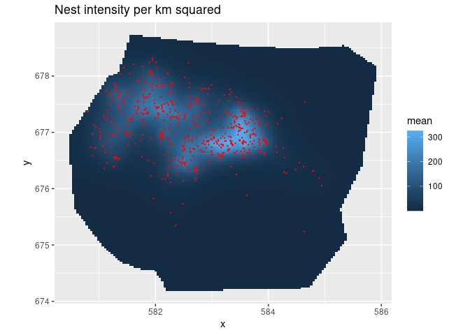

<!-- README.md is generated from README.Rmd. Please edit that file -->

# inlabru

<!-- badges: start -->

[](https://cran.r-project.org/package=inlabru)
[](https://inlabru-org.r-universe.dev)
[](https://github.com/inlabru-org/inlabru/actions)
[](https://github.com/inlabru-org/inlabru/actions)
[](https://github.com/inlabru-org/inlabru/actions)
[](https://app.codecov.io/gh/inlabru-org/inlabru?branch=devel)
<!-- badges: end -->

The goal of [inlabru](http://inlabru.org) is to facilitate spatial
modeling using integrated nested Laplace approximation via the [R-INLA
package](https://www.r-inla.org). Additionally, extends the GAM-like
model class to more general nonlinear predictor expressions, and
implements a log Gaussian Cox process likelihood for modeling univariate
and spatial point processes based on ecological survey data. Model
components are specified with general inputs and mapping methods to the
latent variables, and the predictors are specified via general R
expressions, with separate expressions for each observation likelihood
model in multi-likelihood models. A prediction method based on fast
Monte Carlo sampling allows posterior prediction of general expressions
of the latent variables. See Fabian E. Bachl, Finn Lindgren, David L.
Borchers, and Janine B. Illian (2019), inlabru: an R package for
Bayesian spatial modelling from ecological survey data, Methods in
Ecology and Evolution, British Ecological Society, 10, 760–766,
[doi:10.1111/2041-210X.13168](https://doi.org/10.1111/2041-210X.13168),
and `citation("inlabru")`.

The [inlabru.org](http://inlabru.org) website has links to old tutorials
with code examples for versions up to 2.1.13. For later versions,
updated versions of these tutorials, as well as new examples, can be
found at <https://inlabru-org.github.io/inlabru/articles/>

## Installation

You can install the current [CRAN](https://CRAN.R-project.org) version
of inlabru:

``` r
install.packages("inlabru")
```

You can install the latest bugfix release of inlabru from
[GitHub](https://github.com/inlabru-org/inlabru) with:

``` r
# install.packages("remotes")
remotes::install_github("inlabru-org/inlabru", ref = "stable")
```

You can install the development version of inlabru from
[GitHub](https://github.com/inlabru-org/inlabru) with

``` r
# install.packages("remotes")
remotes::install_github("inlabru-org/inlabru", ref = "devel")
```

or track the development version builds via
[inlabru-org.r-universe.dev](https://inlabru-org.r-universe.dev/builds):

``` r
# Enable universe(s) by inlabru-org
options(repos = c(
  inlabruorg = "https://inlabru-org.r-universe.dev",
  INLA = "https://inla.r-inla-download.org/R/testing",
  CRAN = "https://cloud.r-project.org"
))

# Install some packages
install.packages("inlabru")
```

## Example

This is a basic example which shows you how fit a simple spatial Log
Gaussian Cox Process (LGCP) and predicts its intensity:

``` r
# Load libraries
library(inlabru)
library(INLA)
#> Loading required package: Matrix
#> This is INLA_23.06.15 built 2023-06-15 06:01:53 UTC.
#>  - See www.r-inla.org/contact-us for how to get help.
library(ggplot2)
bru_safe_sp(force = TRUE) # Ensures sp works without rgdal installed

# Load the data
data(gorillas, package = "inlabru")

# Construct latent model components
matern <- inla.spde2.pcmatern(gorillas$mesh,
  prior.sigma = c(0.1, 0.01),
  prior.range = c(0.01, 0.01)
)
cmp <- ~ mySmooth(coordinates, model = matern) + Intercept(1)
# Fit LGCP model
# This particular bru/like combination has a shortcut function lgcp() as well
fit <- bru(
  components = cmp,
  like(
    formula = coordinates ~ .,
    family = "cp",
    data = gorillas$nests,
    samplers = gorillas$boundary,
    domain = list(coordinates = gorillas$mesh)
  ),
  options = list(control.inla = list(int.strategy = "eb"))
)
#> Please note that rgdal will be retired during October 2023,
#> plan transition to sf/stars/terra functions using GDAL and PROJ
#> at your earliest convenience.
#> See https://r-spatial.org/r/2023/05/15/evolution4.html and https://github.com/r-spatial/evolution
#> rgdal: version: 1.6-7, (SVN revision 1203)
#> Geospatial Data Abstraction Library extensions to R successfully loaded
#> Loaded GDAL runtime: GDAL 3.4.1, released 2021/12/27
#> Path to GDAL shared files: /usr/share/gdal
#> GDAL binary built with GEOS: TRUE 
#> Loaded PROJ runtime: Rel. 8.2.1, January 1st, 2022, [PJ_VERSION: 821]
#> Path to PROJ shared files: /home/flindgre/.local/share/proj:/usr/share/proj
#> PROJ CDN enabled: FALSE
#> Linking to sp version:1.6-1
#> To mute warnings of possible GDAL/OSR exportToProj4() degradation,
#> use options("rgdal_show_exportToProj4_warnings"="none") before loading sp or rgdal.

# Predict Gorilla nest intensity
lambda <- predict(
  fit,
  fm_pixels(gorillas$mesh, mask = gorillas$boundary, format = "sp"),
  ~ exp(mySmooth + Intercept)
)

# Plot the result
ggplot() +
  gg(lambda) +
  gg(gorillas$nests, color = "red", size = 0.2) +
  coord_equal() +
  ggtitle("Nest intensity per km squared")
```


