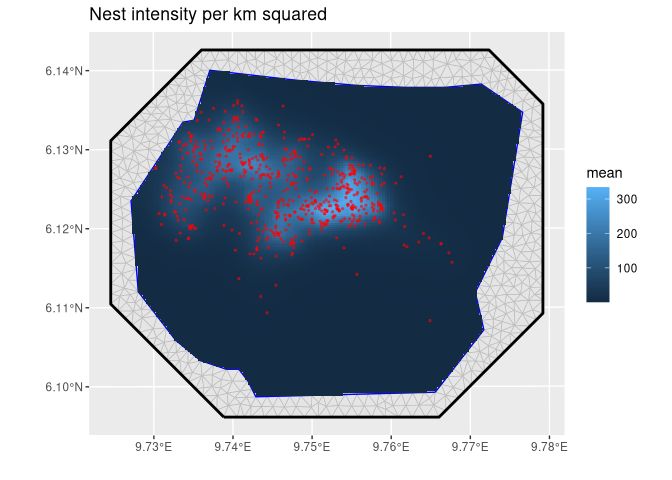

<!-- README.md is generated from README.Rmd. Please edit that file -->

# inlabru

<!-- badges: start -->

[](https://travis-ci.org/fbachl/inlabru)
[](https://cran.r-project.org/package=inlabru)
[](https://github.com/fbachl/inlabru/actions)
[](https://github.com/fbachl/inlabru/actions)
\[<!-- badges: end -->

The goal of [inlabru](http://inlabru.org) is to facilitate spatial
modeling using integrated nested Laplace approximation via the [R-INLA
package](http://www.r-inla.org). Additionally, implements a log Gaussian
Cox process likelihood for modeling univariate and spatial point
processes based on ecological survey data. See Yuan Yuan, Fabian E.
Bachl, Finn Lindgren, David L. Borchers, Janine B. Illian, Stephen T.
Buckland, Havard Rue, Tim Gerrodette (2017),
[arXiv](https://arxiv.org/abs/1604.06013).

## Installation

You can install the current [CRAN](https://CRAN.R-project.org) version
of inlabru:

``` r
install.packages("inlabru")
```

You can install the latest bugfix release of inlabru from
[GitHub](https://github.com/) with:

``` r
# install.packages("remotes")
remotes::install_github("fbachl/inlabru", ref="master")
```

You can install the development version of inlabru from
[GitHub](https://github.com/) with:

``` r
# install.packages("remotes")
remotes::install_github("fbachl/inlabru", ref="devel")
```

## Example

This is a basic example which shows you how fit a simple spatial Log
Gaussian Cox Process (LGCP) and predicts its intensity:

``` r
# Load libraries
library(inlabru)
#> Loading required package: sp
#> Loading required package: ggplot2
library(INLA)
#> Loading required package: Matrix
#> Loading required package: parallel
#> Loading required package: foreach
#> This is INLA_20.04.18 built 2020-04-24 13:46:03 UTC.
#> See www.r-inla.org/contact-us for how to get help.
#> To enable PARDISO sparse library; see inla.pardiso()
library(ggplot2)

# Load the data
data(gorillas, package = "inlabru")

# Construct latent model components
matern <- inla.spde2.pcmatern(gorillas$mesh, 
                              prior.sigma = c(0.1, 0.01), 
                              prior.range = c(5, 0.01))
cmp <- coordinates ~ mySmooth(map = coordinates,
                              model = matern) +
                          Intercept
# Fit LGCP model
fit <- lgcp(cmp, gorillas$nests, samplers = gorillas$boundary,
            options = list(control.inla = list(int.strategy = "eb")))

# Predict Gorilla nest intensity
lambda <- predict(fit, pixels(gorillas$mesh), ~ exp(mySmooth + Intercept))

# Plot the result
ggplot() + 
  gg(lambda) +
  gg(gorillas$nests, color = "red", size = 0.2) +
  coord_equal()
```


