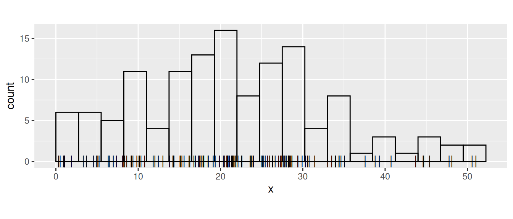
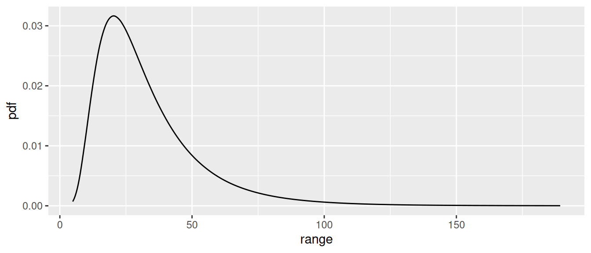
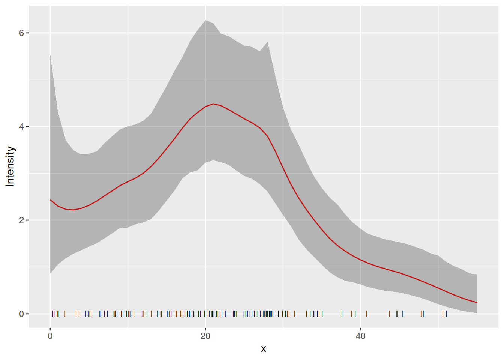
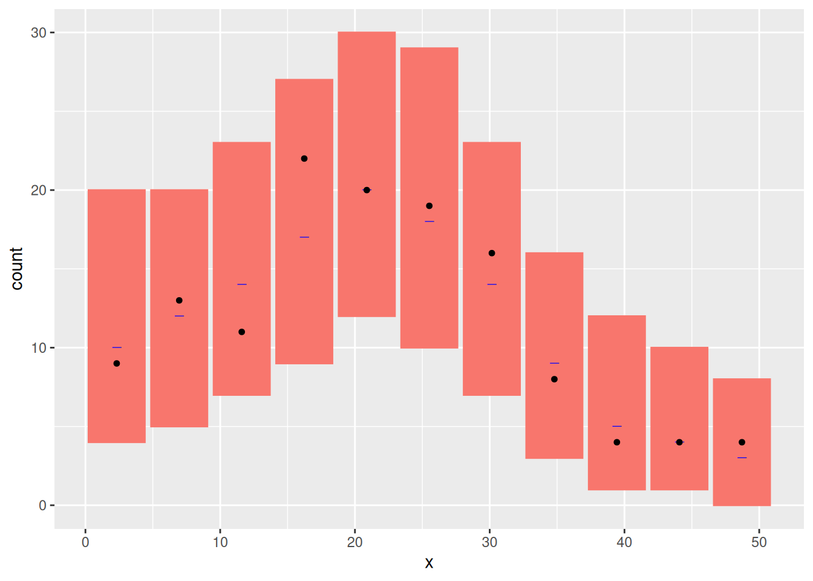
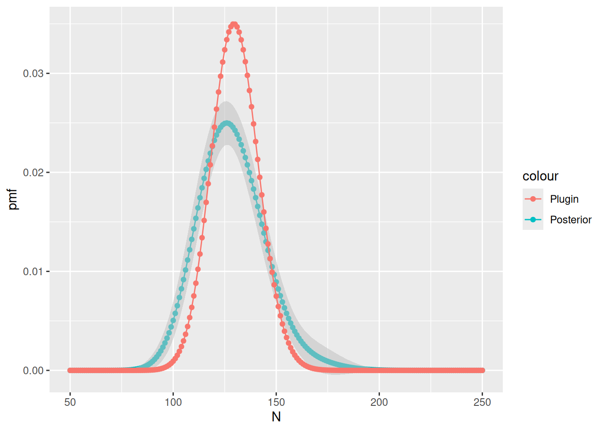
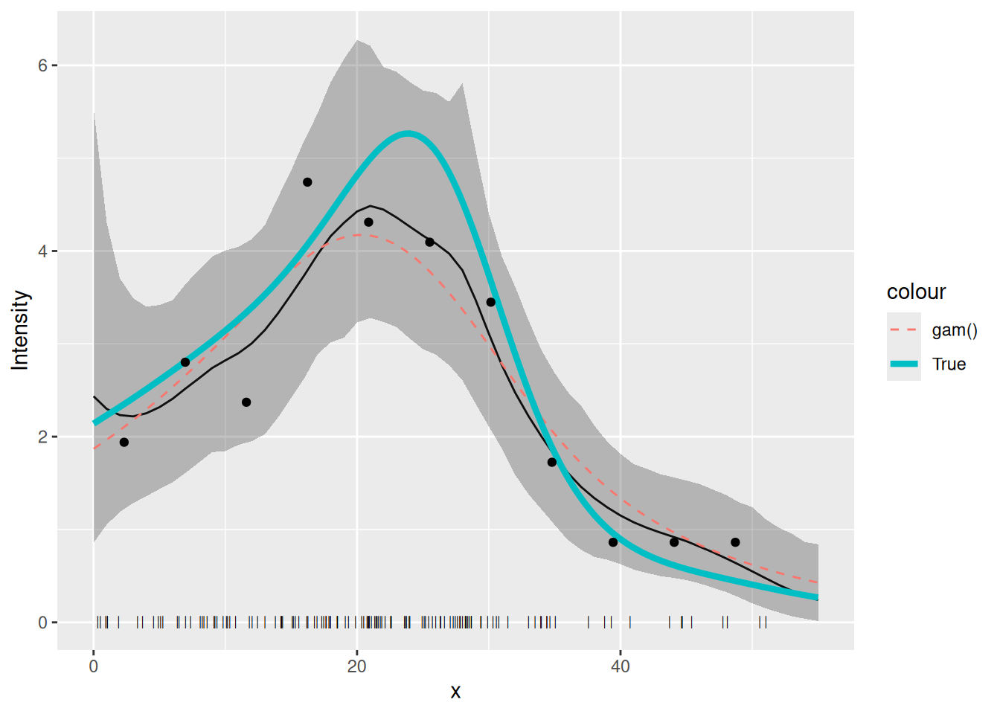

# LGCPs - An example in one dimension

## Introduction

In this vignette we are going to see how to fit an SPDE to
one-dimensional *point* data, i.e. data that consist of the points at
which things are located, not the number of points in some area.

## Setting things up

Load libraries

``` r

library(inlabru)
library(INLA)
library(mgcv)
library(ggplot2)
library(fmesher)
```

## Get the data

``` r

data(Poisson2_1D, package = "inlabru")
```

Take a look at the point (and frequency) data

``` r

ggplot(pts2) +
  geom_histogram(aes(x = x),
    binwidth = 55 / 20,
    boundary = 0, fill = NA, color = "black"
  ) +
  geom_point(aes(x), y = 0, pch = "|", cex = 4) +
  coord_fixed(ratio = 1)
```



## Fiting the model

Build a 1D mesh:

``` r

x <- seq(0, 55, length.out = 50)
mesh1D <- fmesher::fm_mesh_1d(x, boundary = "free")
```

Make the latent components for a 1D SPDE model, using an
integrate-to-zero constraint for better identifiability:

``` r

matern <- inla.spde2.pcmatern(mesh1D,
  prior.range = c(150, 0.75),
  prior.sigma = c(0.1, 0.75),
  constr = TRUE
)
comp <- ~ spde1D(x, model = matern) + Intercept(1)
```

Here we want to fit to the actual points, and the `inlabru` functions
that are used for this are
[`bru()`](https://inlabru-org.github.io/inlabru/reference/bru.md) and
`bru_obs(..., family = "cp")`. For this special case there is also a
shortcut function
[`lgcp()`](https://inlabru-org.github.io/inlabru/reference/lgcp.md) (for
‘Log Gaussian Cox Process’), but it doesn’t support all features. The
standard way of specifying the function space for integration is via the
`domain` argument.

``` r

fit.spde <- bru(
  comp,
  bru_obs(x ~ ., family = "cp", data = pts2, domain = list(x = mesh1D))
)
## Equivalent call for this particular example:
# fit.spde <- lgcp(
#   comp,
#   formula = x ~ ., data = pts2, domain = list(x = mesh1D)
# )
```

Here, `formula = x ~ .` means that the observed points are in `x`, and
`.` denotes a linear predictor that is the sum of all the latent
components.

## SPDE parameters

We can look at the posterior distributions of the parameters of the SPDE
using the function `spde.posterior`. It returns `x` and `y` values for a
plot of the posterior PDF in a data frame, which can be printed using
the `plot` function. To see the PDF for the range parameter, for
example:

``` r

post.range <- spde.posterior(fit.spde, name = "spde1D", what = "range")
plot(post.range)
```



Look at the help file for `spde.posterior` and then plot the posterior
for the log of the SPDE range parameter, the SPDE variance and/or log of
the variance, and for the Matern covariance function. Make sure you
understand the difference between what is plotted for the range and
variance parameters, and for the covariance function (which involves
both these parameters).

``` r

post.log.range <- spde.posterior(fit.spde,
  name = "spde1D",
  what = "log.range"
)
plot(post.log.range)
post.variance <- spde.posterior(fit.spde,
  name = "spde1D",
  what = "variance"
)
plot(post.variance)
post.log.variance <- spde.posterior(fit.spde,
  name = "spde1D",
  what = "log.variance"
)
plot(post.log.variance)
post.matcorr <- spde.posterior(fit.spde,
  name = "spde1D",
  what = "matern.correlation"
)
plot(post.matcorr)
```

You can get a feel for sensitivity to priors by specifying different
priors and looking at the posterior plots.

## Predicting intensity

We can also now predict on any scale we want. For example, to predict on
the ‘response’ scale (i.e. the intensity function \lambda(s)), we call
`predict` thus:

``` r

# Set up a data frame of explanatory values at which to predict
predf <- data.frame(x = seq(0, 55, by = 1))
pred_spde <- predict(fit.spde,
  predf,
  ~ exp(spde1D + Intercept),
  n.samples = 1000
)
```

while to predict on the linear predictor scale (i.e. that of the log
intensity, \log(\lambda(s))), we call `predict` thus:

``` r

pred_spde_lp <- predict(fit.spde, predf, ~ spde1D + Intercept, n.samples = 1000)
```

here’s how to plot the prediction and 95% credible interval:

``` r

plot(pred_spde, color = "red") +
  geom_point(data = pts2, aes(x = x), y = 0, pch = "|", cex = 2) +
  xlab("x") + ylab("Intensity")
```



How does this compare with the underlying intensity function that
generated the data? The function
[`lambda2_1D( )`](https://inlabru-org.github.io/inlabru/reference/Poisson2_1D.md)
in the dataset `Poission2_1D` calculates the true intensity that was
used in simulating these data. In order to plot this, we make a data
frame with `x`- and `y`-coordinates giving the true intensity function,
\lambda(s). We use lots of `x`-values to get a nice smooth plot (150
values).

``` r

xs <- seq(0, 55, length = 150)
true.lambda <- data.frame(x = xs, y = lambda2_1D(xs))
```

Plot the fitted and true intensity functions:

``` r

plot(pred_spde, color = "red") +
  geom_point(data = pts2, aes(x = x), y = 0, pch = "|", cex = 2) +
  geom_line(data = true.lambda, aes(x, y)) +
  xlab("x") + ylab("Intensity")
```

## Goodness-of-Fit

We can look at the goodness-of-fit of the mode using the `inlabru`
function
[`bincount( )`](https://inlabru-org.github.io/inlabru/reference/bincount.md),
which plots the 95% credible intervals in a specified set of bins along
the `x`-axis together with the observed count in each bin: The credible
intervals are shown as red rectangles, the mean fitted value as a short
horizontal blue line, and the observed data as black points:

``` r

bc <- bincount(
  result = fit.spde,
  observations = pts2,
  breaks = seq(0, max(pts2), length = 12),
  predictor = x ~ exp(spde1D + Intercept)
)

attributes(bc)$ggp
```



## Estimating Abundance

Abundance is the integral of the intensity over space. We estimate it by
integrating the predicted intensity over `x`. Integration is done by
adding up the intensity at locations `x` weighted by a particular
weight. The locations `x` and their weights are constructed using the
`fm_int` function

``` r

ips <- fm_int(mesh1D, name = "x")
head(ips)
#> # A tibble: 6 × 4
#>       x weight .block .block_origin[,"x"]
#>   <dbl>  <dbl>  <int>               <int>
#> 1  0     0.187      1                   1
#> 2  1.12  0.374      1                   1
#> 3  2.24  0.374      1                   1
#> 4  3.37  0.374      1                   1
#> 5  4.49  0.374      1                   1
#> 6  5.61  0.374      1                   1
Lambda <- predict(fit.spde, ips, ~ sum(weight * exp(spde1D + Intercept)))
```

You can look at the abundance estimate by typing

``` r

Lambda
#>       mean       sd   q0.025     q0.5  q0.975   median mean.mc_std_err sd.mc_std_err
#> 1 129.9761 11.99775 108.8752 129.1607 152.232 129.1607        1.344881     0.7255328
```

- `mean` is the posterior mean abundance.
- `sd` is the estimated standard error of the posterior of the
  abundance.
- `cv` is its estimated coefficient of variation (stander error divided
  by mean).
- `q0.025` and `q0.975` are the 95% credible interval bounds.
- `q0.5` is the posterior median abundance

But it is not quite that simple! The above posterior for abundance takes
account only of the variance due to us not knowing the parameters of the
intensity function. It neglects the variance in the number of point
locations, given the intensity function. To include this we need to
modify [`predict( )`](https://rdrr.io/r/stats/predict.html) as follows:

``` r

Nest <- predict(
  fit.spde, ips,
  ~ data.frame(
    N = 50:250,
    dpois = dpois(50:250,
      lambda = sum(weight * exp(spde1D + Intercept))
    )
  )
)
```

This calculates the same statistics as were calculated for `Lambda`, but
for evey value of `N` from 50 to 250, rather than for the posterior mean
`N` alone:

``` r

Nest[Nest$N %in% 100:105, ]
#>      N        mean          sd       q0.025        q0.5     q0.975      median mean.mc_std_err
#> 51 100 0.005044271 0.007425957 9.851963e-07 0.001867916 0.02692838 0.001867916    0.0009380739
#> 52 101 0.005759038 0.008042072 1.486492e-06 0.002345456 0.02909157 0.002345456    0.0009958755
#> 53 102 0.006531809 0.008655312 2.221218e-06 0.002916207 0.03112060 0.002916207    0.0010518167
#> 54 103 0.007360356 0.009258286 3.287397e-06 0.003590648 0.03296814 0.003590648    0.0011054416
#> 55 104 0.008241304 0.009843174 4.819345e-06 0.004378560 0.03458975 0.004378560    0.0011562649
#> 56 105 0.009170107 0.010401857 6.999079e-06 0.005288519 0.03594571 0.005288519    0.0012037665
#>    sd.mc_std_err
#> 51  0.0009773912
#> 52  0.0009583415
#> 53  0.0009314279
#> 54  0.0008980651
#> 55  0.0008597377
#> 56  0.0008179044
```

We compute the 95% prediction interval and the median as follows

``` r

inla.qmarginal(c(0.025, 0.5, 0.975), marginal = list(x = Nest$N, y = Nest$mean))
#> [1]  99.03759 127.51411 164.18648
```

Compare `Lambda` to `Nest` by plotting: First calculate the posterior
conditional on the mean of `Lambda`

``` r

Nest$plugin_estimate <- dpois(Nest$N, lambda = Lambda$mean)
```

Then plot it and the unconditional posterior

``` r

ggplot(data = Nest) +
  geom_point(aes(x = N, y = mean, colour = "Posterior")) +
  geom_line(aes(x = N, y = mean, colour = "Posterior")) +
  geom_ribbon(
    aes(
      x = N,
      ymin = mean - 2 * mean.mc_std_err,
      ymax = mean + 2 * mean.mc_std_err
    ),
    fill = "grey",
    alpha = 0.5
  ) +
  geom_point(aes(x = N, y = plugin_estimate, colour = "Plugin")) +
  geom_line(aes(x = N, y = plugin_estimate, colour = "Plugin")) +
  ylab("pmf")
```



Do the differences make sense to you?

## Comparison to GAM fit

Now refit a GAM for the count data of `Poisson2_1D` and plot the
estimated intensity function from this GAM fit, together with the LGCP
fitted above and the true intensity.

``` r

cd2 <- countdata2
fit2.gam <- gam(count ~ s(x, k = 10) + offset(log(exposure)),
  family = poisson(),
  data = cd2
)
dat4pred <- data.frame(
  x = seq(0, 55, length = 100),
  exposure = rep(cd2$exposure[1], 100)
)
pred2.gam <- predict(fit2.gam, newdata = dat4pred, type = "response")
dat4pred2 <- cbind(dat4pred, gam = pred2.gam)
```

You should get a plot like this (thick line is the true intensity, the
thin solid line the inlabru fit, the dashed line the GAM fit:

``` r

plot(pred_spde) +
  geom_point(data = pts2, aes(x = x), y = 0, pch = "|", cex = 2) +
  geom_line(
    data = dat4pred2,
    aes(x, gam / exposure, colour = "gam()"),
    lty = 2
  ) +
  geom_line(data = true.lambda, aes(x, y, colour = "True"), lwd = 1.5) +
  geom_point(data = cd2, aes(x, y = count / exposure)) +
  ylab("Intensity") + xlab("x")
```


