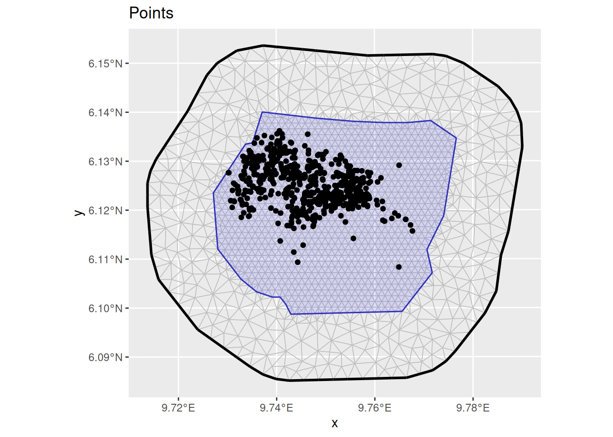
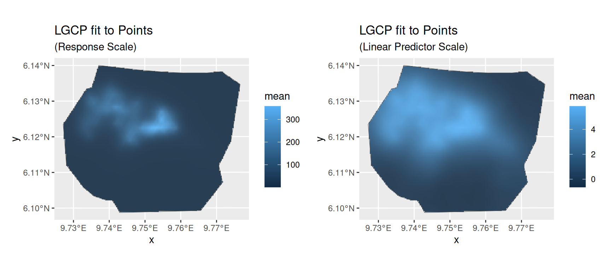
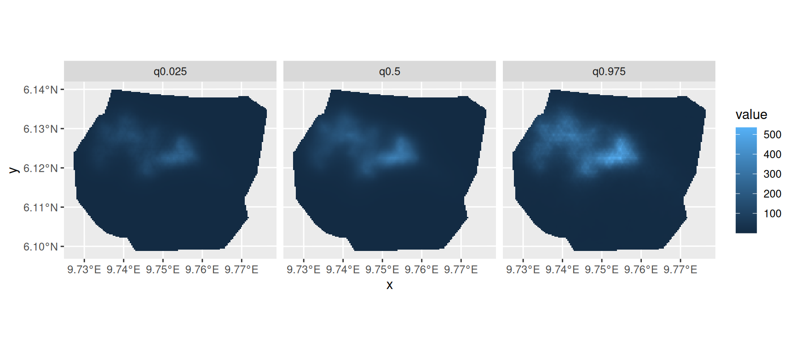
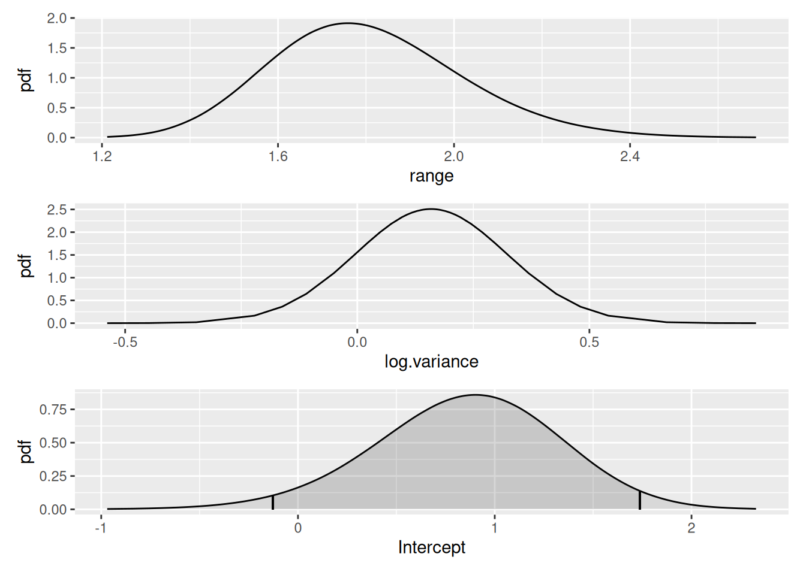
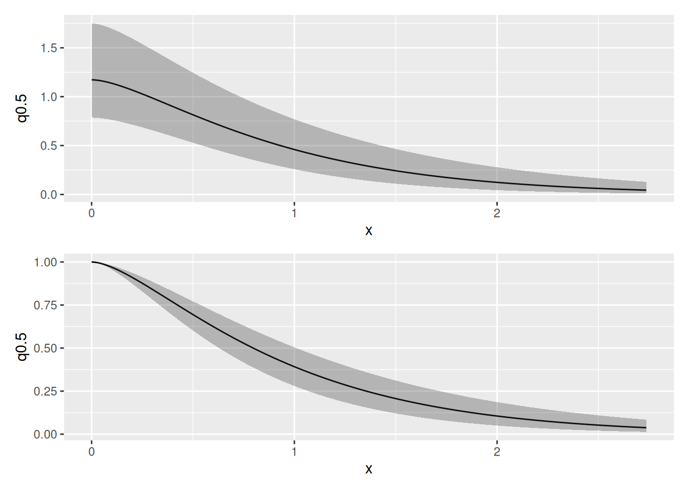
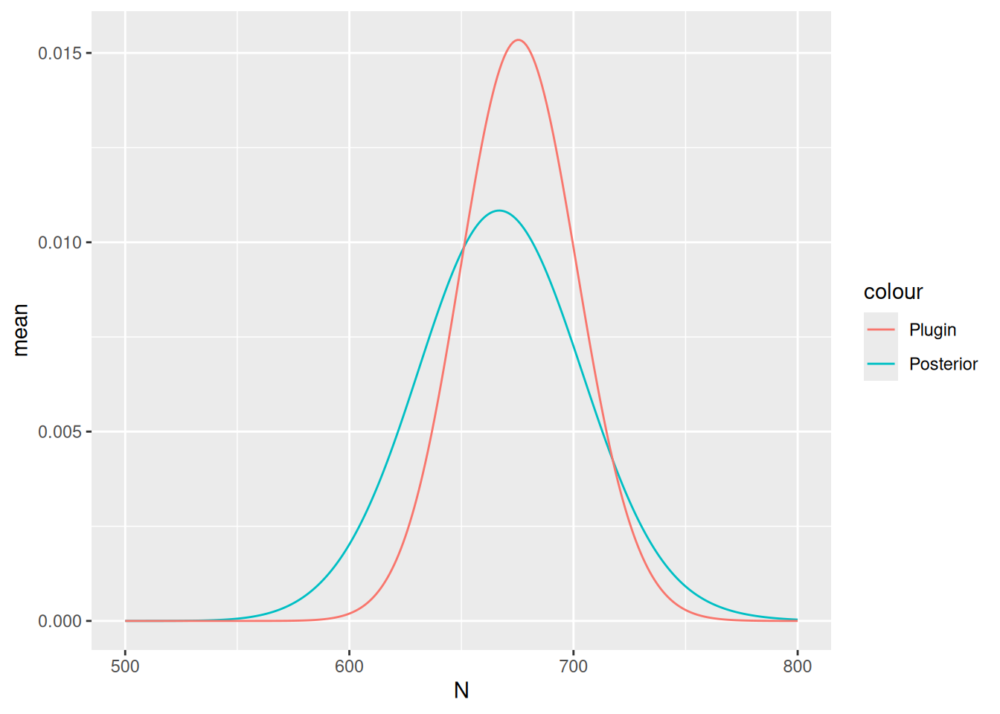

# LGCPs - An example in two dimensions

## Introduction

For this vignette we are going to be working with a dataset obtained
from the `R` package `spatstat`. We will set up a two-dimensional LGCP
to estimate Gorilla abundance.

## Setting things up

Load libraries

``` r

library(fmesher)
library(inlabru)
library(INLA)
library(mgcv)
library(ggplot2)
library(patchwork)
```

## Get the data

For the next few practicals we are going to be working with a dataset
obtained from the `R` package `spatstat`, which contains the locations
of 647 gorilla nests. We load the dataset like this:

``` r

data(gorillas_sf, package = "inlabru")
```

This dataset is a list containing a number of `R` objects, including the
locations of the nests, the boundary of the survey area and an `INLA`
mesh - see
[`help(gorillas)`](https://inlabru-org.github.io/inlabru/reference/gorillas.md)
for details. Extract the the objects we need from the list, into other
objects, so that we don’t have to keep typing ‘`gorillas_sf$`’, and
optionally load the covariates from disk:

``` r

nests <- gorillas_sf$nests
mesh <- gorillas_sf$mesh
boundary <- gorillas_sf$boundary
gcov <- gorillas_sf_gcov()
#> Loading required namespace: terra
```

Plot the points (the nests).

``` r

ggplot() +
  gg(mesh) +
  geom_sf(data = boundary, alpha = 0.1, fill = "blue") +
  geom_sf(data = nests) +
  ggtitle("Points")
```



## Fitting the model

Fit an LGCP model to the locations of the gorilla nests, predict on the
survey region, and produce a plot of the estimated density - which
should look like the plot shown below.

The steps to specifying, fitting and predicting are:

1.  Specify a model, comprising (for 2D models) `geometry` on the left
    of `~` and an SPDE `+ Intercept(1)` on the right. Please use the
    SPDE prior specification stated below.

2.  Call
    [`lgcp( )`](https://inlabru-org.github.io/inlabru/reference/lgcp.md),
    passing it (with 2D models) the model components, the `sf`
    containing the observed points and the `sf` defining the survey
    boundary using the `samplers` argument.

3.  Call [`predict( )`](https://rdrr.io/r/stats/predict.html), passing
    it the fitted model from 2., locations at which to predict and an
    appropriate predictor specification. The locations at which to
    predict can be a `sf` covering the mesh, obtained by calling
    `fm_pixels(mesh, format = "sf")`.

``` r

matern <- inla.spde2.pcmatern(
  mesh,
  prior.sigma = c(0.1, 0.01),
  prior.range = c(0.05, 0.01)
)

cmp <- geometry ~
  mySmooth(geometry, model = matern) +
  Intercept(1)

fit <- lgcp(
  cmp,
  data = nests,
  samplers = boundary,
  domain = list(geometry = mesh)
)
```

## Predicting intensity

You should get a plot like that below. The `gg` method for `sf` point
data takes an optional argument `geom = "tile"` that converts the plot
to the type used for lattice data.

``` r

pred <- predict(
  fit,
  fmesher::fm_pixels(mesh, mask = boundary),
  ~ data.frame(
    lambda = exp(mySmooth + Intercept),
    loglambda = mySmooth + Intercept
  )
)

pl1 <- ggplot() +
  gg(pred$lambda, geom = "tile") +
  geom_sf(data = boundary, alpha = 0.1) +
  ggtitle("LGCP fit to Points", subtitle = "(Response Scale)")

pl2 <- ggplot() +
  gg(pred$loglambda, geom = "tile") +
  geom_sf(data = boundary, alpha = 0.1) +
  ggtitle("LGCP fit to Points", subtitle = "(Linear Predictor Scale)")

(pl1 | pl2)
```



You can plot the median, lower 95% and upper 95% density surfaces as
follows (assuming that the predicted intensity is in object `lambda`).

``` r

ggplot() +
  gg(
    tidyr::pivot_longer(pred$lambda,
      c(q0.025, q0.5, q0.975),
      names_to = "quantile", values_to = "value"
    ),
    aes(fill = value),
    geom = "tile"
  ) +
  facet_wrap(~quantile)
```



## SPDE parameters

Plot the SPDE parameter and fixed effect parameter posteriors.

``` r

int.plot <- plot(fit, "Intercept")
spde.range <- spde.posterior(fit, "mySmooth", what = "range")
spde.logvar <- spde.posterior(fit, "mySmooth", what = "log.variance")
range.plot <- plot(spde.range)
var.plot <- plot(spde.logvar)

(range.plot / var.plot / int.plot)
```



Look at the correlation function if you want to:

``` r

corplot <- plot(spde.posterior(fit, "mySmooth", what = "matern.correlation"))
covplot <- plot(spde.posterior(fit, "mySmooth", what = "matern.covariance"))
(covplot / corplot)
```



## Estimating Abundance

Finally, estimate abundance using the `predict` function. As a first
step we need an estimate for the integrated lambda. The integration
`weight` values are contained in the
[`fm_int()`](https://inlabru-org.github.io/fmesher/reference/fm_int.html)
output.

``` r

Lambda <- predict(
  fit,
  fmesher::fm_int(mesh, boundary),
  ~ sum(weight * exp(mySmooth + Intercept))
)
Lambda
#>      mean       sd   q0.025     q0.5   q0.975   median mean.mc_std_err
#> 1 675.907 28.40663 623.8281 675.5544 735.7902 675.5544        3.263137
#>   sd.mc_std_err
#> 1       2.11237
```

Given some generous interval boundaries (500, 800) for lambda we can
estimate the posterior abundance distribution via

``` r

Nest <- predict(
  fit,
  fmesher::fm_int(mesh, boundary),
  ~ data.frame(
    N = 500:800,
    dpois(500:800,
      lambda = sum(weight * exp(mySmooth + Intercept))
    )
  )
)
```

Get its quantiles via

``` r

inla.qmarginal(c(0.025, 0.5, 0.975), marginal = list(x = Nest$N, y = Nest$mean))
#> [1] 595.2843 667.2684 740.8924
```

… the mean via

``` r

inla.emarginal(identity, marginal = list(x = Nest$N, y = Nest$mean))
#> [1] 667.5486
```

and plot posteriors:

``` r

Nest$plugin_estimate <- dpois(Nest$N, lambda = Lambda$mean)
ggplot(data = Nest) +
  geom_line(aes(x = N, y = mean, colour = "Posterior")) +
  geom_line(aes(x = N, y = plugin_estimate, colour = "Plugin"))
```



The true number of nests in 647; the mean and median of the posterior
distribution of abundance should be close to this if you have not done
anything wrong!
