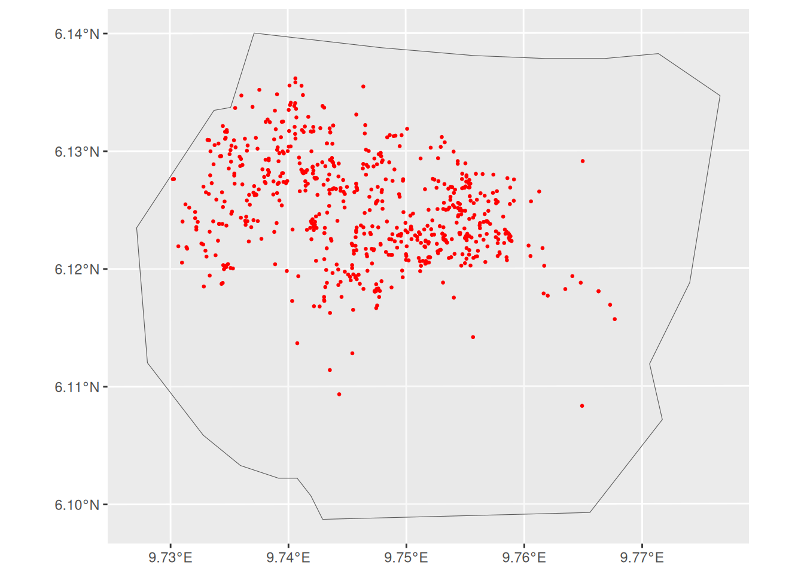
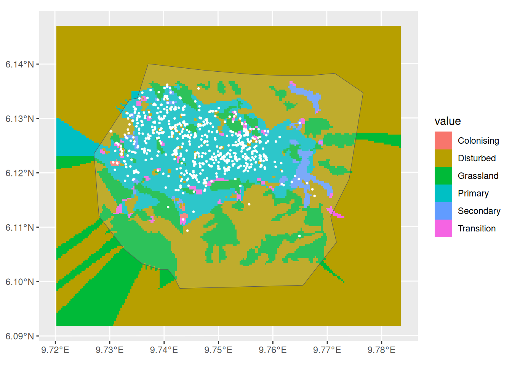
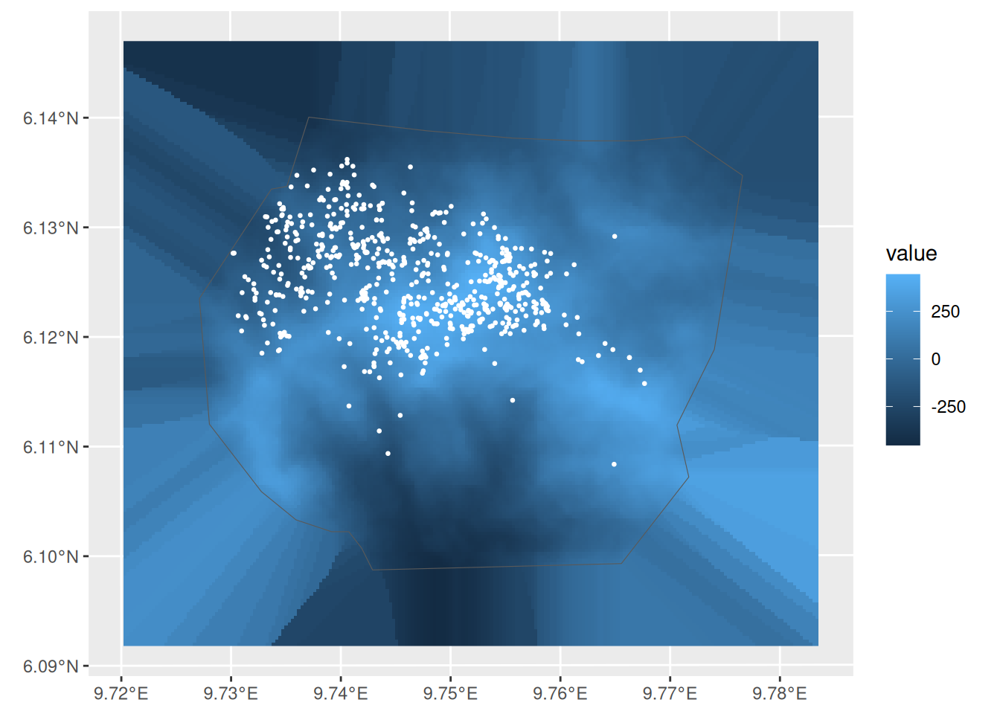
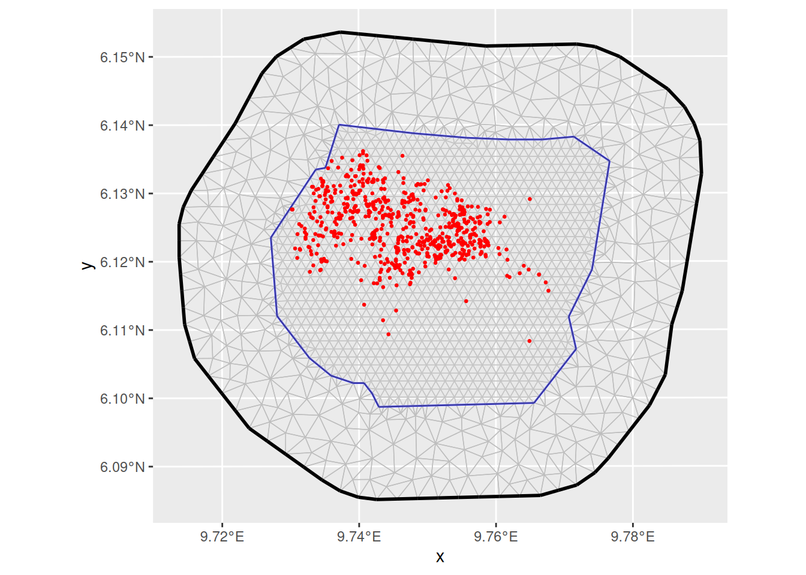
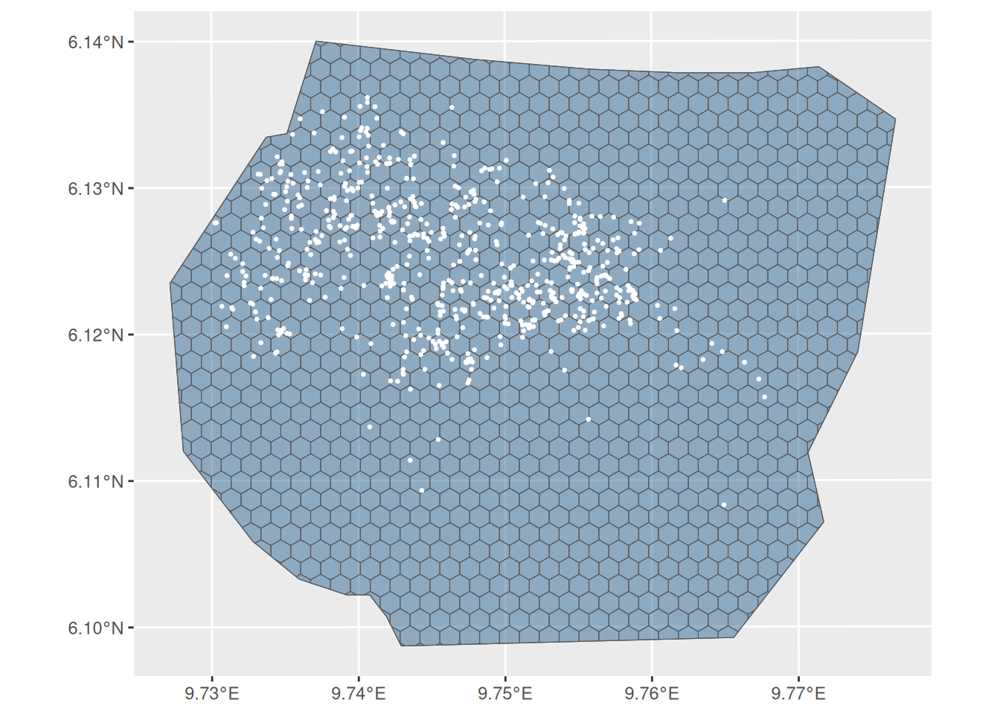
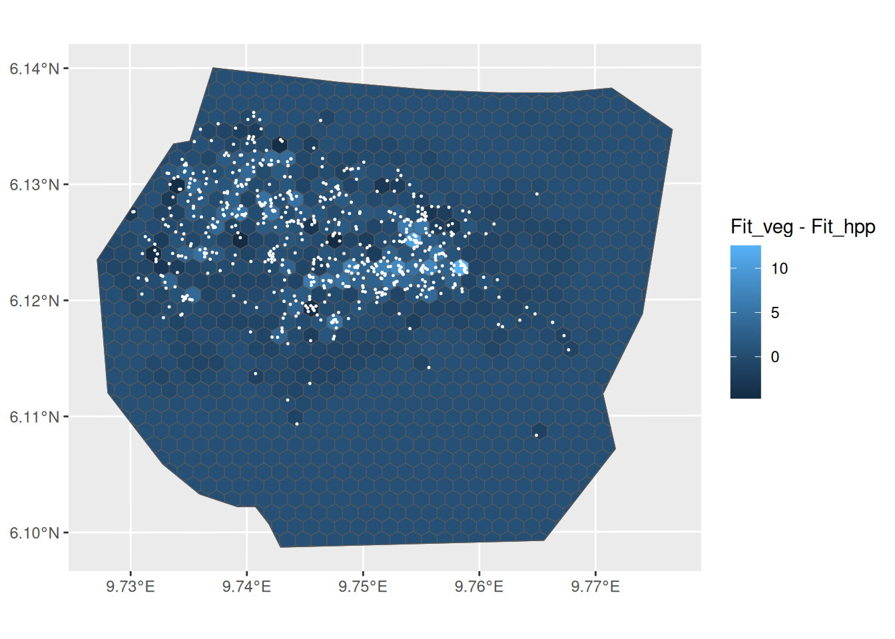
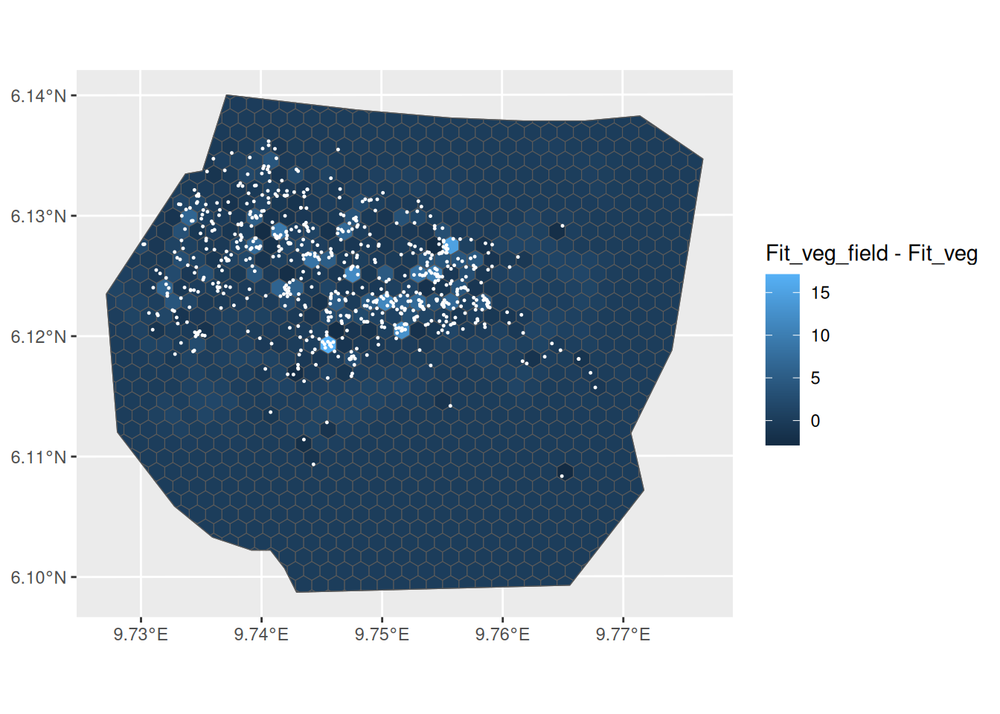
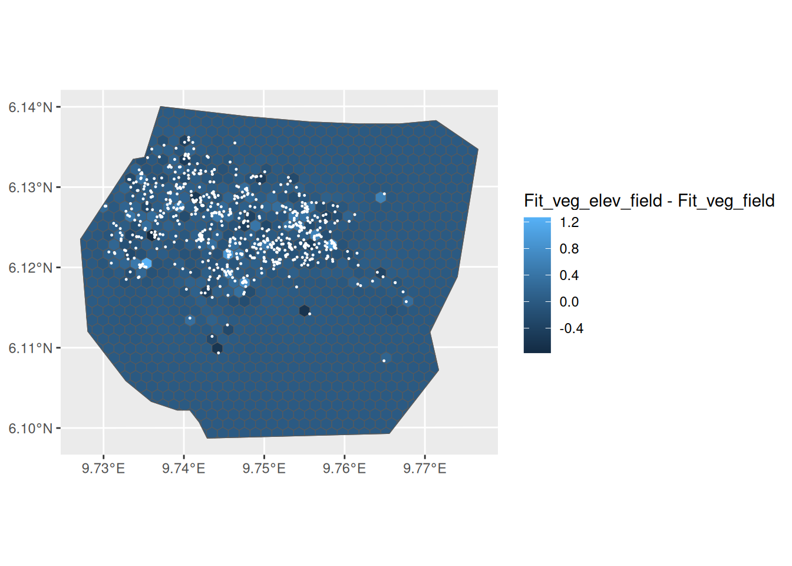
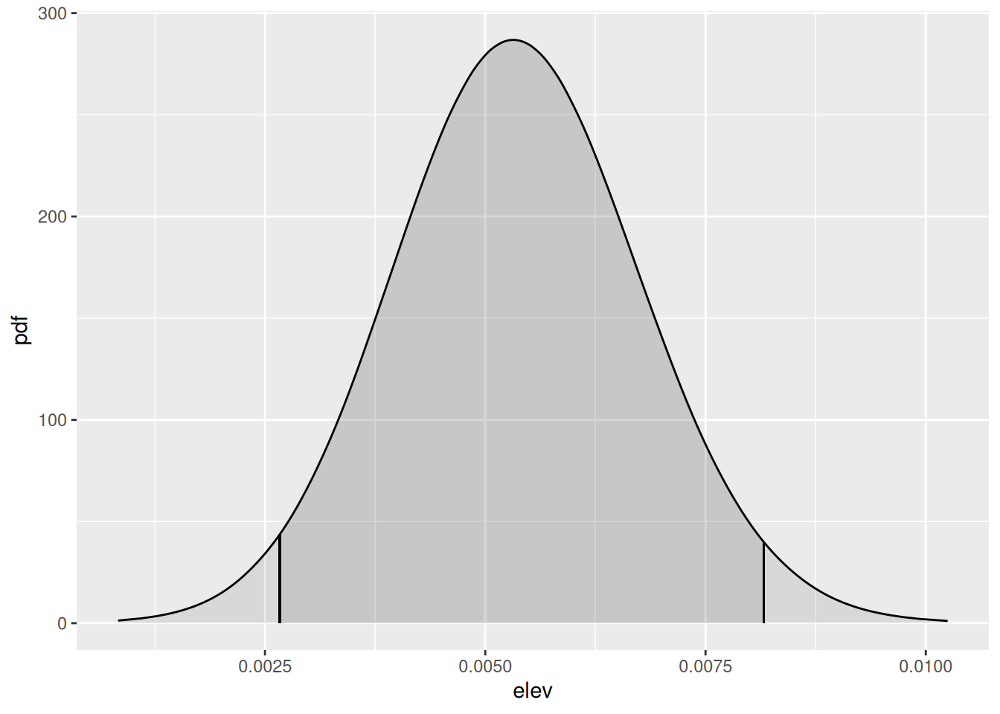

# LGCPs - Model comparison using Cross Validation

Set things up

``` r

library(INLA)
library(inlabru)
library(fmesher)
library(RColorBrewer)
library(ggplot2)
library(patchwork)
```

## Introduction

We are going to fit some spatial models to the gorilla data, and compare
them using cross validation. For illustration, we consider the same
models from the [vignette on spatial
covariates](https://inlabru-org.github.io/inlabru/articles/2d_lgcp_covars.html),
and we only focus on the practical aspects of LGCPs comparison. More
specifically, we consider the following models:

| Models | Components |
|----|----|
| `Fit_hpp` | Intercept ( a homogeneous PP) |
| `Fit_veg` | Intercept and factor covariate `vegetation` |
| `Fit_field` | Intercept and a spatial `SPDE field` |
| `Fit_veg_field` | Intercept, `vegetation` and the `SPDE field` |
| `Fit_veg_elev_field` | Intercept, `vegetation`, `elevation`, and the `SPDE field` |

## Leave-Region-Out Cross Validation

In point pattern analysis, the available information comes from *events
locations* and *empty regions*, and this should be taken into
consideration for models comparison. Here, we use a *leave-region-out
cross validation* approach, in which the domain is partitioned into
subregions, and the model is used the predict the likelihood
contribution from holdout subregions.

Let Y be a LGCP with intensity \lambda(.) defined on a bounded domain
\Omega, and we observe a point pattern \mathbf{y} = (y_1,\cdots, y_n).
Then the log likelihood is defined as

\ell(\lambda(.);\mathbf{y}, \Omega) = \|\Omega\| -
\int\_{\Omega}\lambda(s)ds + \sum\_{y_i \in \mathbf{y}\cap\Omega } \ln
\lambda(y_i).

Now, if we consider a partition \Omega = \Cup\_{j=1}^J B_j of the
domain; we can split the log likelihood into regional log likelihood
contributions as \ell(\lambda(.);\mathbf{y}, \Omega) = \sum\_{j=1}^J
\ell_j(\lambda(.);\mathbf{y}, B_j), where

\ell_j(\lambda(.);\mathbf{y}, B_j) = \|B_j\| - \int\_{B_j}\lambda(s)ds +
\sum\_{y_i \in \mathbf{y}\cap B_j } \ln \lambda(y_i), and we note that,
this representation *is not equivalent to the aggregated count or grid*
approach.

To fit the model, we use the complete information from
\ell(\lambda(.);\mathbf{y}, \Omega). For model comparison, however, the
likelihood contribution, \ell_j(\lambda(.);\mathbf{y}, B_j) from each
B_j, is left out and after fitting the model, we evaluate its predictive
performance on the holdout subregion using the logarithmic scoring rule.

The aggregated Group Conditional Predictive Ordinate (GCPO) is defined
as the sum of the logarithm of the joint leave-region-out predictive
distribution

\text{GCPO} = \sum\_{j=1}^J \log \pi(\mathbf{y}\_{B_j} \|
\mathbf{y}\_{-B_j}) where we define

\pi(\mathbf{y}\_{B_j} \| \mathbf{y}\_{-B_j}) =
\int\_{B_j}\exp(\ell_j(\lambda(.);\mathbf{y}, B_j))
\pi(\lambda(s)\|\mathbf{y}, \Omega\setminus B_j)) ds.

In principle, the model should be refitted J times, however, a fast and
accurate approximation to the leave-region-out predictive distribution,
accessible via the `control.gcpo` argument, allows us to compute the
approximate GCPO score from a single model fit using the complete point
pattern.

## Get the data

``` r

data(gorillas_sf, package = "inlabru")
```

This dataset is a list (see
[`help(gorillas_sf)`](https://inlabru-org.github.io/inlabru/reference/gorillas_sf.md)
for details. Extract the objects you need from the list, for
convenience:

``` r

nests <- gorillas_sf$nests
mesh <- gorillas_sf$mesh
boundary <- gorillas_sf$boundary
gcov <- gorillas_sf_gcov()
ggplot() +
  gg(boundary, alpha = 0.2) +
  gg(nests, color = "red", cex = 0.5)
```



## Covariates: vegetation and elevation

Let’s take a look at the vegetation type, nests and boundary:

``` r

ggplot() +
  gg(gcov$vegetation) +
  gg(boundary, alpha = 0.2) +
  gg(nests, color = "white", cex = 0.5)
```



Also, let’s do the same for elevation:

``` r

elev <- gcov$elevation
elev <- elev - mean(terra::values(elev), na.rm = TRUE)

ggplot() +
  gg(elev, geom = "tile") +
  gg(boundary, alpha = 0) +
  gg(nests, color = "white", cex = 0.5)
```



For the spatial component, we use a SPDE type smoother, with the mesh,
boundary and nests illustrated below:

``` r

ggplot() +
  gg(mesh) +
  gg(boundary, alpha = 0.2) +
  gg(nests, color = "red", cex = 0.5)
```



## The models

### Defining the models

Below, we prepare the formulas for the models under consideration.

``` r

# fit_hpp
comp_hpp <- geometry ~ Intercept(1)

# fit_veg
comp_veg <- geometry ~ -1 +
  vegetation(gcov$vegetation, model = "factor_full")

# fit_field
pcmatern <- inla.spde2.pcmatern(mesh,
  prior.sigma = c(1, 0.01),
  prior.range = c(0.1, 0.01)
)
comp_field <- geometry ~ Intercept(1) +
  field(geometry, model = pcmatern)

# fit_veg_field
comp_veg_field <- geometry ~
  -1 +
  vegetation(gcov$vegetation, model = "factor_full") +
  field(geometry, model = pcmatern)

# fit_veg_elev_field
comp_veg_elev_field <- geometry ~
  -1 +
  vegetation(gcov$vegetation, model = "factor_full") +
  elev(elev, model = "linear") +
  field(geometry, model = pcmatern)
```

### A hexagonal partition for cross validation

To enable the block or regional `group.cv` calculations, we need to
split the domain into spatial regions, and compute the association of
each observed point to these subregions. The `cv_hex` function allows to
create hexagonal partitions, but *if meaningful subregions of interest
are available, these must be used to define the likelihood
contribution*.

``` r

cvpart <- cv_hex(boundary, cellsize = 0.15, n_group = 1)

ggplot() +
  gg(cvpart, aes(fill = group), alpha = 0.5) +
  gg(boundary, alpha = 0) +
  gg(nests, color = "white", cex = 0.5) +
  theme(legend.position = "none")
```



It is important check that *every event belongs to a region*, to ensure
the regional likelihood contribution is properly calculated:

``` r

cvpart$block_ID <- seq_len(nrow(cvpart))
cvpart$group <- NULL
a <- sf::st_intersects(nests, cvpart)
if (any(lengths(a) != 1)) {
  stop("Point in none or multiple polygons")
}
nests$.block <- unlist(a)
```

### Fitting the models

Fit the models as usual, and increase the integration scheme resolution
to better match the covariate. In the code below, `enable = TRUE` for
`control.gcpo` tells `INLA` that the `GCPO` must be calculated,
`type.cv = "joint"` ensures that we are doing a joint prediction for the
entire region. For speed, we set `control.compute(config=FALSE)` to
compute the `group.cv` *score conditional on posterior mode of the
hyperparameters*.

``` r

mesh_int <- mesh
# mesh_int <- fm_subdivide(mesh, 2)
```

The homogeneous model

``` r

fit_hpp <- lgcp(
  comp_hpp,
  nests,
  samplers = cvpart,
  domain = list(geometry = mesh_int),
  control.gcpo = list(enable = TRUE, type.cv = "joint"),
  options = list(control.compute(config = FALSE))
)
```

Accounting for `vegetation`

``` r

fit_veg <- lgcp(
  comp_veg,
  nests,
  samplers = cvpart,
  domain = list(geometry = mesh_int),
  control.gcpo = list(enable = TRUE, type.cv = "joint"),
  options = list(control.compute(config = FALSE))
)
```

Accounting for the spatial dependence with the `SPDE smoother`

``` r

fit_field <- lgcp(
  comp_field,
  nests,
  samplers = cvpart,
  domain = list(geometry = mesh_int),
  control.gcpo = list(enable = TRUE, type.cv = "joint"),
  options = list(control.compute(config = FALSE))
)
```

Accounting for `vegetation` and spatial dependence with the
`SPDE smoother`

``` r

fit_veg_field <- lgcp(
  comp_veg_field,
  nests,
  samplers = cvpart,
  domain = list(geometry = mesh_int),
  control.gcpo = list(enable = TRUE, type.cv = "joint"),
  options = list(control.compute(config = FALSE))
)
```

The last model which accounts for `elevation`, `vegetation` and spatial
dependence with the `SPDE smoother`

``` r

fit_veg_elev_field <- lgcp(
  comp_veg_elev_field,
  nests,
  samplers = cvpart,
  domain = list(geometry = mesh_int),
  control.gcpo = list(enable = TRUE, type.cv = "joint"),
  options = list(control.compute(config = FALSE))
)
```

### Comparing the models with group CV

There are mainly two functions `bru_block_gcpo` and `bru_gcpo_table` for
models comparison using cross validation. `bru_block_gcpo` is used to
access individual scores for a *single* model, and its output is a list
containing the index for each region and the corresponding CV score. On
the other hand, `bru_gcpo_table` is used for *multiple* models
comparison.

``` r

gcpo_hpp <- bru_block_gcpo(fit_hpp)
str(gcpo_hpp)
#> List of 2
#>  $ blocks:List of 1
#>   ..$ lhood1: int [1:1088] 402 227 313 296 423 351 527 631 545 492 ...
#>  $ gcpo  : num [1:1088] 5.90e+05 2.06e+13 6.17e+08 6.17e+08 6.17e+08 ...
```

From the table below, the `vegetation` covariate is a strong predictor,
as expected, but also the `SPDE smoother`. Including `elevation` in the
model already containing `vegetation` and the `SPDE smoother` does not
provide any considerable gain in terms of predictive score. These
conclusions are similar to the ones obtained from the [vignette on
spatial
covariates](https://inlabru-org.github.io/inlabru/articles/2d_lgcp_covars.html),
although the latter was mainly based on in-sample analysis.

``` r

gcpo_df <- bru_gcpo_table(
  list(
    Fit_hpp = fit_hpp,
    Fit_veg = fit_veg,
    Fit_field = fit_field,
    Fit_veg_field = fit_veg_field,
    Fit_veg_elev_field = fit_veg_elev_field
  )
)

gcpo_df[, -1] <- log(gcpo_df[, -1])
knitr::kable(tibble::tibble(
  Models = names(gcpo_df)[-1],
  GCPO = colSums(gcpo_df[, -1])
))
```

| Models             |     GCPO |
|:-------------------|---------:|
| Fit_hpp            | 1603.908 |
| Fit_veg            | 1969.970 |
| Fit_field          | 2396.564 |
| Fit_veg_field      | 2407.937 |
| Fit_veg_elev_field | 2413.298 |

### Plotting regional scores

A valuable feature of the regional CV approach, is to assess regions
where models might provide better fits or to detect some missing
covariate. As an illustration, by evaluating the difference in the log
predictive density per region between models `Fit_veg` and `Fit_hpp`, we
can see that including `vegetation` improves the prediction in regions
with high number of nests, which was expected, since most of the nests
falls in the primary vegetation type.

``` r

names(gcpo_df)[1] <- "block_ID"
gcpo_block_ID <- cvpart |> dplyr::left_join(gcpo_df, "block_ID")
ggplot() +
  gg(gcpo_block_ID, aes(fill = Fit_veg - Fit_hpp), alpha = 1) +
  gg(boundary, alpha = 0) +
  gg(nests, color = "white", cex = 0.2)
```



A similar analysis could be done to assess the gain from the
`SPDE smoother` when added to the model with `vegetation`. Indeed, most
of the subregions with increased GCPO are nearby regions, probably as a
result of the spatial component.

``` r

ggplot() +
  gg(gcpo_block_ID, aes(fill = Fit_veg_field - Fit_veg), alpha = 1) +
  gg(boundary, alpha = 0) +
  gg(nests, color = "white", cex = 0.2)
```



We can also look at the contribution from the `elevation` covariate,
which slightly increased the log score in few subregions, but overall,
it seems to not be relevant.

``` r

plt_gcpo_elev <- ggplot() +
  gg(gcpo_block_ID, aes(fill = Fit_veg_elev_field - Fit_veg_field),
    alpha = 1
  ) +
  gg(boundary, alpha = 0) +
  gg(nests, color = "white", cex = 0.2)

plt_gcpo_elev
```



The `elevation` covariate not being predictively relevant, in the
presence of the `vegetation` covariate and the `SPDE smoother`, was also
expected from its posterior distribution.

``` r

plt_post_elev <- plot(fit_veg_elev_field, "elev")
plt_post_elev
```



### Summary

Based on the previous analysis, we would select the model containing
`vegetation` and the `SPDE smoother`. Here, we use hexagonal partition,
but we could also compare the models over different regions size or
geometry to add some robustness to the selection procedure. However, the
approximation strategy to avoid model refits and compute the GCPOs might
become less accurate for regions that are too large. In the case of very
few but large regions, we recommend refitting the model.

Also, it is important to note the small difference in the GCPOs between
some of the models, making model selection less straightforward. This
illustrates the need for uncertainty quantification, that we are
currently investigating.
