# LGCPs - Spatial covariates

Set things up

``` r

library(INLA)
library(inlabru)
library(fmesher)
library(RColorBrewer)
library(ggplot2)
library(patchwork)
# Activate DIC output
bru_options_set(control.compute = list(dic = TRUE, waic = TRUE))
```

## Introduction

We are going to fit spatial models to the gorilla data, using factor and
continuous explanatory variables in this practical. We will fit one
using the factor variable `vegetation`, the other using the continuous
covariate `elevation`

(Jump to the bottom of the practical if you want to start gently with a
1D example!)

## Get the data

``` r

data(gorillas_sf, package = "inlabru")
```

This dataset is a list (see
[`help(gorillas_sf)`](https://inlabru-org.github.io/inlabru/reference/gorillas_sf.md)
for details. Extract the objects you need from the list, for
convenience:

``` r

nests <- gorillas_sf$nests
mesh <- gorillas_sf$mesh
boundary <- gorillas_sf$boundary
gcov <- gorillas_sf_gcov()
#> Loading required namespace: terra
```

## Factor covariates

Look at the vegetation type, nests and boundary:

``` r

ggplot() +
  gg(gcov$vegetation) +
  gg(boundary, alpha = 0.2) +
  gg(nests, color = "white", cex = 0.5)
```


Or, with the mesh:

``` r

ggplot() +
  gg(gcov$vegetation) +
  gg(mesh) +
  gg(boundary, alpha = 0.2) +
  gg(nests, color = "white", cex = 0.5)
```

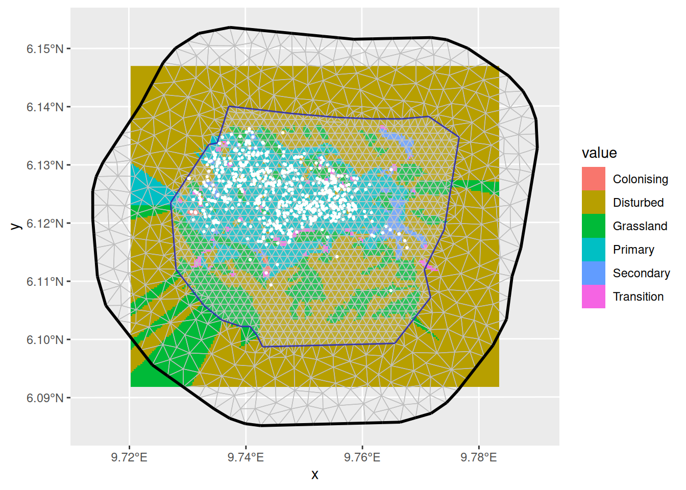

#### A model with vegetation type only

It seems that vegetation type might be a good predictor because nearly
all the nests fall in vegetation type `Primary`. So we construct a model
with vegetation type as a fixed effect. To do this, we need to tell
‘lgcp’ how to find the vegetation type at any point in space, and we do
this by creating model components with a fixed effect that we call
`vegetation` (we could call it anything), as follows:

``` r

comp_veg <- geometry ~ vegetation(gcov$vegetation, model = "factor_full") - 1
```

Notes: \* We need to tell ‘lgcp’ that this is a factor fixed effect,
which we do with `model="factor_full"`, giving one coefficient for each
factor level. \* We need to be careful about overparameterisation when
using factors. Unlike regression models like ‘lm()’, ‘glm()’ or ‘gam()’,
‘lgcp()’, `inlabru` does not automatically remove the first level and
absorb it into an intercept. Instead, we can either use
`model="factor_full"` without an intercept, or
`model="factor_contrast"`, which does remove the first level.

``` r

comp_veg_alt <-
  geometry ~ vegetation(gcov$vegetation, model = "factor_contrast") +
  Intercept(1)
```

To enable group.cv calculations, we need to split the domain into
spatial regions, and compute the association of each observed point to
these subregions.

``` r

cvpart <- cv_hex(boundary, cellsize = 0.4, n_group = 3)

ggplot() +
  gg(cvpart, aes(fill = group), alpha = 0.5) +
  gg(boundary, alpha = 0) +
  gg(nests, color = "white", cex = 0.5)
```

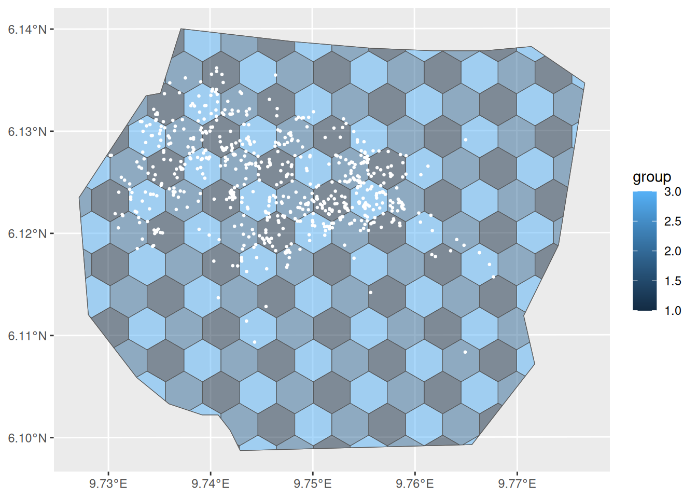

``` r


cvpart$block_ID <- seq_len(nrow(cvpart))
cvpart$group <- NULL
a <- sf::st_intersects(nests, cvpart)
if (any(lengths(a) != 1)) {
  stop("Point in none or multiple polygons")
}
nests$.block <- unlist(a)
```

Fit the model as usual, and increasing the integration scheme resolution
to better match the covariate:

``` r

mesh_int <- fm_subdivide(mesh, 2)
fit_veg <- lgcp(
  comp_veg,
  nests,
  samplers = cvpart,
  domain = list(geometry = mesh_int),
  control.gcpo = list(enable = FALSE, type.cv = "joint", num.level.sets = 2),
  options = list(bru_verbose = 0)
)
#  options = list(control.compute = list(control.gcpo = list(enable = TRUE))))
```

Predict the intensity, and plot the median intensity surface. (In older
versions, predicting takes some time because we did not have vegetation
values outside the mesh so ‘inlabru’ needed to predict these first.
Since v2.0.0, the vegetation has been pre-extended.)

The `predict` function of `inlabru` takes into its `data` argument an
`sf` object or other object supported by the predictor evaluation code
(for non-geographical data, typically a `data.frame`). We can use the
`inlabru` function `pixels` to generate an `sf` object with points only
within the boundary, using its `mask` argument, as shown below.

``` r

pred.df <- fm_pixels(mesh, mask = boundary)
intensity_veg <- predict(fit_veg, pred.df, ~ exp(vegetation))

# gg() with sf points and geom = "tile" plots a raster
ggplot() +
  gg(intensity_veg, geom = "tile") +
  gg(boundary, alpha = 0, lwd = 2) +
  gg(nests, color = "DarkGreen")
```

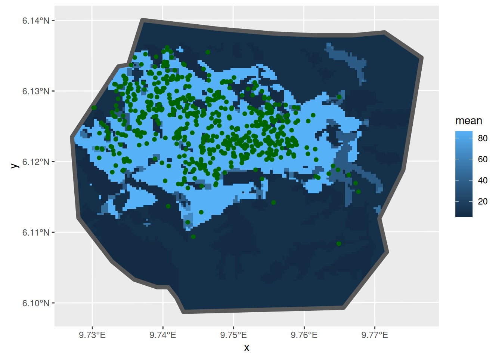

Not surprisingly, given that most nests are in `Primary` vegetation, the
high density is in this vegetation. But there are substantial patches of
predicted high density that have no nests, and some areas of predicted
low density that have nests. What about the estimated abundance (there
are really 647 nests there):

``` r

ips <- fm_int(list(geometry = mesh_int), boundary)
Lambda_veg <- predict(fit_veg, ips, ~ sum(weight * exp(vegetation)))
Lambda_veg
#>       mean       sd   q0.025     q0.5   q0.975   median mean.mc_std_err
#> 1 650.4316 27.80012 599.6772 652.7794 700.9583 652.7794        3.143283
#>   sd.mc_std_err
#> 1      1.816357
```

#### Continuous limit of WAIC

``` r

IC <- lgcp_IC(
  fit_veg,
  data = nests,
  predictor = vegetation,
  domain = list(geometry = mesh_int),
  samplers = cvpart
)
knitr::kable(IC)
```

| Criterion | Method | lppd | p_eff | IC | lppd.std_err | p_eff.std_err | IC.std_err |
|:---|:---|---:|---:|---:|---:|---:|---:|
| DIC | Limit | 1998.468 | 6.324597 | -3984.286 | 0.6000993 | 0.2989089 | 1.7980164 |
| DIC | INLA | 1978.534 | 5.879491 | -3945.309 | NA | NA | NA |
| DIC_adjusted | INLA | 1998.408 | 5.879491 | -3985.057 | NA | NA | NA |
| WAIC | Limit | 1998.468 | 6.151312 | -3984.633 | 0.6000993 | 0.0225973 | 1.2453931 |
| WAIC | Blockwise | 2121.944 | 11.912484 | -4220.064 | 0.0898961 | 0.0870493 | 0.3538907 |
| WAIC | INLA | 1978.842 | 6.502851 | -3944.678 | NA | NA | NA |
| WAIC_adjusted | INLA | 1998.716 | 6.502851 | -3984.425 | NA | NA | NA |

#### Cross validation with NA setting

``` r

fit_veg2_prep <- bru_set_missing(
  fit_veg,
  keep = list(-which(
    as_bru_obs_list(fit_veg)[[1]]$response_data$BRU_block == 8L
  ))
)
fit_veg2 <- bru_rerun(fit_veg2_prep)
```

#### A model with vegetation type and a SPDE type smoother

Lets try to `explain` the pattern in nest distribution that is not
captured by the vegetation covariate, using an SPDE:

``` r

pcmatern <- inla.spde2.pcmatern(mesh,
  prior.sigma = c(1, 0.01),
  prior.range = c(0.1, 0.01)
)

comp_veg_field <- geometry ~
  -1 +
  vegetation(gcov$vegetation, model = "factor_full") +
  field(geometry, model = pcmatern)
```

``` r

fit_veg_field <- lgcp(comp_veg_field,
  nests,
  samplers = boundary,
  domain = list(geometry = mesh_int)
)
```

And plot the posterior median intensity surface

``` r

intensity_veg_field <-
  predict(
    fit_veg_field,
    pred.df,
    ~ exp(field + vegetation),
    n.samples = 1000
  )

ggplot() +
  gg(intensity_veg_field, aes(fill = q0.5), geom = "tile") +
  gg(boundary, alpha = 0, lwd = 2) +
  gg(nests)
```

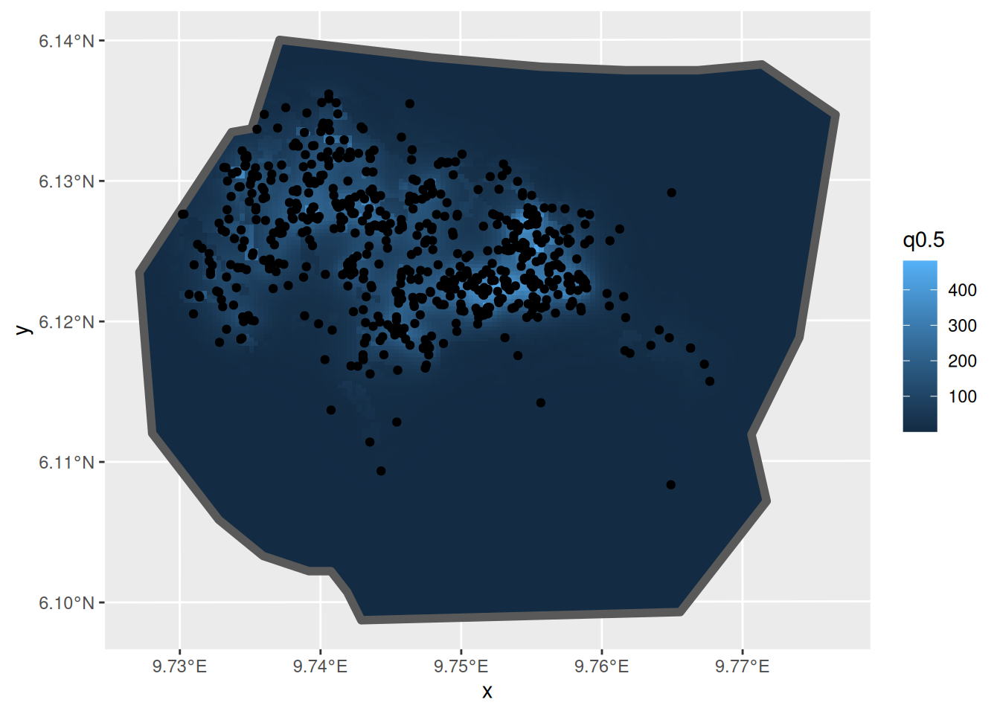

… and the expected integrated intensity (mean of abundance)

``` r

Lambda_veg_field <- predict(
  fit_veg_field,
  fm_int(mesh_int, boundary),
  ~ sum(weight * exp(field + vegetation))
)
Lambda_veg_field
#>       mean       sd   q0.025     q0.5   q0.975   median mean.mc_std_err
#> 1 693.8811 26.84132 653.4034 691.6396 756.2148 691.6396        3.098576
#>   sd.mc_std_err
#> 1       2.07222
```

Look at the contributions to the linear predictor from the SPDE and from
vegetation:

``` r

lp_veg_field <- predict(fit_veg_field, pred.df, ~ list(
  smooth_veg = field + vegetation,
  smooth = field,
  veg = vegetation
))
```

The function `scale_fill_gradientn` sets the scale for the plot legend.
Here we set it to span the range of the three linear predictor
components being plotted (medians are plotted by default).

``` r

lprange <- range(
  lp_veg_field$smooth_veg$median,
  lp_veg_field$smooth$median,
  lp_veg_field$veg$median
)
csc <- scale_fill_gradientn(colours = brewer.pal(9, "YlOrRd"), limits = lprange)

plot.lp_veg_field <- ggplot() +
  gg(lp_veg_field$smooth_veg, geom = "tile") +
  csc +
  gg(boundary, alpha = 0) +
  ggtitle("field + vegetation")

plot.lp_veg_field.spde <- ggplot() +
  gg(lp_veg_field$smooth, geom = "tile") +
  csc +
  gg(boundary, alpha = 0) +
  ggtitle("field")

plot.lp_veg_field.veg <- ggplot() +
  gg(lp_veg_field$veg, geom = "tile") +
  csc +
  gg(boundary, alpha = 0) +
  ggtitle("vegetation")

(plot.lp_veg_field + plot.lp_veg_field.spde + plot.lp_veg_field.veg) +
  plot_layout(ncol = 3, guides = "collect") &
  guides(fill = guide_legend("value")) &
  theme(legend.position = "right")
```

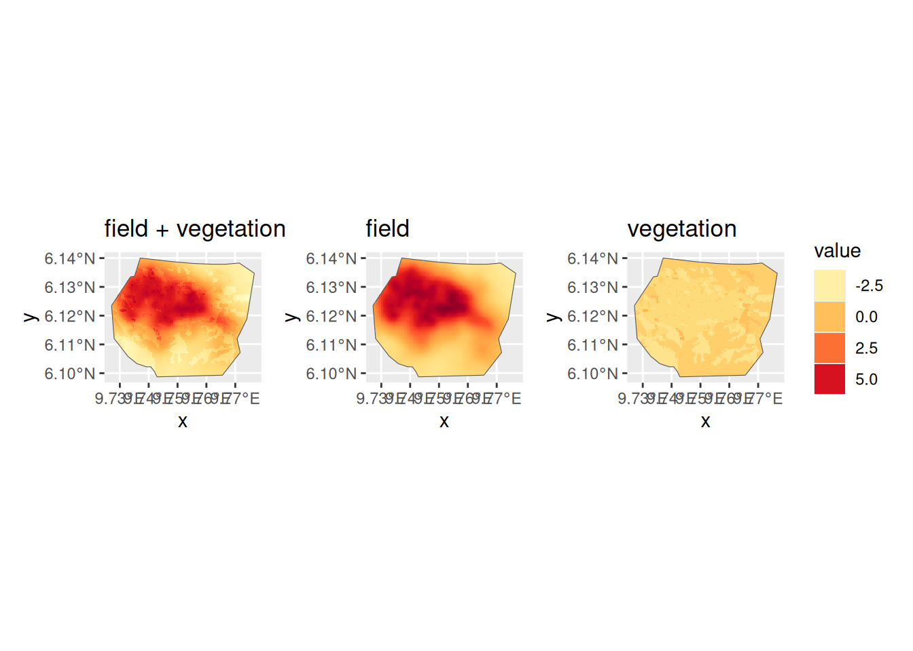

#### A model with SPDE only

Do we need vegetation at all? Fit a model with only an SPDE + Intercept,
and choose between models on the basis of DIC, using
[`deltaIC()`](https://inlabru-org.github.io/inlabru/reference/deltaIC.md).

``` r

comp_field <- geometry ~ field(geometry, model = pcmatern) + Intercept(1)
fit_field <- lgcp(comp_field,
  data = nests,
  samplers = boundary,
  domain = list(geometry = mesh_int),
  options = list(control.compute(dic = TRUE))
)
```

``` r

intensity_field <- predict(fit_field, pred.df, ~ exp(field + Intercept))

ggplot() +
  gg(intensity_field, geom = "tile") +
  gg(boundary, alpha = 0) +
  gg(nests)
```

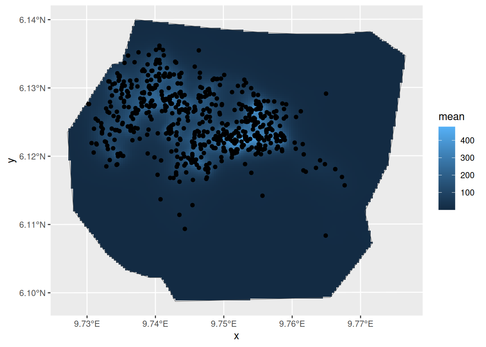

``` r

Lambda_field <- predict(
  fit_field,
  fm_int(mesh_int, boundary),
  ~ sum(weight * exp(field + Intercept))
)
Lambda_field
#>       mean       sd   q0.025     q0.5   q0.975   median mean.mc_std_err
#> 1 697.8443 31.31112 634.5819 698.0781 753.7081 698.0781        3.539308
#>   sd.mc_std_err
#> 1      2.040983
```

``` r

knitr::kable(deltaIC(fit_veg, fit_veg_field, fit_field, criterion = c("DIC")))
```

| Model         |       DIC | Delta.DIC |
|:--------------|----------:|----------:|
| fit_veg_field | -4897.277 |   0.00000 |
| fit_field     | -4876.514 |  20.76282 |
| fit_veg       | -3945.309 | 951.96773 |

New experimental definitions:

``` r

IC_veg <- lgcp_IC(
  fit_veg,
  data = nests,
  predictor = vegetation,
  domain = list(geometry = mesh_int),
  samplers = cvpart
)
IC_veg_field <- lgcp_IC(
  fit_veg_field,
  data = nests,
  predictor = vegetation + field,
  domain = list(geometry = mesh_int),
  samplers = cvpart
)
IC_field <- lgcp_IC(
  fit_field,
  data = nests,
  predictor = field + Intercept,
  domain = list(geometry = mesh_int),
  samplers = cvpart
)
IC_data <- rbind(
  cbind(IC_veg, Model = "veg"),
  cbind(IC_veg_field, Model = "veg + field"),
  cbind(IC_field, Model = "field")
)
knitr::kable(IC_data |>
  dplyr::arrange(Criterion, Method, Model))
```

| Criterion | Method | lppd | p_eff | IC | lppd.std_err | p_eff.std_err | IC.std_err | Model |
|:---|:---|---:|---:|---:|---:|---:|---:|:---|
| DIC | INLA | 2547.125 | 108.867457 | -4876.514 | NA | NA | NA | field |
| DIC | INLA | 1978.534 | 5.879491 | -3945.309 | NA | NA | NA | veg |
| DIC | INLA | 2558.934 | 110.295110 | -4897.277 | NA | NA | NA | veg + field |
| DIC | Limit | 2555.073 | 277.976437 | -4554.193 | 0.7162814 | 9.2935630 | 20.0196886 | field |
| DIC | Limit | 1998.467 | 6.139971 | -3984.655 | 0.5865991 | 0.3520323 | 1.8772629 | veg |
| DIC | Limit | 2567.577 | 291.946055 | -4551.262 | 0.7162825 | 10.9132572 | 23.2590793 | veg + field |
| DIC_adjusted | INLA | 2566.998 | 108.867457 | -4916.261 | NA | NA | NA | field |
| DIC_adjusted | INLA | 1998.408 | 5.879491 | -3985.057 | NA | NA | NA | veg |
| DIC_adjusted | INLA | 2578.807 | 110.295110 | -4937.024 | NA | NA | NA | veg + field |
| WAIC | Blockwise | 2409.438 | 35.009616 | -4748.856 | 0.0859700 | 0.4281899 | 1.0283200 | field |
| WAIC | Blockwise | 2121.992 | 11.675990 | -4220.633 | 0.0950495 | 0.0933871 | 0.3768733 | veg |
| WAIC | Blockwise | 2409.988 | 34.389048 | -4751.198 | 0.0851305 | 0.7331737 | 1.6366086 | veg + field |
| WAIC | INLA | 2549.956 | 115.856274 | -4868.199 | NA | NA | NA | field |
| WAIC | INLA | 1978.842 | 6.502851 | -3944.678 | NA | NA | NA | veg |
| WAIC | INLA | 2562.992 | 120.025081 | -4885.933 | NA | NA | NA | veg + field |
| WAIC | Limit | 2555.073 | 86.364276 | -4937.417 | 0.7162814 | 0.1415581 | 1.7156789 | field |
| WAIC | Limit | 1998.467 | 5.972027 | -3984.991 | 0.5865991 | 0.0231775 | 1.2195532 | veg |
| WAIC | Limit | 2567.577 | 88.607722 | -4957.939 | 0.7162825 | 0.1414027 | 1.7153703 | veg + field |
| WAIC_adjusted | INLA | 2569.829 | 115.856274 | -4907.946 | NA | NA | NA | field |
| WAIC_adjusted | INLA | 1998.716 | 6.502851 | -3984.425 | NA | NA | NA | veg |
| WAIC_adjusted | INLA | 2582.865 | 120.025081 | -4925.681 | NA | NA | NA | veg + field |

#### CV and SPDE parameters for Model 2

We are going with Model `fit_veg_field`. Lets look at the spatial
distribution of the coefficient of variation

``` r

ggplot() +
  gg(intensity_veg_field, aes(fill = sd / mean), geom = "tile") +
  gg(boundary, alpha = 0) +
  gg(nests)
```

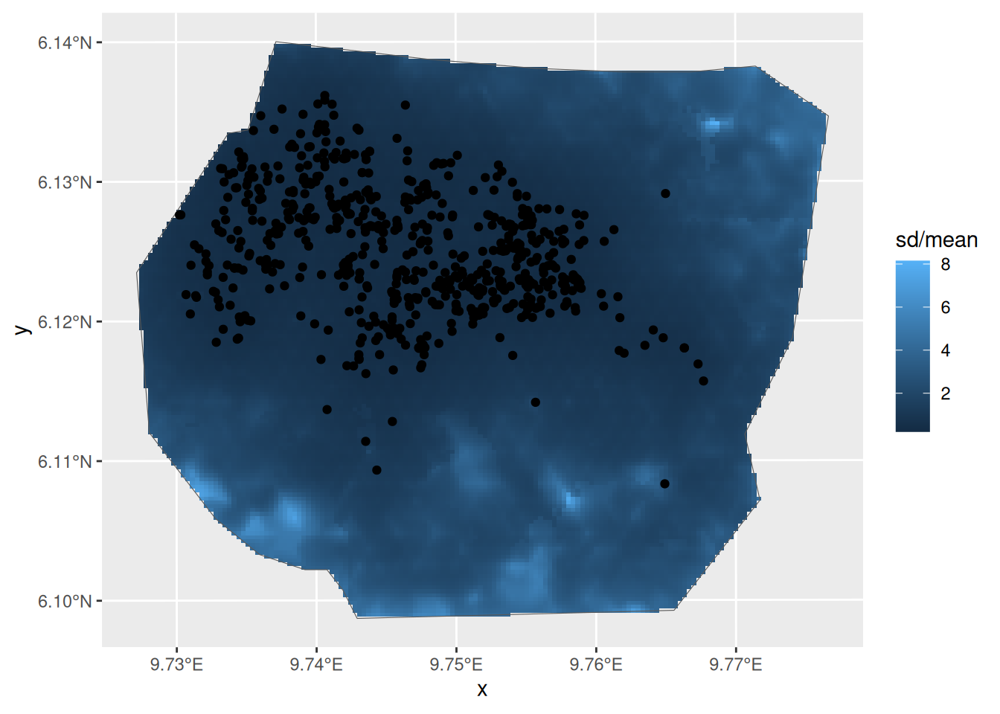

Plot the vegetation “fixed effect” posteriors. First get their names -
from `$marginals.random$vegetation` of the fitted object, which contains
the fixed effect marginal distribution data

``` r

flist <- vector("list", NROW(fit_veg_field$summary.random$vegetation))
for (i in seq_along(flist)) {
  flist[[i]] <- plot(fit_veg_field, "vegetation", index = i)
  flist_combined <- if (i == 1) flist[[i]] else flist_combined + flist[[i]]
}
flist_combined +
  plot_layout(ncol = 3, guides = "collect")
```

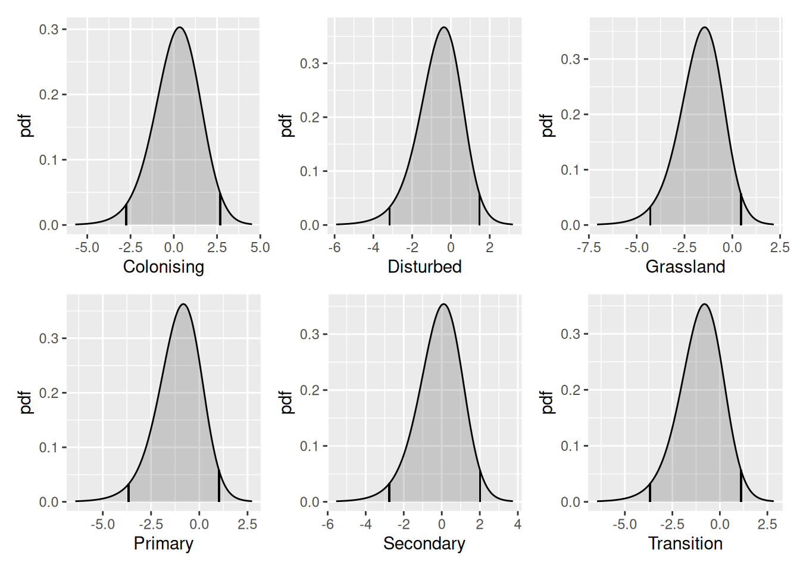

Use
[`spde.posterior( )`](https://inlabru-org.github.io/inlabru/reference/spde.posterior.md)
to obtain and then plot the SPDE parameter posteriors and the Matern
correlation and covariance functions for this model.

``` r

spde.range <- spde.posterior(fit_veg_field, "field", what = "range")
spde.logvar <- spde.posterior(fit_veg_field, "field", what = "log.variance")
range.plot <- plot(spde.range)
var.plot <- plot(spde.logvar)
(range.plot / var.plot)
```


``` r


corplot <-
  plot(spde.posterior(fit_veg_field, "field", what = "matern.correlation"))
covplot <-
  plot(spde.posterior(fit_veg_field, "field", what = "matern.covariance"))
(covplot / corplot)
```


## Continuous covariates

Now lets try a model with elevation as a (continuous) explanatory
variable. (First centre elevations for more stable fitting.)

``` r

elev <- gcov$elevation
elev <- elev - mean(terra::values(elev), na.rm = TRUE)

ggplot() +
  gg(elev, geom = "tile") +
  gg(boundary, alpha = 0)
```

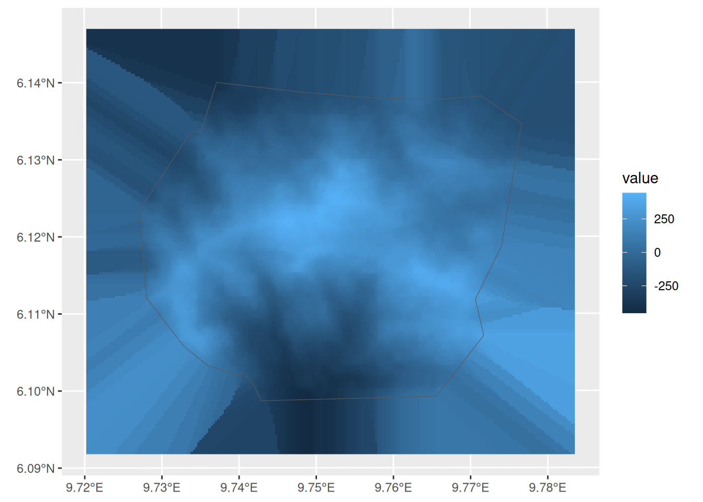

The elevation variable here is of class ‘SpatRaster’, that can be
handled in the same way as the vegetation covariate, with automatic
evaluation via an
[`eval_spatial()`](https://inlabru-org.github.io/inlabru/reference/eval_spatial.md)
method. However, since in some cases data may be stored differently,
other methods are needed to access the stored values, or there’s some
post-processing to be done. In such cases, we can define a function that
knows how to evaluate the covariate at arbitrary points in the survey
region, and call that function in the component definition. The method
[`eval_spatial()`](https://inlabru-org.github.io/inlabru/reference/eval_spatial.md)
is the method that handles this automatically, and supports `terra`
`SpatRaster` and `sf` geometry points objects, and mismatching
coordinate systems as well. In the following evaluator example function,
we only add infilling of missing values as a post-processing step.

``` r

# Note: this method is usually not needed; the automatic invocation of
# `eval_spatial()` method by the component input evaluator is usually
# sufficient.
f.elev <- function(where) {
  # Extract the values
  v <- eval_spatial(elev, where, layer = "elevation")
  # Fill in missing values; this example would work for
  # SpatialPixelsDataFrame data
  # if (anyNA(v)) {
  #   v <- bru_fill_missing(elev, where, v)
  # }
  v
}
```

For brevity we are not going to consider models with elevation only,
with elevation and a SPDE, and with SPDE only. We will just fit one with
elevation and SPDE. We create our model to pass to lgcp thus:

``` r

matern <- inla.spde2.pcmatern(mesh,
  prior.sigma = c(1, 0.01),
  prior.range = c(0.1, 0.01)
)

comp_elev_field <- geometry ~ elev(f.elev(.data.), model = "linear") +
  field(geometry, model = matern) + Intercept(1)
```

Note how the elevation effect is defined. We could alternatively use the
`terra` grid object directly (causing `inlabru` to automatically call
[`eval_spatial()`](https://inlabru-org.github.io/inlabru/reference/eval_spatial.md)),
like in the vegetation case: we specified it like

``` r

elev(elev, model = "factor_full")
```

whereas with the special function method we specify the covariate like
this:

``` r

elev(f.elev(.data.), model = "linear")
```

Most applications can use the automatic method, and the special function
method is included only as an example of how to handle more complex
cases.

We also now include an intercept term in the model.

The model is fitted in the usual way:

``` r

fit_elev_field <- lgcp(comp_elev_field, nests,
  samplers = boundary,
  domain = list(geometry = mesh_int)
)
```

Summary and model selection

``` r

summary(fit_elev_field)
#> inlabru version: 2.15.0 
#> INLA version: 26.06.08 
#> Latent components:
#> elev: main = linear(f.elev(.data.))
#> field: main = spde(geometry)
#> Intercept: main = linear(1)
#> Observation models:
#>   Model tag: <No tag>
#>     Family: 'cp'
#>     Data class: 'sf', 'tbl_df', 'tbl', 'data.frame'
#>     Response class: 'numeric'
#>     Predictor: geometry ~ elev + field + Intercept
#>     Additive/Linear/Rowwise: TRUE/TRUE/TRUE
#>     Used components: effect[elev, field, Intercept], latent[] 
#> Time used:
#>     Pre = 0.265, Running = 3.4, Post = 0.166, Total = 3.83 
#> Fixed effects:
#>             mean    sd 0.025quant 0.5quant 0.975quant   mode kld
#> elev       0.003 0.002      0.000    0.003      0.006  0.003   0
#> Intercept -0.609 1.024     -2.877   -0.530      1.181 -0.382   0
#> 
#> Random effects:
#>   Name     Model
#>     field SPDE2 model
#> 
#> Model hyperparameters:
#>                 mean    sd 0.025quant 0.5quant 0.975quant mode
#> Range for field 1.85 0.371       1.25     1.81       2.70 1.72
#> Stdev for field 2.22 0.329       1.66     2.19       2.95 2.13
#> 
#> Deviance Information Criterion (DIC) ...............: -4877.04
#> Deviance Information Criterion (DIC, saturated) ....: 320147.32
#> Effective number of parameters .....................: 111.41
#> 
#> Watanabe-Akaike information criterion (WAIC) ...: -4868.25
#> Effective number of parameters .................: 118.78
#> 
#> Marginal log-Likelihood:  2370.48 
#>  is computed 
#> Posterior summaries for the linear predictor and the fitted values are computed
#> (Posterior marginals needs also 'control.compute=list(return.marginals.predictor=TRUE)')
deltaIC(fit_veg, fit_veg_field, fit_field, fit_elev_field)
#>            Model       DIC Delta.DIC
#> 1  fit_veg_field -4897.277   0.00000
#> 2 fit_elev_field -4877.038  20.23912
#> 3      fit_field -4876.514  20.76282
#> 4        fit_veg -3945.309 951.96773
```

New definitions:

``` r

IC_elev_field <- lgcp_IC(
  fit_elev_field,
  data = nests,
  predictor = elev + field + Intercept,
  domain = list(geometry = mesh_int),
  samplers = cvpart
)
IC_data <- rbind(IC_data, cbind(IC_elev_field, Model = "elev + field"))
knitr::kable(IC_data |> dplyr::arrange(Criterion, Method, Model))
```

| Criterion | Method | lppd | p_eff | IC | lppd.std_err | p_eff.std_err | IC.std_err | Model |
|:---|:---|---:|---:|---:|---:|---:|---:|:---|
| DIC | INLA | 2549.924 | 111.405421 | -4877.038 | NA | NA | NA | elev + field |
| DIC | INLA | 2547.125 | 108.867457 | -4876.514 | NA | NA | NA | field |
| DIC | INLA | 1978.534 | 5.879491 | -3945.309 | NA | NA | NA | veg |
| DIC | INLA | 2558.934 | 110.295110 | -4897.277 | NA | NA | NA | veg + field |
| DIC | Limit | 2558.447 | 280.293693 | -4556.307 | 0.7222690 | 9.1449199 | 19.7343779 | elev + field |
| DIC | Limit | 2555.073 | 277.976437 | -4554.193 | 0.7162814 | 9.2935630 | 20.0196886 | field |
| DIC | Limit | 1998.467 | 6.139971 | -3984.655 | 0.5865991 | 0.3520323 | 1.8772629 | veg |
| DIC | Limit | 2567.577 | 291.946055 | -4551.262 | 0.7162825 | 10.9132572 | 23.2590793 | veg + field |
| DIC_adjusted | INLA | 2569.798 | 111.405421 | -4916.785 | NA | NA | NA | elev + field |
| DIC_adjusted | INLA | 2566.998 | 108.867457 | -4916.261 | NA | NA | NA | field |
| DIC_adjusted | INLA | 1998.408 | 5.879491 | -3985.057 | NA | NA | NA | veg |
| DIC_adjusted | INLA | 2578.807 | 110.295110 | -4937.024 | NA | NA | NA | veg + field |
| WAIC | Blockwise | 2409.727 | 35.005531 | -4749.444 | 0.0856589 | 0.3797570 | 0.9308318 | elev + field |
| WAIC | Blockwise | 2409.438 | 35.009616 | -4748.856 | 0.0859700 | 0.4281899 | 1.0283200 | field |
| WAIC | Blockwise | 2121.992 | 11.675990 | -4220.633 | 0.0950495 | 0.0933871 | 0.3768733 | veg |
| WAIC | Blockwise | 2409.988 | 34.389048 | -4751.198 | 0.0851305 | 0.7331737 | 1.6366086 | veg + field |
| WAIC | INLA | 2552.901 | 118.775628 | -4868.250 | NA | NA | NA | elev + field |
| WAIC | INLA | 2549.956 | 115.856274 | -4868.199 | NA | NA | NA | field |
| WAIC | INLA | 1978.842 | 6.502851 | -3944.678 | NA | NA | NA | veg |
| WAIC | INLA | 2562.992 | 120.025081 | -4885.933 | NA | NA | NA | veg + field |
| WAIC | Limit | 2558.447 | 88.429743 | -4940.035 | 0.7222690 | 0.1445588 | 1.7336557 | elev + field |
| WAIC | Limit | 2555.073 | 86.364276 | -4937.417 | 0.7162814 | 0.1415581 | 1.7156789 | field |
| WAIC | Limit | 1998.467 | 5.972027 | -3984.991 | 0.5865991 | 0.0231775 | 1.2195532 | veg |
| WAIC | Limit | 2567.577 | 88.607722 | -4957.939 | 0.7162825 | 0.1414027 | 1.7153703 | veg + field |
| WAIC_adjusted | INLA | 2572.775 | 118.775628 | -4907.998 | NA | NA | NA | elev + field |
| WAIC_adjusted | INLA | 2569.829 | 115.856274 | -4907.946 | NA | NA | NA | field |
| WAIC_adjusted | INLA | 1998.716 | 6.502851 | -3984.425 | NA | NA | NA | veg |
| WAIC_adjusted | INLA | 2582.865 | 120.025081 | -4925.681 | NA | NA | NA | veg + field |

``` r

knitr::kable(
  IC_data |>
    delta_IC() |>
    dplyr::select(
      Method, Criterion, lppd, p_eff, IC, Delta_IC, IC.std_err, Model
    )
)
```

| Method | Criterion | lppd | p_eff | IC | Delta_IC | IC.std_err | Model |
|:---|:---|---:|---:|---:|---:|---:|:---|
| INLA | DIC | 2558.934 | 110.295110 | -4897.277 | 0.000000 | NA | veg + field |
| INLA | DIC | 2549.924 | 111.405421 | -4877.038 | 20.239117 | NA | elev + field |
| INLA | DIC | 2547.125 | 108.867457 | -4876.514 | 20.762818 | NA | field |
| INLA | DIC | 1978.534 | 5.879491 | -3945.309 | 951.967729 | NA | veg |
| Limit | DIC | 2558.447 | 280.293693 | -4556.307 | 0.000000 | 19.7343779 | elev + field |
| Limit | DIC | 2555.073 | 277.976437 | -4554.193 | 2.113799 | 20.0196886 | field |
| Limit | DIC | 2567.577 | 291.946055 | -4551.262 | 5.044637 | 23.2590793 | veg + field |
| Limit | DIC | 1998.467 | 6.139971 | -3984.655 | 571.651762 | 1.8772629 | veg |
| INLA | DIC_adjusted | 2578.807 | 110.295110 | -4937.024 | 0.000000 | NA | veg + field |
| INLA | DIC_adjusted | 2569.798 | 111.405421 | -4916.785 | 20.239117 | NA | elev + field |
| INLA | DIC_adjusted | 2566.998 | 108.867457 | -4916.261 | 20.762818 | NA | field |
| INLA | DIC_adjusted | 1998.408 | 5.879491 | -3985.057 | 951.967729 | NA | veg |
| Blockwise | WAIC | 2409.988 | 34.389048 | -4751.198 | 0.000000 | 1.6366086 | veg + field |
| Blockwise | WAIC | 2409.727 | 35.005531 | -4749.444 | 1.754413 | 0.9308318 | elev + field |
| Blockwise | WAIC | 2409.438 | 35.009616 | -4748.856 | 2.342097 | 1.0283200 | field |
| Blockwise | WAIC | 2121.992 | 11.675990 | -4220.633 | 530.565306 | 0.3768733 | veg |
| INLA | WAIC | 2562.992 | 120.025081 | -4885.933 | 0.000000 | NA | veg + field |
| INLA | WAIC | 2552.901 | 118.775628 | -4868.250 | 17.682901 | NA | elev + field |
| INLA | WAIC | 2549.956 | 115.856274 | -4868.199 | 17.734570 | NA | field |
| INLA | WAIC | 1978.842 | 6.502851 | -3944.678 | 941.255206 | NA | veg |
| Limit | WAIC | 2567.577 | 88.607722 | -4957.939 | 0.000000 | 1.7153703 | veg + field |
| Limit | WAIC | 2558.447 | 88.429743 | -4940.035 | 17.904129 | 1.7336557 | elev + field |
| Limit | WAIC | 2555.073 | 86.364276 | -4937.417 | 20.521506 | 1.7156789 | field |
| Limit | WAIC | 1998.467 | 5.972027 | -3984.991 | 972.947903 | 1.2195532 | veg |
| INLA | WAIC_adjusted | 2582.865 | 120.025081 | -4925.681 | 0.000000 | NA | veg + field |
| INLA | WAIC_adjusted | 2572.775 | 118.775628 | -4907.998 | 17.682901 | NA | elev + field |
| INLA | WAIC_adjusted | 2569.829 | 115.856274 | -4907.946 | 17.734570 | NA | field |
| INLA | WAIC_adjusted | 1998.716 | 6.502851 | -3984.425 | 941.255206 | NA | veg |

Predict and plot the density

``` r

pred_elev_field <- predict(
  fit_elev_field,
  pred.df,
  ~ list(
    int = exp(field + elev + Intercept),
    int.log = field + elev + Intercept
  )
)

p1 <- ggplot() +
  gg(pred_elev_field$int, aes(fill = log(sd)), geom = "tile") +
  gg(boundary, alpha = 0) +
  gg(nests, shape = "+")
p2 <- ggplot() +
  gg(pred_elev_field$int.log, aes(fill = exp(mean + sd^2 / 2)), geom = "tile") +
  gg(boundary, alpha = 0) +
  gg(nests, shape = "+")
(p1 | p2)
```

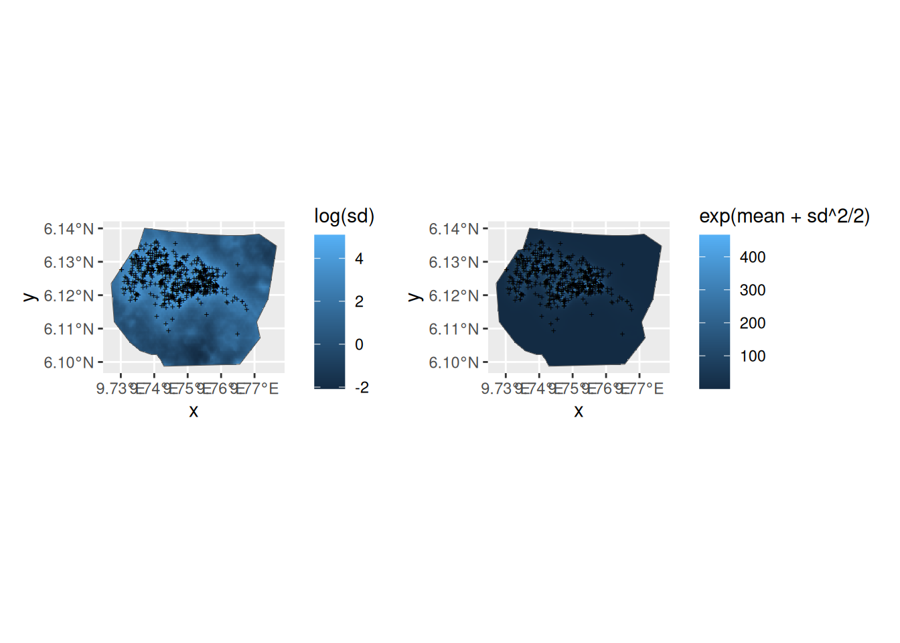

Now look at the elevation and SPDE effects in space. Leave out the
Intercept because it swamps the spatial effects of elevation and the
SPDE in the plots and we are interested in comparing the effects of
elevation and the SPDE.

First we need to predict on the linear predictor scale.

``` r

lp_elev_field <- predict(
  fit_elev_field,
  pred.df,
  ~ list(
    smooth_elev = field + elev,
    elev = elev,
    smooth = field
  )
)
```

The code below, which is very similar to that used for the vegetation
factor variable, produces the plots we want.

``` r

lprange <- range(
  lp_elev_field$smooth_elev$mean,
  lp_elev_field$elev$mean,
  lp_elev_field$smooth$mean
)

library(RColorBrewer)
csc <- scale_fill_gradientn(colours = brewer.pal(9, "YlOrRd"), limits = lprange)

plot.lp_elev_field <- ggplot() +
  gg(lp_elev_field$smooth_elev, mask = boundary, geom = "tile") +
  csc +
  theme(legend.position = "bottom") +
  gg(boundary, alpha = 0) +
  ggtitle("SPDE + elevation")

plot.lp_elev_field.spde <- ggplot() +
  gg(lp_elev_field$smooth, mask = boundary, geom = "tile") +
  csc +
  gg(boundary, alpha = 0) +
  ggtitle("SPDE")

plot.lp_elev_field.elev <- ggplot() +
  gg(lp_elev_field$elev, mask = boundary, geom = "tile") +
  csc +
  gg(boundary, alpha = 0) +
  ggtitle("elevation")

(plot.lp_elev_field + plot.lp_elev_field.spde + plot.lp_elev_field.elev) +
  plot_layout(ncol = 3, guides = "collect") &
  guides(fill = guide_legend("value")) &
  theme(legend.position = "right")
```

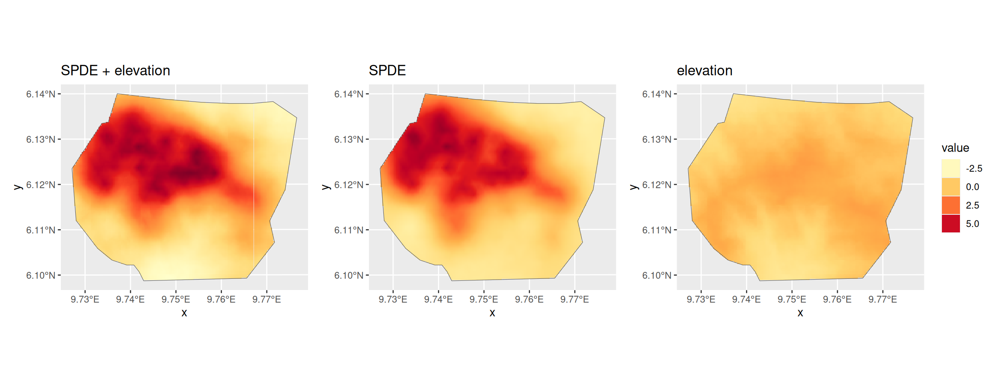

You might also want to look at the posteriors of the fixed effects and
of the SPDE. Adapt the code used for the vegetation factor to do this.

``` r

Lambda_elev_field <- predict(
  fit_elev_field,
  fm_int(mesh_int, boundary),
  ~ sum(weight * exp(Intercept + elev + field))
)
Lambda_elev_field
#>       mean       sd   q0.025     q0.5   q0.975   median mean.mc_std_err
#> 1 695.5474 29.34504 636.4544 697.4044 753.2339 697.4044          3.3367
#>   sd.mc_std_err
#> 1       2.01098
```

``` r

flist <- vector("list", NROW(fit_elev_field$summary.fixed))
for (i in seq_along(flist)) {
  flist[[i]] <- plot(fit_elev_field, rownames(fit_elev_field$summary.fixed)[i])
  flist_combined <- if (i == 1) flist[[i]] else flist_combined + flist[[i]]
}
flist_combined +
  plot_layout(ncol = 2, guides = "collect")
```

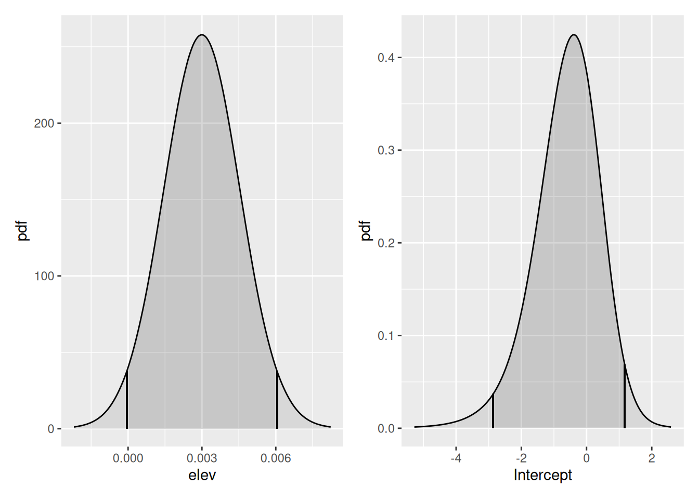

Plot the SPDE parameter posteriors and the Matern correlation and
covariance functions for this model.

``` r

spde.range <- spde.posterior(fit_elev_field, "field", what = "range")
spde.logvar <- spde.posterior(fit_elev_field, "field", what = "log.variance")
range.plot <- plot(spde.range)
var.plot <- plot(spde.logvar)
(range.plot / var.plot)
```

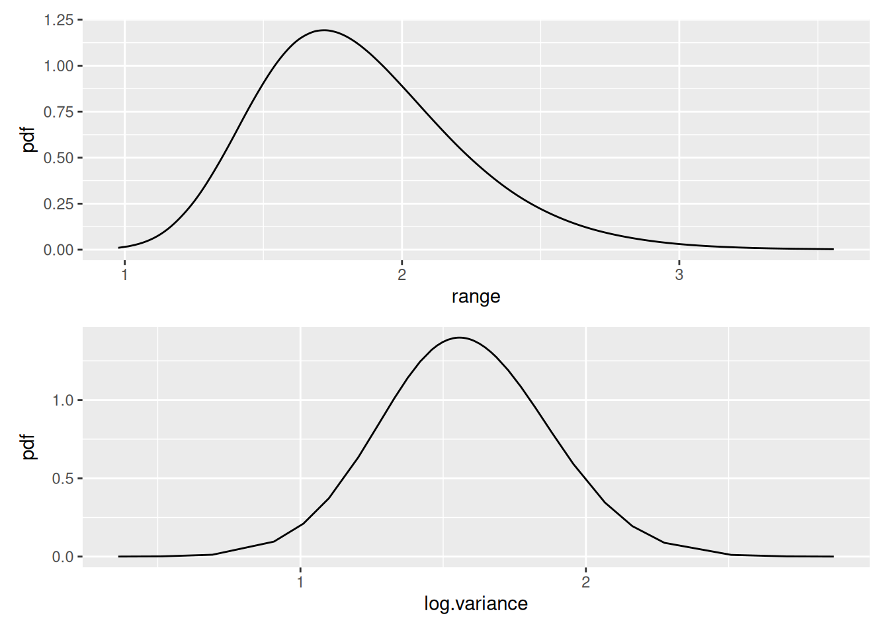

``` r


corplot <-
  plot(spde.posterior(fit_elev_field, "field", what = "matern.correlation"))
covplot <-
  plot(spde.posterior(fit_elev_field, "field", what = "matern.covariance"))
(covplot / corplot)
```

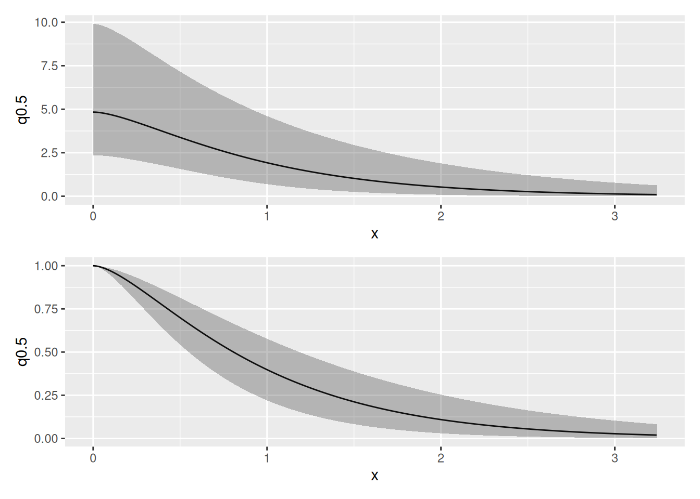

Also estimate abundance. The `data.frame` in the second call leads to
inclusion of `N` in the prediction object, for easier plotting.

``` r

Lambda_elev_field <- predict(
  fit_elev_field, fm_int(mesh_int, boundary),
  ~ sum(weight * exp(field + elev + Intercept))
)
Lambda_elev_field
#>       mean       sd   q0.025    q0.5   q0.975  median mean.mc_std_err
#> 1 695.0666 26.94285 650.0671 693.883 747.1842 693.883        3.020236
#>   sd.mc_std_err
#> 1      1.629755

Nest_elev_field <- predict(
  fit_elev_field,
  fm_int(mesh_int, boundary),
  ~ data.frame(
    N = 200:1000,
    density = dpois(200:1000,
      lambda = sum(weight * exp(field + elev + Intercept))
    )
  ),
  n.samples = 2000
)
```

Plot in the same way as in previous practicals

``` r

Nest_elev_field$plugin_estimate <-
  dpois(Nest_elev_field$N, lambda = Lambda_elev_field$median)
ggplot(data = Nest_elev_field) +
  geom_line(aes(x = N, y = mean, colour = "Posterior")) +
  geom_line(aes(x = N, y = plugin_estimate, colour = "Plugin"))
```

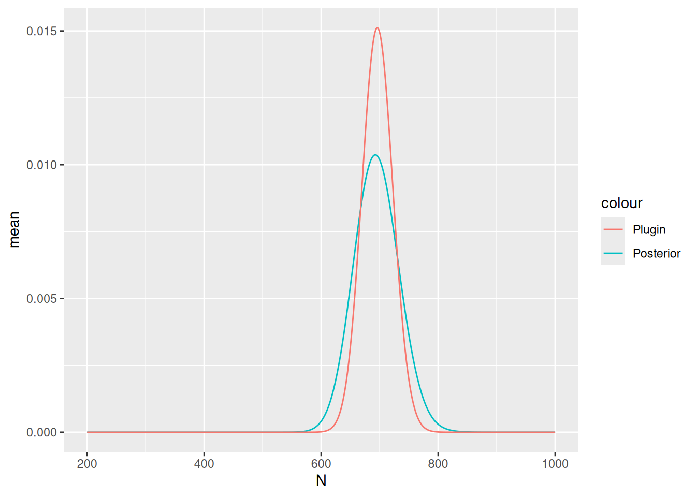

### Non-spatial evaluation of the covariate effect

The previous examples of posterior prediction focused on spatial
prediction. It is also possible to evaluate the effect of a covariate
directly, by bypassing the component definition input. This is done by
adding the suffix `_eval()` to the end of the component name in the
predictor expression, and supplying data that is sufficient for
evaluating , and supplying data needed by the input arguments to this
function, see
[`bru_comp_eval()`](https://inlabru-org.github.io/inlabru/reference/bru_comp_eval.md).

Note on backwards version support, starting with version `2.2.8` Prior
to version `2.8.0`, this feature required setting the `include` argument
to `character(0)` to disable normal component evaluation for all
components. From version `2.8.0`, `inlabru` automatically detects which
model components are used by the prediction expression, including the
use of component `_eval()` calls, making the `include` argument
unnecessary. From version `2.11.0`, the `include`, `exclude`, and
`include_latent` arguments have been deprecated in favour of the `used`
argument that takes input generated by
[`bru_used()`](https://inlabru-org.github.io/inlabru/reference/bru_used.md),
with a deprecation warning being generated from version `2.12.0.9003`.

Since the elevation effect in this model is linear, the resulting plot
isn’t very interesting, but the same method can be applied to non-linear
effects (e.g. “rw2”) as well, and combined into general R expressions.

``` r

elev.pred <- predict(
  fit_elev_field,
  data.frame(elevation = seq(0, 100, length.out = 1000)),
  formula = ~ elev_eval(elevation)
  # include = character(0) # Not needed from version 2.8.0
)

ggplot(elev.pred) +
  geom_line(aes(elevation, mean)) +
  geom_ribbon(
    aes(elevation,
      ymin = q0.025,
      ymax = q0.975
    ),
    alpha = 0.2
  ) +
  geom_ribbon(
    aes(elevation,
      ymin = mean - 1 * sd,
      ymax = mean + 1 * sd
    ),
    alpha = 0.2
  )
```

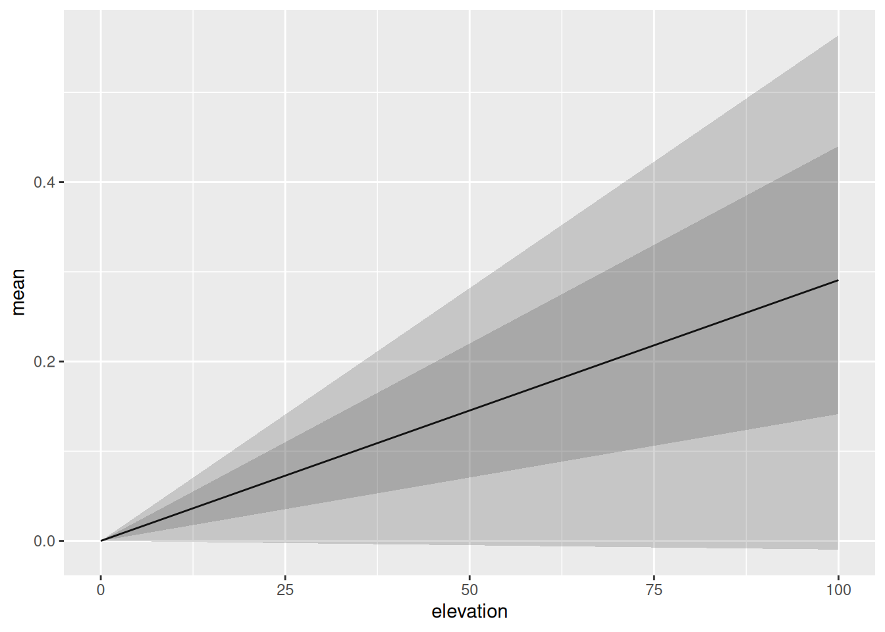

## A 1D Example

Try fitting a 1-dimensional model to the point data in the `inlabru`
dataset `Poisson2_1D`. This comes with a covariate function called
`cov2_1D`. Try to reproduce the plot below (used in lectures) showing
the effects of the `Intercept + z` and the `SPDE`. (You may find it
helpful to build on the model you fitted in the previous practical,
adding the covariate to the model specification.)

``` r

data(Poisson2_1D)
x <- seq(0, 55, length.out = 50)
mesh <- fm_mesh_1d(x, degree = 2, boundary = "free")

process_model <- inla.spde2.pcmatern(
  mesh,
  prior.sigma = c(1, 0.01),
  prior.range = c(5, 0.01),
  constr = TRUE
)
comp <- x ~
  z(cov2_1D(x), model = "linear") +
  smooth(x, model = process_model) +
  Intercept(1)

fitcov1D <- lgcp(comp,
  pts2,
  domain = list(x = mesh),
  samplers = tibble::tibble(x = cbind(0, 55))
)
pr.df <- data.frame(x = x)
prcov1D <- predict(
  fitcov1D,
  pr.df,
  ~ list(
    Intensity = exp(z + smooth + Intercept),
    z = exp(z + Intercept),
    smooth = exp(smooth)
  ),
  n.samples = 2000
)

ggplot() +
  gg(prcov1D$Intensity,
    aes(colour = "Intensity", fill = "Intensity"),
    alpha = 0.2,
    lwd = 1.25
  ) +
  gg(prcov1D$smooth,
    aes(colour = "Smooth", fill = "Smooth"),
    alpha = 0.2,
    lwd = 1.25
  ) +
  gg(prcov1D$z,
    aes(colour = "z-effect", fill = "z-effect"),
    alpha = 0.2,
    lwd = 1.25
  ) +
  geom_line(aes(x, lambda2_1D(x), colour = "True intensity"), lwd = 1.25) +
  geom_point(data = pts2, aes(x = x), y = 0.2, shape = "|", cex = 4) +
  xlab(quote(bold(s))) +
  ylab(quote(hat(lambda)(bold(s)) ~ ~"and its components")) +
  guides(colour = guide_legend("Quantity"), fill = "none")
```

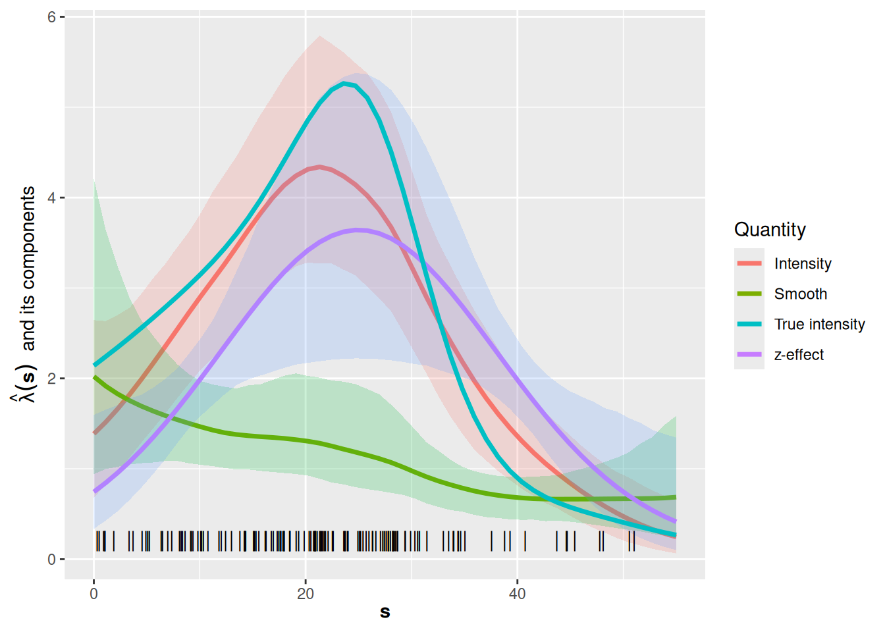
