# LGCPs - Distance sampling

## Introduction

We’re going to estimate distribution and abundance from a line transect
survey of dolphins in the Gulf of Mexico. These data are also available
in the `R` package `dsm` (where they go under the name `mexdolphins`).
In `inlabru` the data are called `mexdolphin_sf` for `sf` format, and
`sp` an format can be obtained using the
[`mexdolphin_sp()`](https://inlabru-org.github.io/inlabru/reference/mexdolphin_sf.md)
function.

## Setting things up

Load libraries

``` r

library(inlabru)
library(fmesher)
library(INLA)
library(ggplot2)
```

## Get the data

We’ll start by loading the data, renaming it, and extracting the mesh
(for convenience).

``` r

mexdolphin <- mexdolphin_sf
mesh <- mexdolphin$mesh
```

Plot the data (the initial code below is just to get rid of tick marks,
if desired)

``` r

noyticks <- theme(
  axis.text.y = element_blank(),
  axis.ticks = element_blank()
)

noxticks <- theme(
  axis.text.x = element_blank(),
  axis.ticks = element_blank()
)

ggplot() +
  gg(mexdolphin$ppoly) +
  gg(mexdolphin$samplers, color = "grey") +
  gg(mexdolphin$points, size = 0.2, alpha = 1) +
  theme(
    legend.key.width = unit(x = 0.2, "cm"),
    legend.key.height = unit(x = 0.3, "cm")
  ) +
  theme(legend.text = element_text(size = 6)) +
  coord_sf(datum = fm_crs(mexdolphin$ppoly))
```

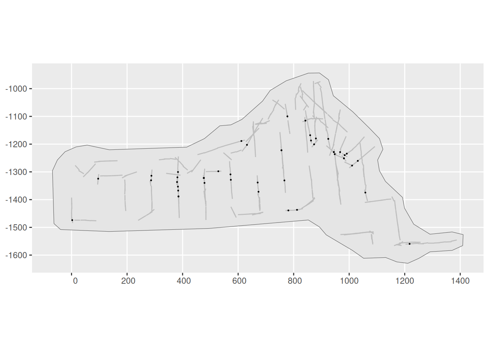

## Spatial model with a half-normal detection function

The `samplers` in this dataset are lines, not polygons, so we need to
tell `inlabru` about the strip half-width, `W`, which in the case of
these data is 8. We start by plotting the distances and histogram of
frequencies in distance intervals:

``` r

W <- 8
ggplot(mexdolphin$points) +
  geom_histogram(aes(x = distance),
    breaks = seq(0, W, length.out = 9),
    boundary = 0, fill = NA, color = "black"
  ) +
  geom_point(aes(x = distance), y = 0, pch = "|", cex = 4)
```

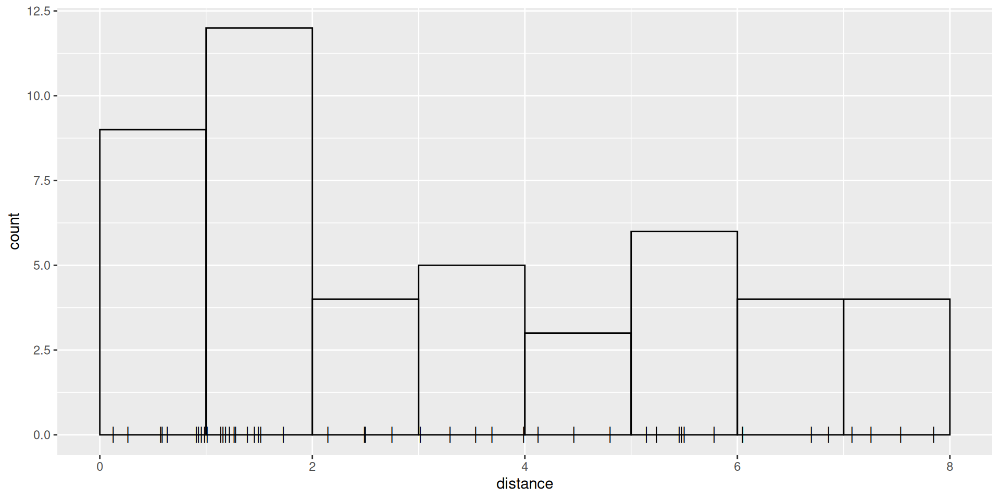

We need to define a half-normal detection probability function. This
must take distance as its first argument and the linear predictor of the
sigma parameter as its second:

``` r

hn <- function(distance, sigma) {
  exp(-0.5 * (distance / sigma)^2)
}
```

To control the prior distribution for the `sigma` parameter, we use a
transformation mapper that converts a N(0, 1) latent variable into an
exponentially distributed variable with expectation 8 (this is a
somewhat arbitrary value, but motivated by the maximum observation
distance `W`):

``` r

bm_marginal(qexp, pexp, dexp, rate = 1 / 8)
```

Specify and fit an SPDE model to these data using a half-normal
detection function form. We need to define a (Matérn) covariance
function for the SPDE:

``` r

matern <- inla.spde2.pcmatern(mexdolphin$mesh,
  prior.sigma = c(2, 0.01),
  prior.range = c(50, 0.01)
)
```

Here, the range is probabilistically limited by P(\text{range}\leq
50)=0.01 and the standard deviation of the spatial field is limited by
P(\text{sd}\geq 2)=0.01.

We need to now separately define the components of the model (the SPDE,
the Intercept and the detection function parameter `sigma`)

``` r

cmp <- ~ mySPDE(main = geometry, model = matern) +
  sigma(1,
    prec.linear = 1,
    marginal = bm_marginal(qexp, pexp, dexp, rate = 1 / 8)
  ) +
  Intercept(1)
```

The `marginal` argument in the `sigma` component specifies the
transformation function taking N(0,1) to Exponential(1/8).

The formula, which describes how these components are combined to form
the linear predictor (remembering that we need an offset due to the
unknown direction of the detections!):

``` r

form <- geometry + distance ~ mySPDE +
  log(hn(distance, sigma)) +
  Intercept + log(2)
```

Before version `2.9.0.9004`, a less compact approach had to be used, by
applying the transformation between N(0,1) and Exponential(1/8) directly
in the predictor expression, requiring corresponding adjustments to the
later [`predict()`](https://rdrr.io/r/stats/predict.html) calls, etc:

``` r

# sigma_transf <- function(x) {
#   bru_forward_transformation(qexp, x, rate = 1 / 8)
# }
# cmp <- ~ mySPDE(main = geometry, model = matern) +
#   sigma_theta(1, prec.linear = 1) +
#   Intercept(1)
# form <- geometry + distance ~ mySPDE +
#   log(hn(distance, sigma_transf(sigma_theta))) +
#   Intercept + log(2)
```

Then we fit the model, passing both the components and the formula
(previously the formula was constructed invisibly by `inlabru`), and
specify integration domains for the spatial and distance dimensions:

``` r

fit <- lgcp(
  components = cmp,
  is_rowwise = TRUE,
  data = mexdolphin$points,
  samplers = mexdolphin$samplers,
  domain = list(
    geometry = mesh,
    distance = fm_mesh_1d(seq(0, 8, length.out = 30))
  ),
  formula = form
)
```

Look at the SPDE parameter posteriors

``` r

spde.range <- spde.posterior(fit, "mySPDE", what = "range")
plot(spde.range)
```

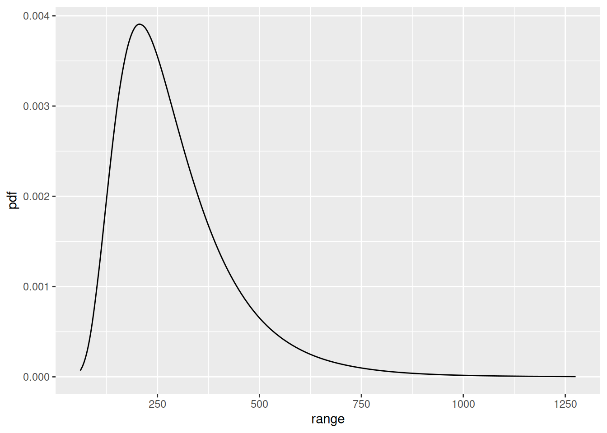

``` r

spde.logvar <- spde.posterior(fit, "mySPDE", what = "log.variance")
plot(spde.logvar)
```


Predict spatial intensity, and plot it:

``` r

pxl <- fm_pixels(mesh, dims = c(200, 100), mask = mexdolphin$ppoly)
pr.int <- predict(fit, pxl, ~ exp(mySPDE + Intercept))
```

``` r

ggplot() +
  gg(pr.int, geom = "tile") +
  gg(mexdolphin$ppoly, linewidth = 1, alpha = 0) +
  gg(mexdolphin$samplers, color = "grey") +
  gg(mexdolphin$points, size = 0.2, alpha = 1) +
  theme(
    legend.key.width = unit(x = 0.2, "cm"),
    legend.key.height = unit(x = 0.3, "cm")
  ) +
  theme(legend.text = element_text(size = 6))
```

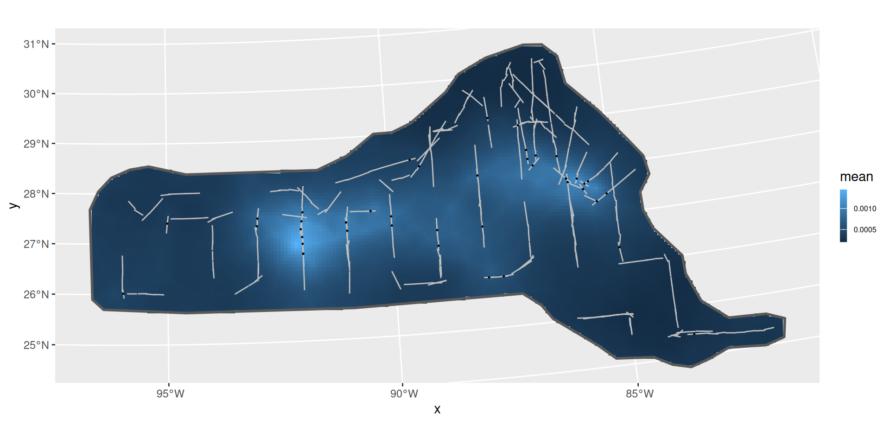

Predict the detection function and plot it, to generate a plot like the
one below. Here, we should make sure that it doesn’t try to evaluate the
effects of components that can’t be evaluated using the given input
data. From version 2.8.0, `inlabru` automatically detects which
components are involved. See
[`?predict.bru`](https://inlabru-org.github.io/inlabru/reference/predict.md)
for more information.

``` r

distdf <- data.frame(distance = seq(0, 8, length.out = 100))
dfun <- predict(fit, distdf, ~ hn(distance, sigma))
plot(dfun)
```

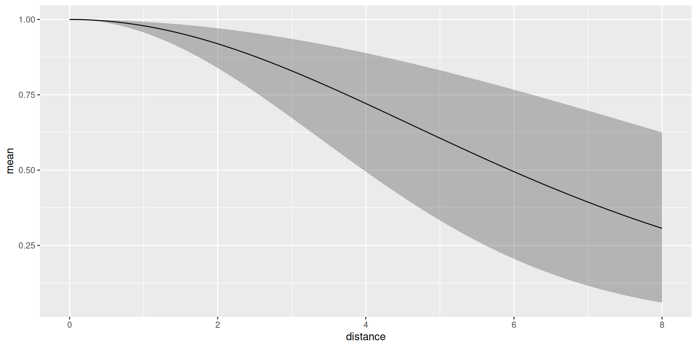
The average detection probability within the maximum detection distance
is estimated to be 0.6999319.

We can look at the posterior for expected number of dolphins as usual:

``` r

predpts <- fm_int(mexdolphin$mesh, mexdolphin$ppoly)
Lambda <- predict(fit, predpts, ~ sum(weight * exp(mySPDE + Intercept)))
Lambda
#>       mean       sd   q0.025     q0.5   q0.975   median mean.mc_std_err
#> 1 253.6056 59.87417 166.9217 255.2476 398.7837 255.2476        6.883002
#>   sd.mc_std_err
#> 1      4.477929
```

and including the randomness about the expected number. In this case, it
turns out that you need lots of posterior samples, e.g. 2,000 to smooth
out the Monte Carlo error in the posterior, and this takes a little
while to compute:

``` r

Ns <- seq(50, 450, by = 1)
Nest <- predict(fit, predpts,
  ~ data.frame(
    N = Ns,
    density = dpois(
      Ns,
      lambda = sum(weight * exp(mySPDE + Intercept))
    )
  ),
  n.samples = 2000
)

Nest <- dplyr::bind_rows(
  cbind(Nest, Method = "Posterior"),
  data.frame(
    N = Nest$N,
    mean = dpois(Nest$N, lambda = Lambda$mean),
    mean.mc_std_err = 0,
    Method = "Plugin"
  )
)
ggplot(data = Nest) +
  geom_line(aes(x = N, y = mean, colour = Method)) +
  geom_ribbon(
    aes(
      x = N,
      ymin = mean - 2 * mean.mc_std_err,
      ymax = mean + 2 * mean.mc_std_err,
      fill = Method,
    ),
    alpha = 0.2
  ) +
  geom_line(aes(x = N, y = mean, colour = Method)) +
  ylab("Probability mass function")
```

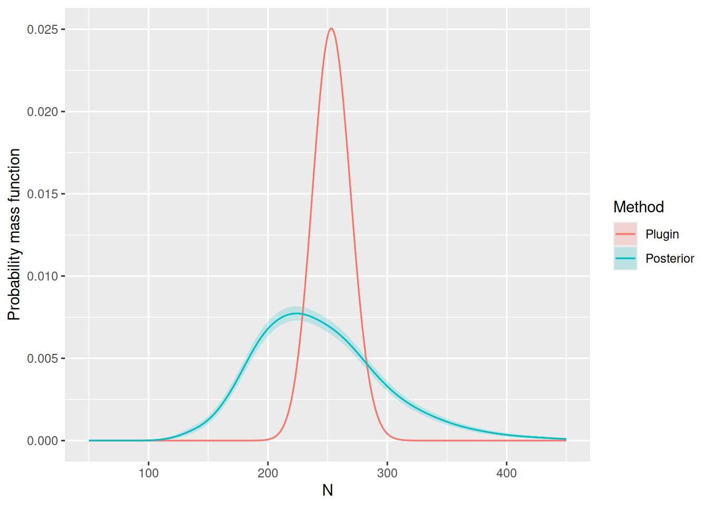

## Hazard-rate Detection Function

Try doing this all again, but use this hazard-rate detection function
model, with the same prior for the `sigma` parameter as for the
half-Normal model (such parameters aren’t always comparable, but in this
example it’s a reasonable choice):

``` r

hr <- function(distance, sigma) {
  1 - exp(-(distance / sigma)^-1)
}
```

Solution:

``` r

formula1 <- geometry + distance ~ mySPDE +
  log(hr(distance, sigma)) +
  Intercept + log(2)

fit1 <- lgcp(
  components = cmp,
  mexdolphin$points,
  samplers = mexdolphin$samplers,
  domain = list(
    geometry = mesh,
    distance = fm_mesh_1d(seq(0, 8, length.out = 30))
  ),
  formula = formula1
)
```

Plots:

``` r

spde.range <- spde.posterior(fit1, "mySPDE", what = "range")
plot(spde.range)
```


``` r

spde.logvar <- spde.posterior(fit1, "mySPDE", what = "log.variance")
plot(spde.logvar)
```

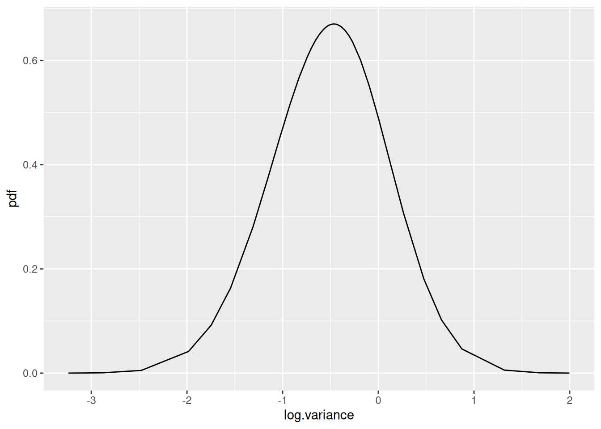

``` r

pr.int1 <- predict(fit1, pxl, ~ exp(mySPDE + Intercept))

ggplot() +
  gg(pr.int1, geom = "tile") +
  gg(mexdolphin$ppoly, linewidth = 1, alpha = 0) +
  gg(mexdolphin$samplers, color = "grey") +
  gg(mexdolphin$points, size = 0.2, alpha = 1) +
  theme(
    legend.key.width = unit(x = 0.2, "cm"),
    legend.key.height = unit(x = 0.3, "cm")
  ) +
  theme(legend.text = element_text(size = 6))
```

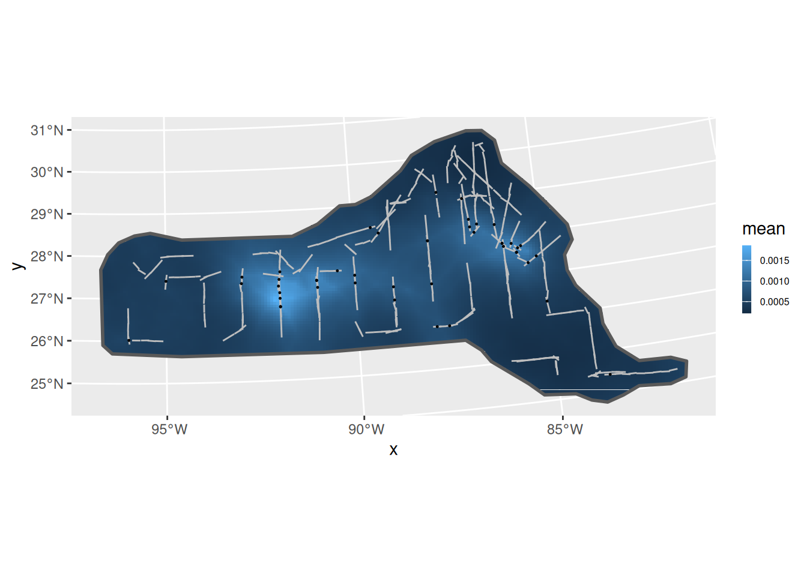

``` r

distdf <- data.frame(distance = seq(0, 8, length.out = 100))
dfun1 <- predict(fit1, distdf, ~ hr(distance, sigma))
plot(dfun1)
```

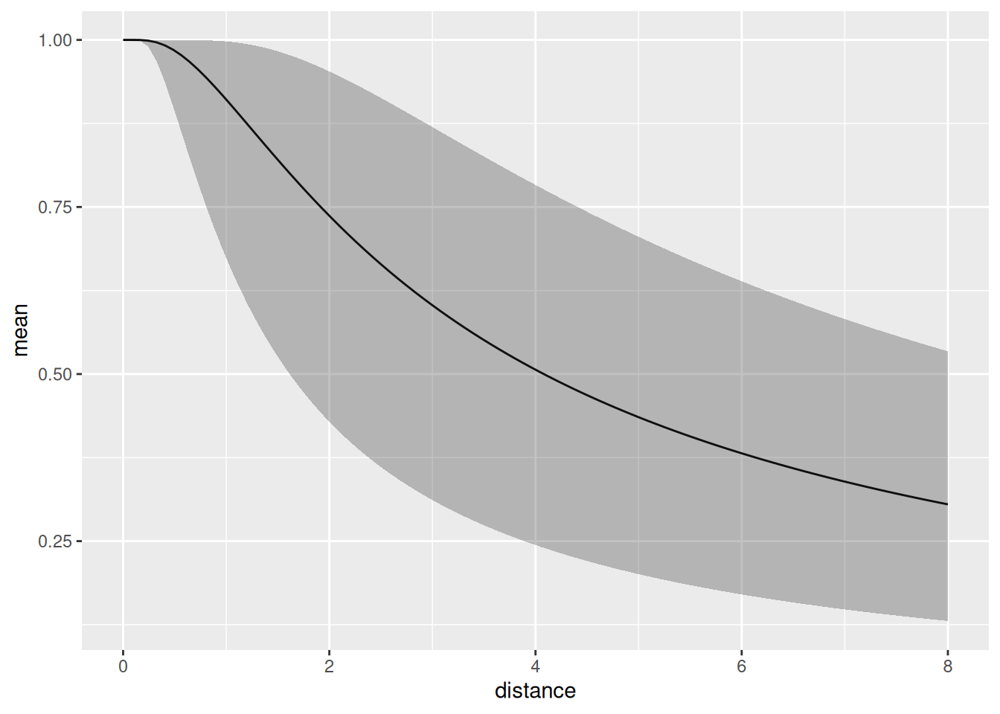

``` r

predpts <- fm_int(mexdolphin$mesh, mexdolphin$ppoly)
Lambda1 <- predict(fit1, predpts, ~ sum(weight * exp(mySPDE + Intercept)))
Lambda1
#>       mean       sd   q0.025     q0.5   q0.975   median mean.mc_std_err
#> 1 285.6374 74.31623 172.2163 286.0136 424.8881 286.0136        8.669447
#>   sd.mc_std_err
#> 1      6.189122
```

``` r

Ns <- seq(50, 650, by = 1)
Nest1 <- predict(
  fit1,
  predpts,
  ~ data.frame(
    N = Ns,
    density = dpois(
      Ns,
      lambda = sum(weight * exp(mySPDE + Intercept))
    )
  ),
  n.samples = 2000
)

Nest1 <- dplyr::bind_rows(
  cbind(Nest1, Method = "Posterior"),
  data.frame(
    N = Nest1$N,
    mean = dpois(Nest1$N, lambda = Lambda1$mean),
    mean.mc_std_err = 0,
    Method = "Plugin"
  )
)

ggplot(data = Nest1) +
  geom_line(aes(x = N, y = mean, colour = Method)) +
  geom_ribbon(
    aes(
      x = N,
      ymin = mean - 2 * mean.mc_std_err,
      ymax = mean + 2 * mean.mc_std_err,
      fill = Method
    ),
    alpha = 0.2
  ) +
  geom_line(aes(x = N, y = mean, colour = Method)) +
  ylab("Probability mass function")
```

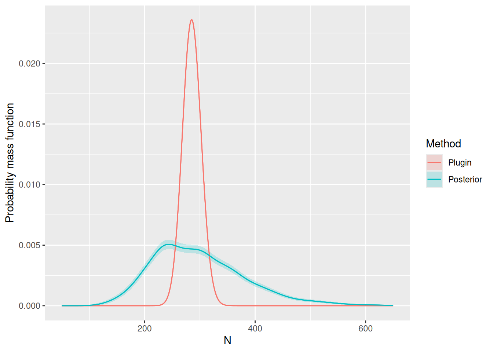

## Comparing the models

Look at the goodness-of-fit of the two models in the distance dimension

``` r

bc <- bincount(
  result = fit,
  observations = mexdolphin$points$distance,
  breaks = seq(0, max(mexdolphin$points$distance), length.out = 9),
  predictor = distance ~ hn(distance, sigma)
)
attributes(bc)$ggp
```

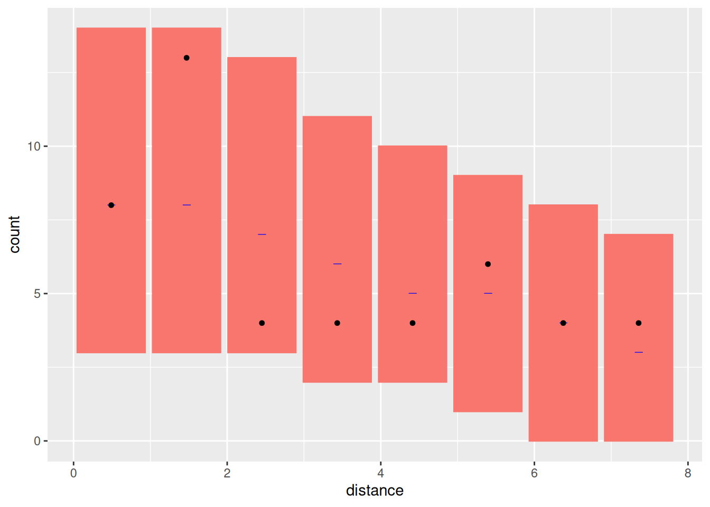

``` r


bc1 <- bincount(
  result = fit1,
  observations = mexdolphin$points$distance,
  breaks = seq(0, max(mexdolphin$points$distance), length.out = 9),
  predictor = distance ~ hn(distance, sigma)
)
attributes(bc1)$ggp
```

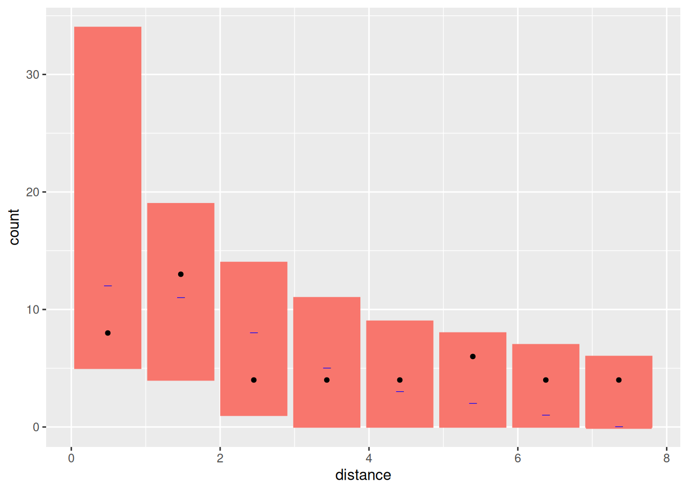

## Fit Models only to the distance sampling data

Half-normal first

``` r

formula <- distance ~ log(hn(distance, sigma)) + Intercept
cmp <- ~ sigma(1,
  prec.linear = 1,
  marginal = bm_marginal(qexp, pexp, dexp, rate = 1 / 8)
) +
  Intercept(1)
dfit <- lgcp(
  components = cmp,
  mexdolphin$points,
  domain = list(distance = fm_mesh_1d(seq(0, 8, length.out = 30))),
  formula = formula,
  options = list(bru_initial = list(sigma = 1, Intercept = 3))
)
detfun <- predict(dfit, distdf, ~ hn(distance, sigma))
```

Hazard-rate next

``` r

formula1 <- distance ~ log(hr(distance, sigma)) + Intercept
cmp <- ~ sigma(1,
  prec.linear = 1,
  marginal = bm_marginal(qexp, pexp, dexp, rate = 1 / 8)
) +
  Intercept(1)
dfit1 <- lgcp(
  components = cmp,
  mexdolphin$points,
  domain = list(distance = fm_mesh_1d(seq(0, 8, length.out = 30))),
  formula = formula1
)
detfun1 <- predict(dfit1, distdf, ~ hr(distance, sigma))
```

Plot both lines on histogram of observations. First scale lines to have
same area as that of histogram.

Half-normal:

``` r

hnline <- data.frame(
  distance = detfun$distance,
  p = detfun$mean,
  lower = detfun$q0.025,
  upper = detfun$q0.975
)
wts <- diff(hnline$distance)
wts[1] <- wts[1] / 2
wts <- c(wts, wts[1])
hnarea <- sum(wts * hnline$p)
n <- length(mexdolphin$points$distance)
scale <- n / hnarea
hnline$En <- hnline$p * scale
hnline$En.lower <- hnline$lower * scale
hnline$En.upper <- hnline$upper * scale
```

Hazard-rate:

``` r

hrline <- data.frame(
  distance = detfun1$distance,
  p = detfun1$mean,
  lower = detfun1$q0.025,
  upper = detfun1$q0.975
)
wts <- diff(hrline$distance)
wts[1] <- wts[1] / 2
wts <- c(wts, wts[1])
hrarea <- sum(wts * hrline$p)
n <- length(mexdolphin$points$distance)
scale <- n / hrarea
hrline$En <- hrline$p * scale
hrline$En.lower <- hrline$lower * scale
hrline$En.upper <- hrline$upper * scale
```

Combine lines in a single object for plotting

``` r

dlines <- rbind(
  cbind(hnline, model = "Half-normal"),
  cbind(hrline, model = "Hazard-rate")
)
```

Plot without the 95% credible intervals

``` r

ggplot(data.frame(mexdolphin$points)) +
  geom_histogram(aes(x = distance),
    breaks = seq(0, 8, length.out = 9),
    alpha = 0.3
  ) +
  geom_point(aes(x = distance), y = 0.2, shape = "|", size = 3) +
  geom_line(
    data = dlines,
    aes(x = distance, y = En, group = model, col = model)
  )
```

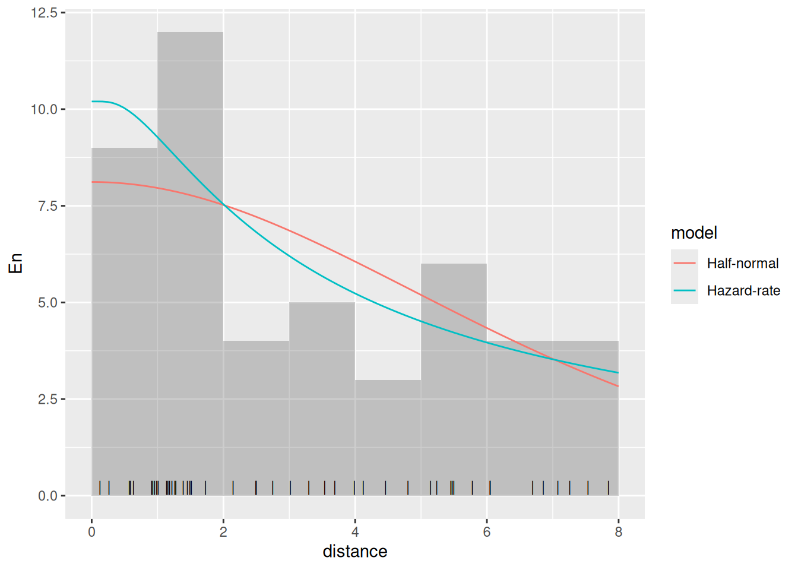

Plot with the 95% credible intervals (without taking the count rescaling
into account)

``` r

ggplot(data.frame(mexdolphin$points)) +
  geom_histogram(aes(x = distance),
    breaks = seq(0, 8, length.out = 9),
    alpha = 0.3
  ) +
  geom_point(aes(x = distance), y = 0.2, shape = "|", size = 3) +
  geom_line(
    data = dlines,
    aes(x = distance, y = En, group = model, col = model)
  ) +
  geom_ribbon(
    data = dlines,
    aes(
      x = distance,
      ymin = En.lower,
      ymax = En.upper,
      group = model,
      col = model,
      fill = model
    ),
    alpha = 0.2, lty = 2
  )
```

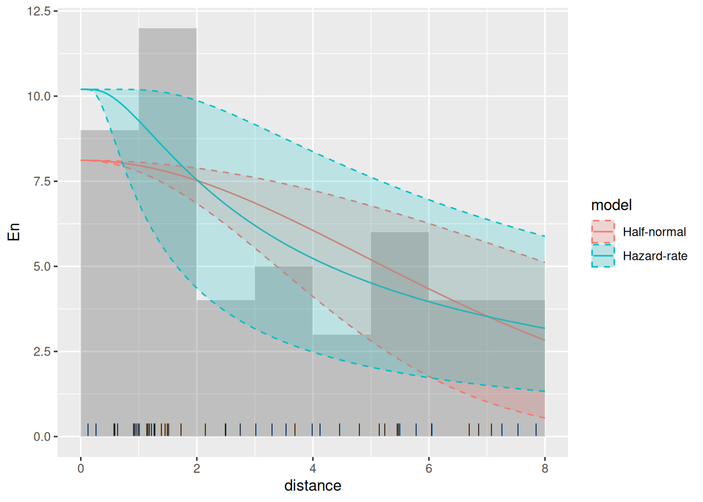
