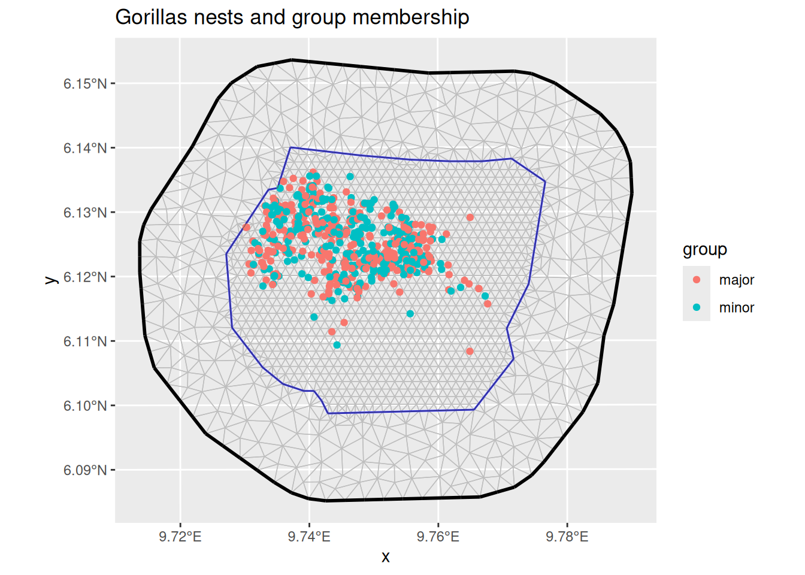
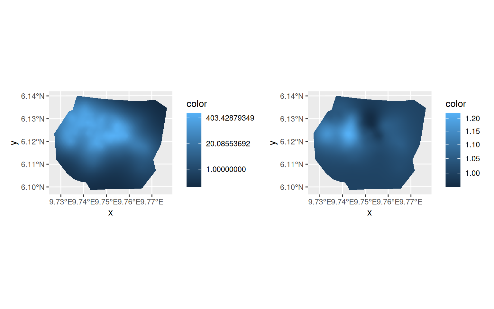
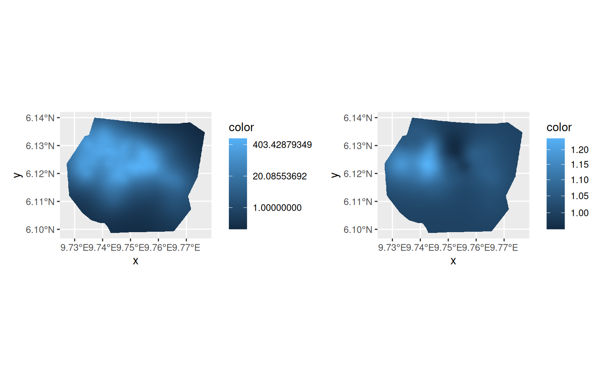
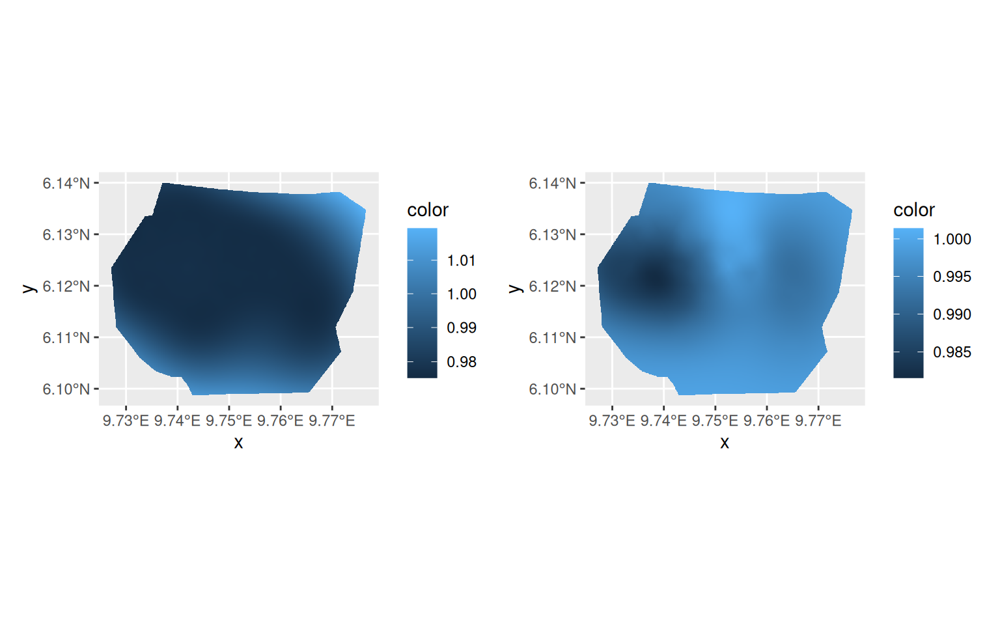

# LGCPs - Multiple Likelihoods

## Introduction

For this vignette we are going to be working with the inlabru’s
´gorillas_sf´ dataset which was originally obtained from the `R` package
`spatstat`. The data set contains two types of gorillas nests which are
marked as either major or minor. We will set up a multi-likelihood model
for these nests which creates two spatial LGCPs that share a common
intercept but have employ different spatial smoothers.

## Setting things up

Load libraries

``` r
library(inlabru)
library(INLA)
library(ggplot2)
```

## Get the data

For the next few practicals we are going to be working with a dataset
obtained from the `R` package `spatstat`, which contains the locations
of 647 gorilla nests. We load the dataset like this:

``` r
data(gorillas_sf, package = "inlabru")
```

Plot the nests and visualize the group membership (major/minor) by
color:

``` r
ggplot() +
  gg(gorillas_sf$mesh) +
  gg(gorillas_sf$nests, aes(color = group)) +
  gg(gorillas_sf$boundary, alpha = 0) +
  ggtitle("Gorillas nests and group membership")
```



## Fiting the model

First, we define all components that enter the joint model. That is, the
intercept that is common to both LGCPs and the two different spatial
smoothers, one for each nest group.

``` r
matern <- inla.spde2.pcmatern(gorillas_sf$mesh,
  prior.range = c(0.1, 0.01),
  prior.sigma = c(1, 0.01)
)

cmp <- ~
  Common(geometry, model = matern) +
    Difference(geometry, model = matern) +
    Intercept(1)
```

Given these components we define the linear predictor for each of the
likelihoods. (Using “.” indicates a pure additive model, and one can use
include/exclude options for
[`bru_obs()`](https://inlabru-org.github.io/inlabru/reference/bru_obs.md)
to indicate which components are actively involved in each model.)

``` r
fml.major <- geometry ~ Intercept + Common + Difference / 2
fml.minor <- geometry ~ Intercept + Common - Difference / 2
```

Setting up the Cox process likelihoods is easy in this example. Both
nest types were observed within the same window:

``` r
lik_minor <- bru_obs("cp",
  formula = fml.major,
  data = gorillas_sf$nests[gorillas_sf$nests$group == "major", ],
  samplers = gorillas_sf$boundary,
  domain = list(geometry = gorillas_sf$mesh)
)
lik_major <- bru_obs("cp",
  formula = fml.minor,
  data = gorillas_sf$nests[gorillas_sf$nests$group == "minor", ],
  samplers = gorillas_sf$boundary,
  domain = list(geometry = gorillas_sf$mesh)
)
```

… which we provide to the ´bru´ function.

``` r
jfit <- bru(cmp, lik_major, lik_minor,
  options = list(
    control.inla = list(
      int.strategy = "eb"
    ),
    bru_max_iter = 1
  )
)
```

``` r
library(patchwork)
pl.major <- ggplot() +
  gg(gorillas_sf$mesh,
    mask = gorillas_sf$boundary,
    col = exp(jfit$summary.random$Common$mean)
  )
pl.minor <- ggplot() +
  gg(gorillas_sf$mesh,
    mask = gorillas_sf$boundary,
    col = exp(jfit$summary.random$Difference$mean)
  )
(pl.major + scale_fill_continuous(trans = "log")) +
  (pl.minor + scale_fill_continuous(trans = "log")) &
  theme(legend.position = "right")
```



## Rerunning

Rerunning with the previous estimate as starting point sometimes
improves the accuracy of the posterior distribution estimation.

``` r
jfit0 <- jfit
jfit <- bru_rerun(jfit)
```

``` r
pl.major <- ggplot() +
  gg(gorillas_sf$mesh,
    mask = gorillas_sf$boundary,
    col = exp(jfit$summary.random$Common$mean)
  )
pl.minor <- ggplot() +
  gg(gorillas_sf$mesh,
    mask = gorillas_sf$boundary,
    col = exp(jfit$summary.random$Difference$mean)
  )
(pl.major + scale_fill_continuous(trans = "log")) +
  (pl.minor + scale_fill_continuous(trans = "log")) &
  theme(legend.position = "right")
```



``` r
summary(jfit0)
#> inlabru version: 2.14.1 
#> INLA version: 26.05.21 
#> Latent components:
#> Common: main = spde(geometry)
#> Difference: main = spde(geometry)
#> Intercept: main = linear(1)
#> Observation models:
#>   Model tag: <No tag>
#>     Family: 'cp'
#>     Data class: 'sf', 'tbl_df', 'tbl', 'data.frame'
#>     Response class: 'numeric'
#>     Predictor: geometry ~ Intercept + Common - Difference/2
#>     Additive/Linear/Rowwise: FALSE/FALSE/TRUE
#>     Used components: effect[Common, Difference, Intercept], latent[] 
#>   Model tag: <No tag>
#>     Family: 'cp'
#>     Data class: 'sf', 'tbl_df', 'tbl', 'data.frame'
#>     Response class: 'numeric'
#>     Predictor: geometry ~ Intercept + Common + Difference/2
#>     Additive/Linear/Rowwise: FALSE/FALSE/TRUE
#>     Used components: effect[Common, Difference, Intercept], latent[] 
#> Time used:
#>     Pre = 0.782, Running = 17.4, Post = 0.128, Total = 18.3 
#> Fixed effects:
#>             mean   sd 0.025quant 0.5quant 0.975quant   mode kld
#> Intercept -1.338 1.25     -3.788   -1.338      1.112 -1.338   0
#> 
#> Random effects:
#>   Name     Model
#>     Common SPDE2 model
#>    Difference SPDE2 model
#> 
#> Model hyperparameters:
#>                       mean    sd 0.025quant 0.5quant 0.975quant  mode
#> Range for Common     3.163 0.633      2.128    3.092      4.609 2.942
#> Stdev for Common     2.191 0.364      1.576    2.157      3.007 2.081
#> Range for Difference 1.874 2.562      0.147    1.106      8.356 0.386
#> Stdev for Difference 0.159 0.101      0.033    0.136      0.412 0.089
#> 
#> Marginal log-Likelihood:  1901.47 
#>  is computed 
#> Posterior summaries for the linear predictor and the fitted values are computed
#> (Posterior marginals needs also 'control.compute=list(return.marginals.predictor=TRUE)')
```

``` r
summary(jfit)
#> inlabru version: 2.14.1 
#> INLA version: 26.05.21 
#> Latent components:
#> Common: main = spde(geometry)
#> Difference: main = spde(geometry)
#> Intercept: main = linear(1)
#> Observation models:
#>   Model tag: <No tag>
#>     Family: 'cp'
#>     Data class: 'sf', 'tbl_df', 'tbl', 'data.frame'
#>     Response class: 'numeric'
#>     Predictor: geometry ~ Intercept + Common - Difference/2
#>     Additive/Linear/Rowwise: FALSE/FALSE/TRUE
#>     Used components: effect[Common, Difference, Intercept], latent[] 
#>   Model tag: <No tag>
#>     Family: 'cp'
#>     Data class: 'sf', 'tbl_df', 'tbl', 'data.frame'
#>     Response class: 'numeric'
#>     Predictor: geometry ~ Intercept + Common + Difference/2
#>     Additive/Linear/Rowwise: FALSE/FALSE/TRUE
#>     Used components: effect[Common, Difference, Intercept], latent[] 
#> Time used:
#>     Pre = 0.411, Running = 4.08, Post = 0.0599, Total = 4.55 
#> Fixed effects:
#>             mean    sd 0.025quant 0.5quant 0.975quant   mode kld
#> Intercept -1.343 1.254       -3.8   -1.343      1.115 -1.343   0
#> 
#> Random effects:
#>   Name     Model
#>     Common SPDE2 model
#>    Difference SPDE2 model
#> 
#> Model hyperparameters:
#>                      mean    sd 0.025quant 0.5quant 0.975quant  mode
#> Range for Common     3.16 0.633      2.124     3.09      4.605 2.945
#> Stdev for Common     2.19 0.365      1.574     2.16      3.006 2.084
#> Range for Difference 1.94 2.530      0.166     1.18      8.398 0.436
#> Stdev for Difference 0.16 0.094      0.035     0.14      0.392 0.097
#> 
#> Marginal log-Likelihood:  1901.39 
#>  is computed 
#> Posterior summaries for the linear predictor and the fitted values are computed
#> (Posterior marginals needs also 'control.compute=list(return.marginals.predictor=TRUE)')
```

## Single-likelihood version

In this particular model, we can also rewrite the problem as a single
point process over a product domain over space and `group`. In versions
`<= 2.7.0`, the integration domain had to be numeric, so we convert the
group variable to a 0/1 variable, `group_major <- group == "major"`,
which is also useful in the predictor expression:

``` r
fml.joint <-
  geometry + group_major ~ Intercept + Common + (group_major - 0.5) * Difference
```

``` r
gorillas_sf$nests$group_major <- gorillas_sf$nests$group == "major"
lik_joint <- bru_obs("cp",
  formula = fml.joint,
  data = gorillas_sf$nests,
  samplers = gorillas_sf$boundary,
  domain = list(
    geometry = gorillas_sf$mesh,
    group_major = c(0, 1)
  )
)
```

``` r
# Approximate with "eb" for faster vignette
jfit_joint <- bru(cmp, lik_joint,
  options = list(
    control.inla = list(
      int.strategy = "eb"
    ),
    bru_max_iter = 1
  )
)
```

Plotting the ratios of `exp(Common)` and `exp(Difference)` between the
new fit and the old confirms that the results are the same up to small
numerical differences.

``` r
library(patchwork)
pl.major <- ggplot() +
  gg(gorillas_sf$mesh,
    mask = gorillas_sf$boundary,
    col = exp(jfit_joint$summary.random$Common$mean -
      jfit$summary.random$Common$mean)
  )
pl.minor <- ggplot() +
  gg(gorillas_sf$mesh,
    mask = gorillas_sf$boundary,
    col = exp(jfit_joint$summary.random$Difference$mean -
      jfit$summary.random$Difference$mean)
  )
(pl.major + scale_fill_continuous(trans = "log")) +
  (pl.minor + scale_fill_continuous(trans = "log")) &
  theme(legend.position = "right")
```


