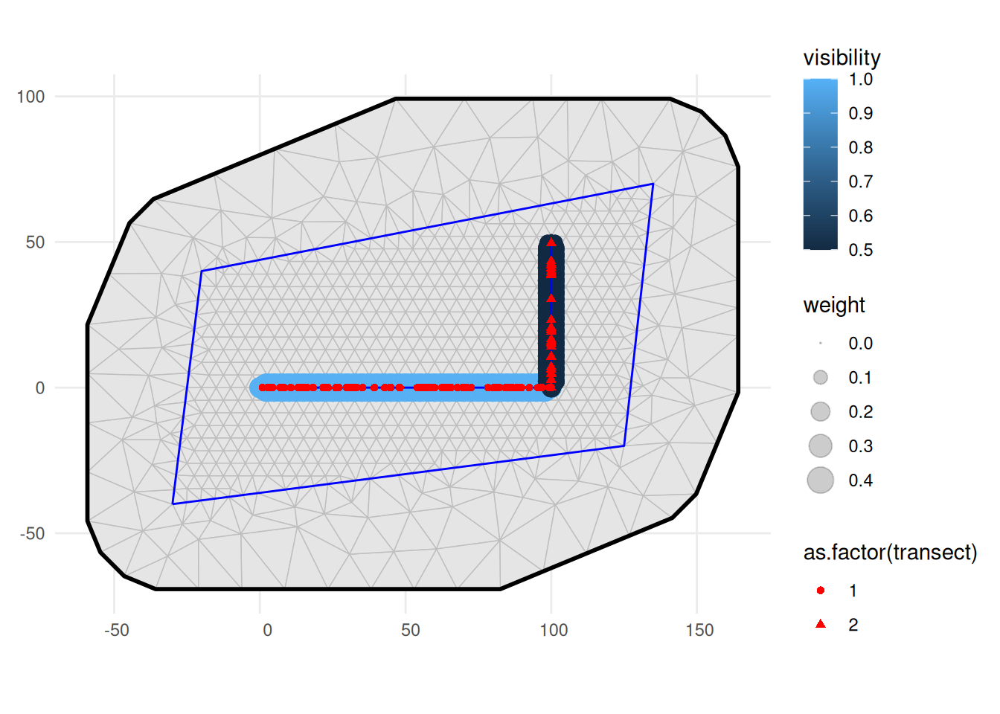

# LGCPs - Distance sampling and per-transect covariates

Set things up

``` r
library(INLA)
library(inlabru)
library(tibble)
library(sf)
library(fmesher)
library(dplyr)
library(ggplot2)
library(fmesher)
library(RColorBrewer)
```

Construct sampler transects, with a per-transect covariate,
`visibility`:

``` r
samplers <- st_sf(
  bind_rows(
    tibble(
      transect = 1L,
      geometry = fm_as_sfc(fm_segm(rbind(c(0, 0), c(100, 0)),
        is.bnd = FALSE
      )),
      visibility = 1
    ),
    tibble(
      transect = 2L,
      geometry = fm_as_sfc(fm_segm(rbind(c(100, 0), c(100, 50)),
        is.bnd = FALSE
      )),
      visibility = 0.5
    )
  )
)
```

Point observations, with marks `distance` and `transect`:

``` r
intensity <- 0.1
set.seed(1324L)
N_expected <- c(100 * 10 * intensity * 1, 50 * 10 * intensity * 0.5)
N <- c(rpois(1, N_expected[1]), rpois(1, N_expected[2]))
obs_coord <- rbind(
  tibble(
    x = runif(N[1], 0, 100),
    y = 0,
    transect = 1L,
    distance = abs(runif(N[1], -5, 5))
  ),
  tibble(
    x = 100,
    y = runif(N[2], 0, 50),
    transect = 2L,
    distance = abs(runif(N[2], -5, 5))
  )
)
observations <- st_as_sf(obs_coord, coords = c("x", "y"))
```

Domain of interest:

``` r
bnd <- fm_as_sfc(fm_segm(
  rbind(c(-30, -40), c(125, -20), c(135, 70), c(-20, 40), c(-30, -40)),
  is.bnd = TRUE
))
```

Computational meshes:

``` r
mesh <- fm_mesh_2d(
  loc = fm_hexagon_lattice(bnd, edge_len = 5),
  boundary = bnd,
  max.edge = c(10, 25)
)

# Distance mesh for integration scheme
distance_mesh <- fm_mesh_1d(
  seq(0, 5, length.out = 21),
  boundary = "free"
)
```

Transect integration scheme, including per-transect covariates:

``` r
ips <- fm_int(
  domain = list(
    geometry = fm_subdivide(mesh, 1),
    distance = distance_mesh
  ),
  samplers = samplers
)
```

Join per-transect covariates into the point observations, so they are
available for model fitting:

``` r
obs_with_transect_info <- observations |>
  left_join(as_tibble(samplers),
    by = "transect",
    suffix = c("", ".sampler")
  )


ggplot() +
  geom_fm(data = mesh) +
  geom_sf(data = ips, aes(size = weight, color = visibility), alpha = 0.2) +
  scale_size_area() +
  geom_sf(data = samplers, color = "blue") +
  geom_sf(
    data = obs_with_transect_info, aes(shape = as.factor(transect)),
    color = "red"
  ) +
  theme_minimal()
```



## Model fitting

Fitting model with visibility.

``` r
cmp <- ~ Intercept(1) +
  visibility(log(visibility), model = "linear") +
  twosided(log(2), model = "const")
obs <- bru_obs(
  formula = geometry + distance ~ Intercept + visibility + twosided,
  family = "cp",
  domain = list(
    geometry = fm_subdivide(mesh, 1),
    distance = distance_mesh
  ),
  samplers = samplers,
  data = obs_with_transect_info,
  options = list(control.inla = list(int.strategy = "eb"))
)
fit_vis <- bru(
  cmp,
  obs,
  options = list(
    bru_verbose = FALSE
  )
)
```

``` r
summary(fit_vis)
#> inlabru version: 2.14.1 
#> INLA version: 26.05.21 
#> Latent components:
#> Intercept: main = linear(1)
#> visibility: main = linear(log(visibility))
#> twosided: main = const(log(2))
#> Observation models:
#>   Model tag: <No tag>
#>     Family: 'cp'
#>     Data class: 'sf', 'tbl_df', 'tbl', 'data.frame'
#>     Response class: 'numeric'
#>     Predictor: geometry + distance ~ Intercept + visibility + twosided
#>     Additive/Linear/Rowwise: TRUE/TRUE/TRUE
#>     Used components: effect[Intercept, visibility, twosided], latent[] 
#> Time used:
#>     Pre = 0.322, Running = 0.231, Post = 0.0356, Total = 0.588 
#> Fixed effects:
#>              mean    sd 0.025quant 0.5quant 0.975quant   mode kld
#> Intercept  -2.471 0.108     -2.684   -2.471     -2.258 -2.471   0
#> visibility  0.335 0.293     -0.239    0.335      0.908  0.335   0
#> 
#> Marginal log-Likelihood:  -347.98 
#>  is computed 
#> Posterior summaries for the linear predictor and the fitted values are computed
#> (Posterior marginals needs also 'control.compute=list(return.marginals.predictor=TRUE)')
```

Posterior predictive interval and median for the intensity (true value
0.1)

``` r
rbind(
  True = c(NA, intensity, NA),
  Estimated = exp(fit_vis$summary.fixed[1, c(
    "0.025quant",
    "0.5quant",
    "0.975quant"
  )])
)
#>           0.025quant   0.5quant 0.975quant
#> True              NA 0.10000000         NA
#> Estimated 0.06832058 0.08450347  0.1045196
```

Note: The true expected point counts for the two transects, taking the
visibility into account are 100 and 25, respectively. The observed point
counts were 85 and 34, respectively.
