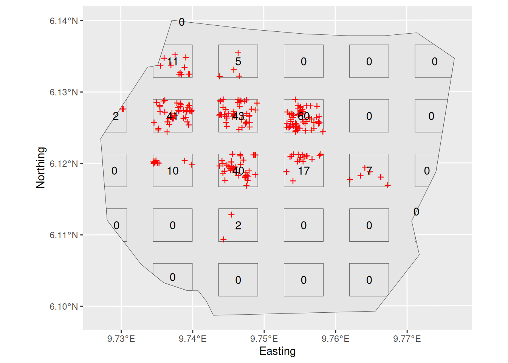
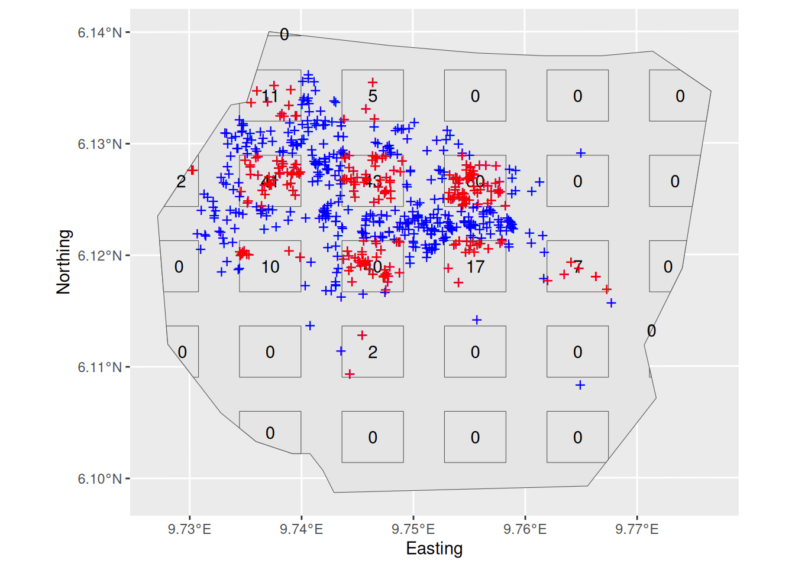
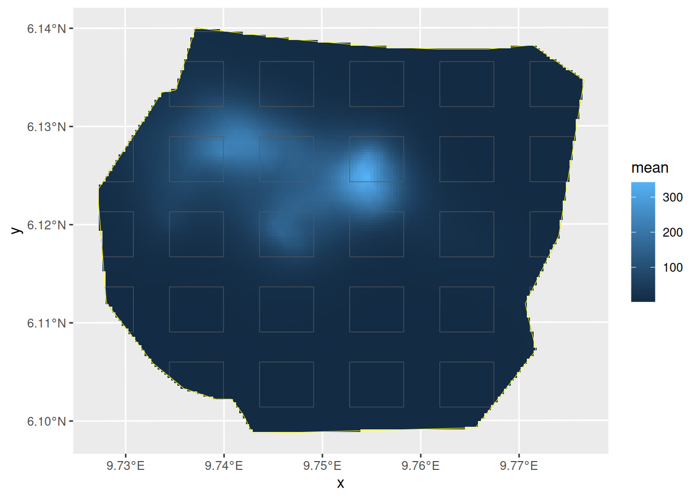
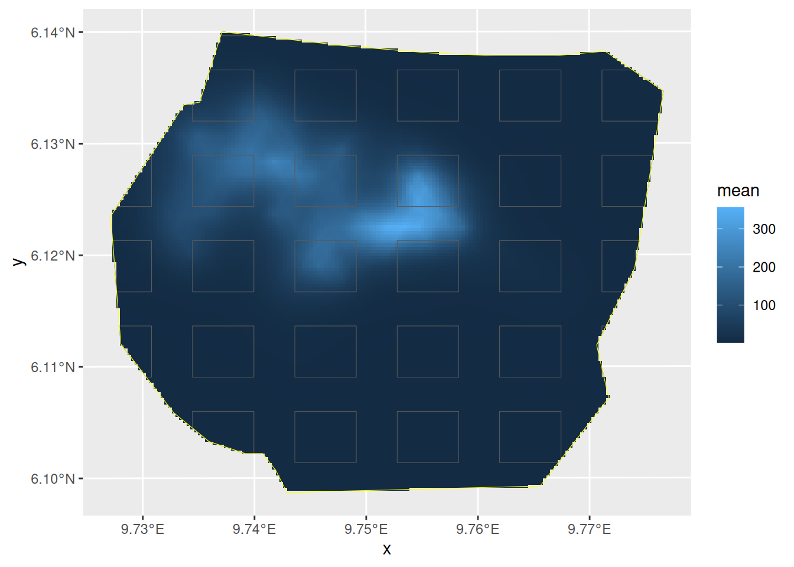
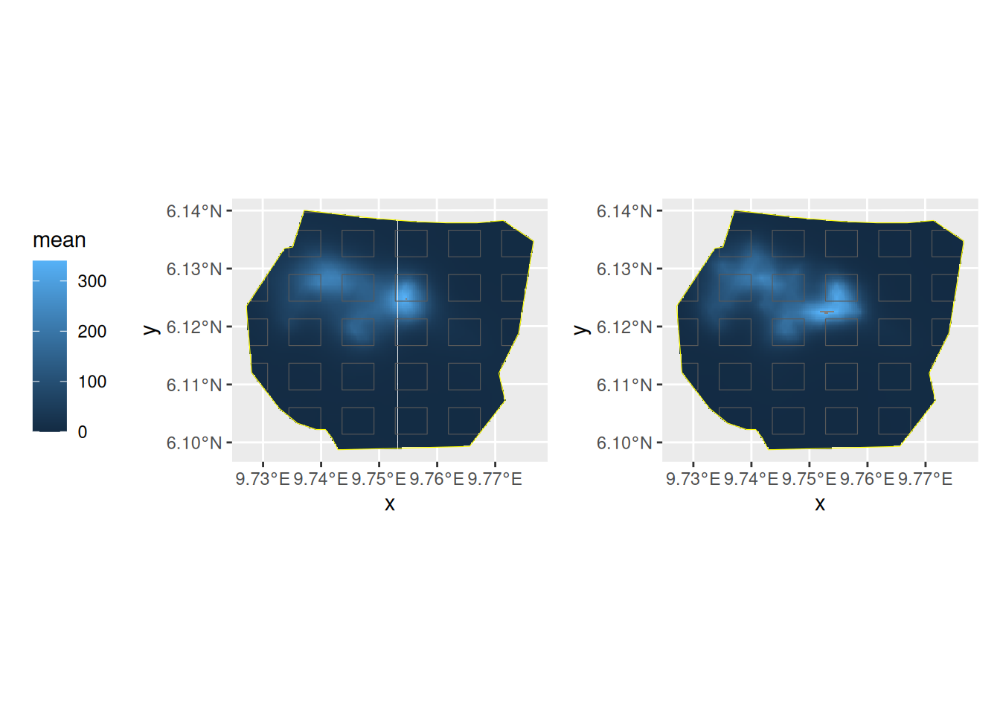

# LGCPs - Plot sampling

## Introduction

This practical demonstrates use of the `samplers` argument in `lgcp`,
which you need to use when you have observed points from only a sample
of plots in the survey region.

## Setting things up

Load libraries

``` r

library(fmesher)
library(inlabru)
library(INLA)
library(mgcv)
library(ggplot2)
```

## Get the data

``` r

data(gorillas_sf, package = "inlabru")
```

This dataset is a list (see
[`help(gorillas_sf)`](https://inlabru-org.github.io/inlabru/reference/gorillas_sf.md)
for details. Extract the the objects you need from the list, for
convenience:

``` r

nests <- gorillas_sf$nests
mesh <- gorillas_sf$mesh
boundary <- gorillas_sf$boundary
gcov <- gorillas_sf_gcov()
#> Loading required namespace: terra
```

The `gorillas_sf` data also contains a plot sample subset which covers
60% of the survey region.

``` r

sample <- gorillas_sf$plotsample
```

``` r

plotdets <- ggplot() +
  gg(boundary) +
  gg(sample$plots) +
  gg(sample$nests, pch = "+", cex = 4, color = "red") +
  geom_text(aes(
    label = sample$counts$count,
    x = sf::st_coordinates(sample$counts)[, 1],
    y = sf::st_coordinates(sample$counts)[, 2]
  )) +
  labs(x = "Easting", y = "Northing")
plot(plotdets)
```



On this plot survey, only points within the rectangles are detected, but
it is also informative to plot all the points here (which if it was a
real plot survey you could not do, because you would not have seen them
all).

``` r

plotwithall <- ggplot() +
  gg(boundary) +
  gg(sample$plots) +
  gg(nests, pch = "+", cex = 4, color = "blue") +
  geom_text(aes(
    label = sample$counts$count,
    x = sf::st_coordinates(sample$counts)[, 1],
    y = sf::st_coordinates(sample$counts)[, 2]
  )) +
  gg(sample$nests, pch = "+", cex = 4, color = "red") +
  labs(x = "Easting", y = "Northing")
plot(plotwithall)
```



## Inference

The observed nest locations are in the `sf` `sample$nests`, and the
plots are in the `sf` `sample$plots`. Again, we are using the following
SPDE setup:

``` r

matern <- inla.spde2.pcmatern(mesh,
  prior.sigma = c(0.1, 0.01),
  prior.range = c(0.05, 0.01)
)
```

Fit an LGCP model with SPDE only to these data by using the `samplers=`
argument of the function
[`lgcp( )`](https://inlabru-org.github.io/inlabru/reference/lgcp.md):

``` r

cmp <- geometry ~ my.spde(geometry, model = matern)

fit <- lgcp(cmp,
  sample$nests,
  samplers = sample$plots,
  domain = list(geometry = mesh)
)
```

Plot the density surface from your fitted model

``` r

pxl <- fm_pixels(mesh, mask = boundary)
lambda.sample <- predict(fit, pxl, ~ exp(my.spde + Intercept))
```

``` r

lambda.sample.plot <- ggplot() +
  gg(lambda.sample, geom = "tile") +
  gg(sample$plots, alpha = 0) +
  gg(boundary, col = "yellow", alpha = 0)

lambda.sample.plot
```



Estimate the integrated intensity lambda. We compute both the overall
integrated intensity, representative of an imagined new realisation of
the point process, and the conditional expectation that takes the
actually observed nests into account, by recognising that we have
complete information in the surveyed plots.

``` r

Lambda <- predict(
  fit,
  fm_int(mesh, boundary),
  ~ sum(weight * exp(my.spde + Intercept))
)
Lambda.empirical <- predict(
  fit,
  rbind(
    cbind(fm_int(mesh, boundary), data.frame(all = TRUE)),
    cbind(fm_int(mesh, sample$plots), data.frame(all = FALSE))
  ),
  ~ (sum(weight * exp(my.spde + Intercept) * all) -
    sum(weight * exp(my.spde + Intercept) * !all) +
    nrow(sample$nests))
)
rbind(
  Lambda,
  Lambda.empirical
)
```

Fit the same model to the full dataset (the points in
`gorillas_sf$nests`), or get your previous fit, if you kept it. Plot the
intensity surface and estimate the integrated intensity

``` r

fit.all <- lgcp(cmp, nests,
  samplers = boundary,
  domain = list(geometry = mesh)
)
lambda.all <- predict(fit.all, pxl, ~ exp(my.spde + Intercept))
Lambda.all <- predict(
  fit.all,
  fm_int(mesh, boundary),
  ~ sum(weight * exp(my.spde + Intercept))
)
```

Your plot should look like this:



The values `Lambda.empirical`, `Lambda`, and `Lambda.all` should be
close to each other if the plot samples gave sufficient information for
the overall prediction:

``` r

rbind(
  Plots = Lambda,
  PlotsEmp = Lambda.empirical,
  All = Lambda.all,
  AllEmp = c(
    nrow(gorillas_sf$nests),
    0,
    rep(nrow(gorillas_sf$nests), 3),
    rep(NA, 3)
  )
)
#>              mean       sd   q0.025     q0.5   q0.975   median mean.mc_std_err
#> Plots    661.0623 47.34472 578.2771 662.2237 762.1676 662.2237        5.383716
#> PlotsEmp 640.6520 37.93582 570.5890 640.2118 719.4910 640.2118        4.341687
#> All      672.4880 24.79734 627.2966 670.5408 718.2919 670.5408        2.812837
#> AllEmp   647.0000  0.00000 647.0000 647.0000 647.0000       NA              NA
#>          sd.mc_std_err
#> Plots         3.246222
#> PlotsEmp      2.740529
#> All           1.665519
#> AllEmp              NA
```

Now, let’s compare the results

``` r

library(patchwork)
lambda.sample.plot + lambda.all.plot +
  plot_layout(guides = "collect") &
  theme(legend.position = "left") &
  scale_fill_continuous(limits = range(c(0, 340)))
```



Do you understand the reason for the differences in the posteriors of
the abundance estimates?
