# Residual Analysis of spatial point process models using Bayesian methods

``` r

# Load function definitions
source(
  system.file(
    "misc",
    "2d_lgcp_residuals_functions.R",
    package = "inlabru"
  )
)
```

## Introduction

Point processes are useful for spatial data analysis and have wide
applications in ecology, epidemiology, seismology, computational
neuroscience, etc. Residual analysis is an effective assessment method
for spatial point processes, which commonly takes a frequentist
approach.

In this vignette, we will calculate residuals of some of the models from
<https://inlabru-org.github.io/inlabru/articles/2d_lgcp_covars.html>
using a Bayesian approach to the residual methods in “Residual Analysis
for spatial point processes” (Baddeley et al).

## Theory of Residuals for Spatial point process models

Consider a spatial point pattern \mathbf{x} = \\x_1, \dots, x_n \\ of n
points in a bounded region W of \mathbb{R}^2. For a model of a spatial
point process \mathbf{X} with probability density f\_{\theta} and
parameter \theta, the innovation process of the model is defined by
\begin{equation}\label{eq:innovations} I\_{\theta}(B) = n(\mathbf{X}
\cap B) - \int_B \lambda\_{\theta} (u) \\ du \end{equation} Here, \int_B
\lambda\_{\theta}(u) \\ du is the expected number of points of the
fitted model in the bounded subset of B. Innovations satisfy
\mathbb{E}\_{\theta} \left\[ I\_{\theta}(B)\right\] = 0 .

Given data \mathbf{x} of the model and that the parameter estimate is
\hat{\theta}, the raw residuals are given by
\begin{equation}\label{eq:raw residuals} R\_{\hat{\theta}}(B) =
n(\mathbf{x} \cap B) - \int_B \hat{\lambda}(u) \\du \end{equation}

Increments of the innovation process I and raw residuals of the Poisson
processes R are analogous to errors and raw residuals of linear models
respectively.

### Types of Residuals

We can scale the raw residual by scaling the increments of
R\_{\hat{\theta}}. \\ The h-weighted innovations are given by
\begin{equation}\label{eq:h innovations} I(B, h, \lambda) = \sum\_{x_i
\in \mathbf{X} \cap B} h(x_i) - \int_B h(u) \lambda(u) \\du
\end{equation} This leads to the h-weighted residuals \begin{equation}
\label{eq:h residuals} R(B, \hat{h}, \hat{\theta}) = I(B, \hat{h},
\hat{\lambda}) = \sum\_{x_i \in \mathbf{x} \cap B} h(x_i) - \int_B
\hat{h}(u) \hat{\lambda}(u)\\du \end{equation} Since the innovation has
mean 0, a true model would yield \mathbb{E}\left\[R(B, \hat{h},
\hat{\theta})\right\] \approx 0. Changing the choice of the weight
function h, yields different types of residuals.

#### Scaling Residuals

By taking h(u) \equiv 1, we get the raw residuals: \begin{aligned} R(B,
\hat{h}, \hat{\theta}) & = I(B, \hat{h}, \hat{\lambda}) = \sum\_{x_i \in
\mathbf{x} \cap B}h(x_i) - \int_B \hat{h}(u)\hat{\lambda}(u)\\du\\ & =
n(\mathbf{x} \cap B) - \int_B \hat{\lambda}(u) \\du \end{aligned}

#### Inverse Residuals

By taking h(u) = \frac{1}{\lambda (u)}, we may encounter the case where
\lambda(u) = 0. The GNZ-formula \begin{aligned} \mathbb{E}\left\[
\sum\_{x_i \in \mathbf{X}} h(x_i)\right\]& = \mathbb{E}\left\[ \int_W
h(u) \lambda(u) \\du \right\], \end{aligned} would still hold for the
first terms of the h-weighted residuals to exist. If we define h(u)
\lambda(u) = 0 for all u such that \lambda(u) = 0, then the second term
of h-weighted residuals will also exist and the inverse residual is
given by \begin{aligned} R\left(B, \frac{1}{\hat{\lambda}},
\hat{\theta}\right) & = \sum\_{x_i \in \mathbf{x} \cap B} \hat{h}(x_i) -
\int_B \hat{h}(u) \hat{\lambda}(u) \\du \\ & = \sum\_{x_i \in \mathbf{x}
\cap B} \frac{1}{\hat{\lambda}(x_i)} - \int_B \mathbf{1} \\
\hat{\lambda}(u) \> 0 \\ \\du \end{aligned}

#### Pearson Residuals

By using h(u) = \frac{1}{\sqrt{\lambda(u)}}, the Pearson residual is
given by \begin{aligned} R\left( B, \frac{1}{\sqrt{\hat{\lambda}}},
\hat{\theta} \right) & = \sum\_{x_i \in \mathbf{x} \cap B}
\hat{h}(x_i) - \int_B \hat{h}(u) \hat{\lambda}(u) \\du \\ & = \sum\_{x_i
\in \mathbf{x} \cap B} \frac{1}{\sqrt{\hat{\lambda}(x_i)}} - \int_B
\sqrt{\hat{\lambda}(u)} \\du \end{aligned} Here, zero values of
\hat{\lambda}(u) do not cause any issues with calculating residuals as
we set \hat{h}(u) \hat{\lambda}(u) = \sqrt{\hat{\lambda}(u)} for all u.

So the three types of residuals are: \begin{aligned} \text{Scaled:} &&
R(B, 1, \hat{\theta}) &= n(\mathbf{x} \cap B) - \int_B \hat{\lambda}(u)
\\du \\ \text{Inverse:} && R\left(B, \frac{1}{\hat{\lambda}},
\hat{\theta}\right) &= \sum\_{x_i \in \mathbf{x} \cap B}
\frac{1}{\hat{\lambda}(x_i)} - \int_B \mathbf{1} \\ \hat{\lambda}(u) \>
0 \\ \\du \\ \text{Pearson:} && R\left( B,
\frac{1}{\sqrt{\hat{\lambda}}},\hat{\theta} \right) &= \sum\_{x_i \in
\mathbf{x} \cap B} \frac{1}{\sqrt{\hat{\lambda}(x_i)}} - \int_B
\sqrt{\hat{\lambda}(u)} \\du \end{aligned}

Note that \hat{\lambda}(u) and \hat{h}(u) are estimates of \lambda (u)
and h(u) respectively

### Motivation for choice of residuals

The scaling residuals are nothing but the raw residuals and hence depict
the residual data as is. However, the Pearson residuals use a weighted
function h(u) = \frac{1}{\lambda(u)} so this helps to obtain normalised
residuals since the denominator accounts for variance of the residuals
and hence makes it reliable for any sample size.

The use of the inverse residual in this project is less clear. However,
we do know that it is easier to compute this residual since we have the
GNZ formula to estimate the value of h(u) = \frac{1}{\lambda(u)} for any
value \lambda(u).

For notation’s sake in this discussion, let h\_{s}(u), h\_{i}(u), h_p(u)
indicate the weight function for scaling, inverse and Pearson residuals
respectively. Then, h_s(u) \equiv 1, h_i(u) = \frac{1}{\lambda(u)},
h_p(u) = \frac{1}{\sqrt{\lambda(u)}}. We can also see that h_s(u) =
\left(h_i(u)\right)^0 and h_p(u) = \left(h_i(u)\right)^{1/2}, so the
values of the Pearson residuals would lie somewhere between the other
two residuals. So, in our case, the inverse residuals would not be very
useful, but we do find that they are easier to compute by hand in terms
of estimates.

## Computation of Residuals

In this vignette, the residuals of some models from
<https://inlabru-org.github.io/inlabru/articles/2d_lgcp_covars.html> are
computed using a Bayesian approach of the residuals described above.
This is done using the `inlabru` package. The models used are:

- Model 1 (Vegetation Model): The model is defined such that the gorilla
  nests have vegetation type as a fixed covariate.

- Model 2 (Elevation Model): The model is defined such that the gorilla
  nests have elevation as a continuous variable.

- Model 3 (Intercept Model): The model is defined such that the gorilla
  nests have a constant effect.

- Model 4 (SPDE Smooth type model): The model is defined such that the
  gorilla nests depend on an SPDE type smooth function.

The functions used to calculate the residuals of these models are given
in the Code appendix at the end of this vignette.

### Loading gorillas data

This vignette uses the `gorillas` dataset from the “inlabru” package in
R for modelling spatial Poisson processes. Here, the \`\`inlabru”
package uses Latent Gaussian Cox Processes to model the data using
different model definitions.

``` r

# Load data
gorillas <- inlabru::gorillas_sf
nests <- gorillas$nests
mesh <- gorillas$mesh
boundary <- gorillas$boundary
gcov <- gorillas_sf_gcov()
```

Initially, the set B is defines as B=W, where W is the object
`boundary`. The function `prepare_residual_calculations()` is defined to
compute a data frame of observations x_i and sample points u \in W to
compute the residual, a matrix `A_sum` that helps to calculate the
summation term of the residual and a matrix `A_integrate` that helps to
calculate the integral term of the residual.

The function `residual_df` is defined to compute all three types of
residuals for a given model and choice of B given a set of observations.

``` r

# Define the subset B
B <- boundary

# Store the required matrices and data frames for residual computation
As <- prepare_residual_calculations(
  samplers = B, domain = mesh,
  observations = nests
)
```

### Assessing 4 models with residuals

#### Vegetation Model

This model is taken from
<https://inlabru-org.github.io/inlabru/articles/2d_lgcp_covars.html> .
The model is defined such that the gorilla nests have vegetation type as
a fixed covariate.

The code chunk below shows how the model is defined by
[`lgcp()`](https://inlabru-org.github.io/inlabru/reference/lgcp.md) and
also displays the model in the form of a plot. The residuals of the
model are also computed where B = W.

``` r

# Define the vegetation model
comp1 <- geometry ~
  vegetation(gcov$vegetation, model = "factor_contrast") + Intercept(1)

fit1 <- lgcp(comp1, nests,
  samplers = boundary,
  domain = list(geometry = mesh)
)

# Display the model
int1 <- predict(fit1,
  newdata = fm_pixels(mesh, mask = boundary, format = "sf"),
  ~ exp(vegetation + Intercept)
)
ggplot() +
  gg(int1, geom = "tile") +
  gg(boundary, alpha = 0, lwd = 2) +
  gg(nests, color = "DarkGreen")
```

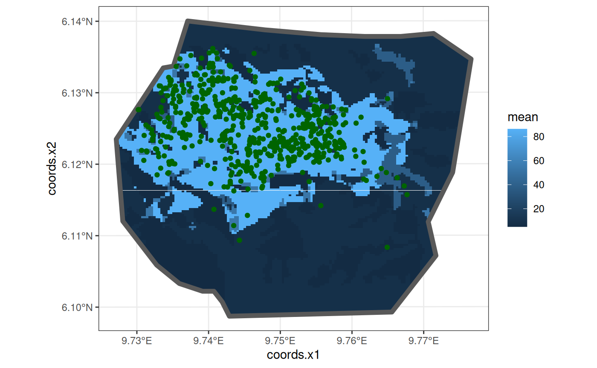

``` r

# Calculate the residuals for the vegetation model
veg_res <- residual_df(
  fit1, As$df, expression(exp(vegetation + Intercept)),
  As$A_sum, As$A_integrate
)
knitr::kable(
  edit_df(veg_res, c("Type", "mean.mc_std_err", "sd.mc_std_err", "median"))
)
```

|                   |       mean |        sd |     q0.025 |       q0.5 |   q0.975 |
|:------------------|-----------:|----------:|-----------:|-----------:|---------:|
| Scaling_Residuals | -0.7252763 | 28.833770 | -51.013362 | -2.4405164 | 51.97342 |
| Inverse_Residuals |  0.5587179 |  1.645284 |  -1.966520 |  0.3957641 |  4.47847 |
| Pearson_Residuals |  0.8561556 |  5.055520 |  -7.774578 |  0.9430356 | 11.25007 |

Note: The data frame produced by `residual_df()` originally contains the
columns `Type`, `mean.mc_std_err`, `sd.mc_std_err` and `median` which
have been removed in all the tables in the vignette to highlight only
essential and non-recurring data. This editing of the data frames is
done by the function `edit_df`.

#### Elevation model

This model is also taken from
<https://inlabru-org.github.io/inlabru/articles/2d_lgcp_covars.html> .
The model is defined such that the gorilla nests have elevation as a
continuous variable.

The code chunk below shows how the model is defined by
[`lgcp()`](https://inlabru-org.github.io/inlabru/reference/lgcp.md) and
also displays the model in the form of a plot.

``` r

# Define the Elevation model
comp2 <- geometry ~ elev(elev, model = "linear") +
  mySmooth(geometry, model = matern) + Intercept(1)

fit2 <- lgcp(comp2, nests,
  samplers = boundary,
  domain = list(geometry = mesh)
)

# Display the model
int2 <- predict(
  fit2,
  fm_pixels(mesh, mask = boundary, format = "sf"),
  ~ exp(elev + mySmooth + Intercept)
)
ggplot() +
  gg(int2, geom = "tile") +
  gg(boundary, alpha = 0) +
  gg(nests, shape = "+")
```

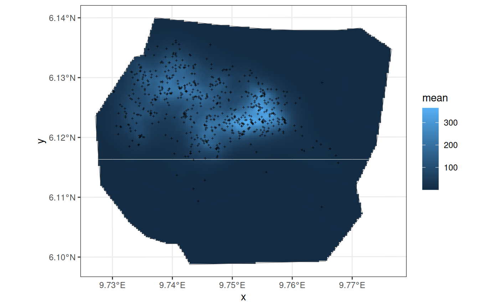

The residuals of the model when B = W are given below:

|                   |       mean |        sd |    q0.025 |       q0.5 |    q0.975 |
|:------------------|-----------:|----------:|----------:|-----------:|----------:|
| Scaling_Residuals | -30.053071 | 30.104107 | -92.42106 | -27.197344 | 22.832798 |
| Inverse_Residuals |  -8.588137 |  1.460373 | -10.65283 |  -8.821934 | -5.684720 |
| Pearson_Residuals | -12.095661 |  3.490711 | -18.91377 | -11.556431 | -5.893244 |

#### Intercept Model

This model is also taken from
<https://inlabru-org.github.io/inlabru/articles/2d_lgcp_covars.html> .
The model is defined such that the gorilla nests have a constant effect.

The code chunk below shows how the model is defined by
[`bru_obs()`](https://inlabru-org.github.io/inlabru/reference/bru_obs.md)
and also displays the model in the form of a plot. The residuals of the
model are also computed where B = W.

``` r

# Define the Intercept model. Need to explicitly extend it to match the
# data size to use it in spatial predictions.
comp3 <- geometry ~ Intercept(rep(1, nrow(.data.)))
lik3 <- bru_obs(
  geometry ~ .,
  data = nests,
  samplers = boundary,
  domain = list(geometry = mesh),
  family = "cp"
)
fit3 <- bru(comp3, lik3)

# Display the model
int3 <- predict(
  fit3,
  fm_pixels(mesh, mask = boundary, format = "sf"),
  ~ exp(Intercept)
)
ggplot() +
  gg(int3, geom = "tile") +
  gg(boundary, alpha = 0) +
  gg(nests, shape = "+")
```

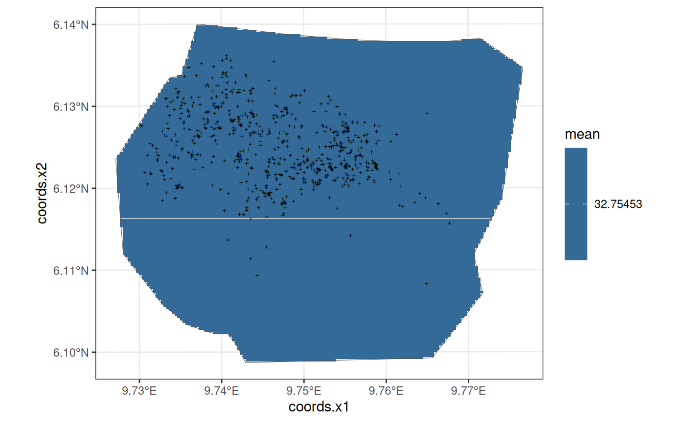

The residuals of the model when B = W are given below:

|                   |      mean |         sd |     q0.025 |      q0.5 |    q0.975 |
|:------------------|----------:|-----------:|-----------:|----------:|----------:|
| Scaling_Residuals | 4.8574884 | 25.3825493 | -46.753377 | 3.5922626 | 57.763803 |
| Inverse_Residuals | 0.1815243 |  0.7981514 |  -1.339235 | 0.1109926 |  1.948312 |
| Pearson_Residuals | 0.9428235 |  4.4970530 |  -7.912881 | 0.6314383 | 10.608573 |

#### Smooth Model

This model is also taken from
<https://inlabru-org.github.io/inlabru/articles/2d_lgcp_covars.html> .
The model is defined such that the gorilla nests depend on an SPDE type
smooth function.

The code chunk below shows how the model is defined by
[`lgcp()`](https://inlabru-org.github.io/inlabru/reference/lgcp.md) and
also displays the model in the form of a plot. The residuals of the
model are also computed where B = W.

``` r

# Define the Smooth model
comp4 <- geometry ~ mySmooth(geometry, model = matern) +
  Intercept(1)
fit4 <- lgcp(comp4, nests,
  samplers = boundary,
  domain = list(geometry = mesh)
)

# Display the model
int4 <- predict(
  fit4,
  fm_pixels(mesh, mask = boundary, format = "sf"),
  ~ exp(mySmooth + Intercept)
)
ggplot() +
  gg(int4, geom = "tile") +
  gg(boundary, alpha = 0) +
  gg(nests, shape = "+")
```


The residuals of the model when B = W are given below:

|                   |       mean |        sd |    q0.025 |       q0.5 |    q0.975 |
|:------------------|-----------:|----------:|----------:|-----------:|----------:|
| Scaling_Residuals | -27.233853 | 26.233671 | -91.10876 | -24.422818 | 15.780166 |
| Inverse_Residuals |  -9.012403 |  1.385826 | -11.00053 |  -9.289706 | -6.215308 |
| Pearson_Residuals | -12.629185 |  3.272115 | -21.90405 | -12.533770 | -6.611701 |

#### Comparing models

Firstly, from the plots of the four models, we see that there are visual
similarities in what the Elevation and smooth models appear to be. So,
we would expect that these two models show similar trends in residuals.

### Redefining the set B

Consider defining a new type of set B which consists of two subpolygons
within the boundary. This is done by the `partition()` function which
divides a polygon into grids based on number of rows and columns or by a
desired resolution. The code chunk below demonstrates a use of the
function for dividing the polygon and calculating the residuals for this
choice of B.

``` r

# Create a grid for B partitioned into two
B1 <- partition(samplers = boundary, nrows = 1, ncols = 2)
plot(B1, main = "Two partitions of B")
```

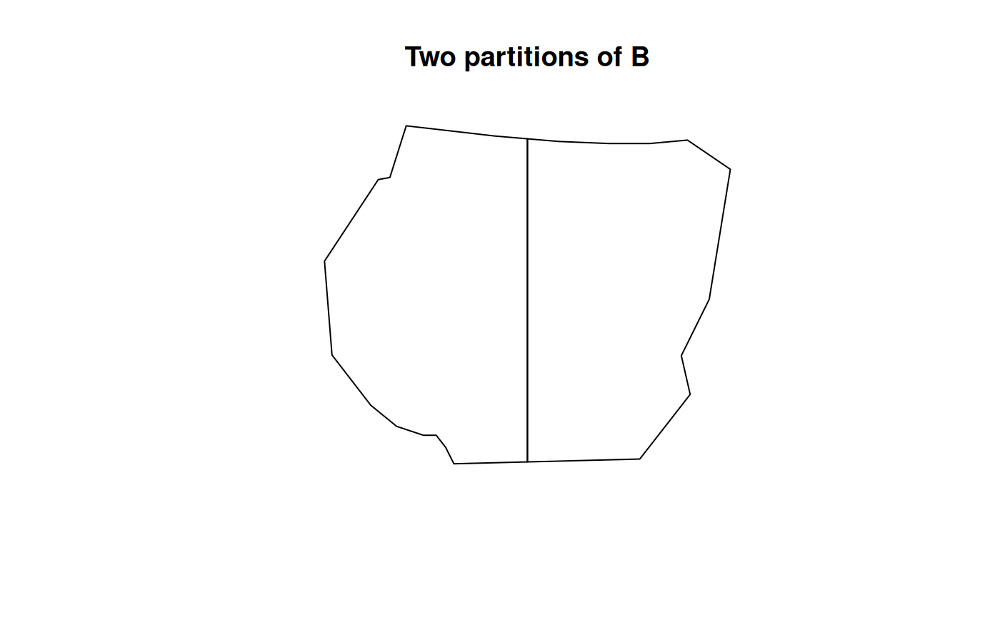

``` r

As1 <- prepare_residual_calculations(
  samplers = B1, domain = mesh,
  observations = nests
)
# Residuals for the vegetation model
veg_res2 <- residual_df(
  fit1, As1$df, expression(exp(vegetation + Intercept)),
  As1$A_sum, As1$A_integrate
)
knitr::kable(edit_df(veg_res2, c(
  "Type", "mean.mc_std_err",
  "sd.mc_std_err", "median"
)))
```

|                     |       mean |         sd |     q0.025 |       q0.5 |     q0.975 |
|:--------------------|-----------:|-----------:|-----------:|-----------:|-----------:|
| Scaling_Residuals.1 |  40.870971 | 15.6603840 |   8.947880 |  39.384359 |  69.693679 |
| Scaling_Residuals.2 | -40.763013 |  9.4465674 | -59.088954 | -40.547925 | -22.991792 |
| Inverse_Residuals.1 |   5.014250 |  1.0930902 |   3.415318 |   4.962647 |   7.242723 |
| Inverse_Residuals.2 |  -4.588806 |  0.3912645 |  -5.230760 |  -4.622634 |  -3.765246 |
| Pearson_Residuals.1 |  14.247506 |  2.7934045 |   9.073768 |  14.170034 |  19.792742 |
| Pearson_Residuals.2 | -13.465843 |  1.7108375 | -16.639400 | -13.408847 | -10.477080 |

Here, it can be seen that there are two lines of residual data for each
type of residual. This signifies that the `residual_df` function has
calculated residuals for each partition. To compare these residuals
effectively, a function `residual_plot()` is defined that plots the
residuals for each corresponding polygon of `B`. This is discussed later
in the vignette.

Another type of partitioning is considered with three sections of the
region and its residuals are as displayed below:
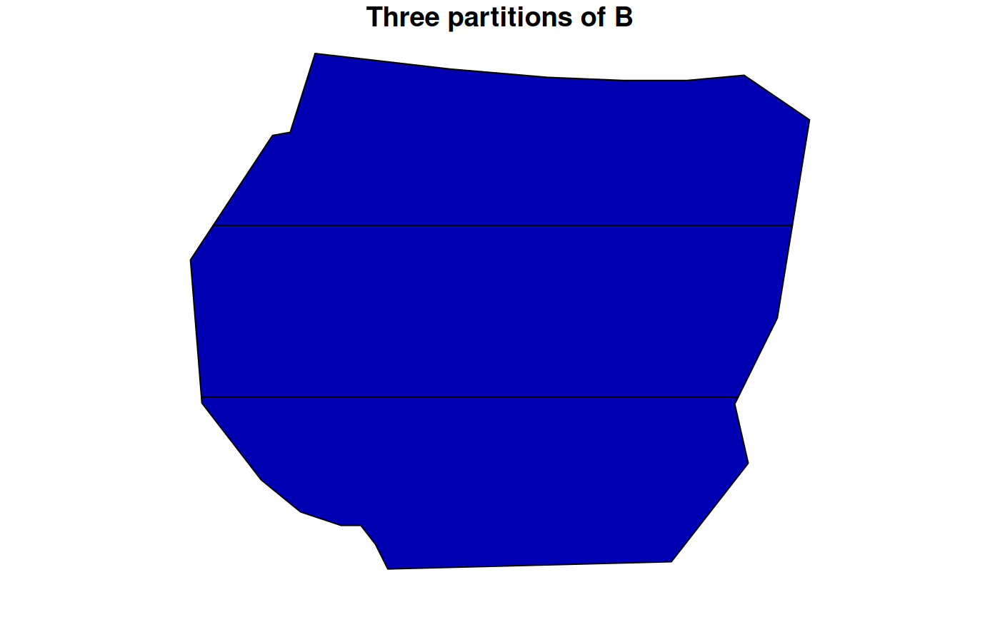

|                     |       mean |         sd |     q0.025 |       q0.5 |     q0.975 |
|:--------------------|-----------:|-----------:|-----------:|-----------:|-----------:|
| Scaling_Residuals.1 |  69.516075 |  8.4562596 |  52.143802 |  70.340036 |  85.277599 |
| Scaling_Residuals.2 | -21.830520 | 18.1871110 | -60.742829 | -19.644906 |   9.232902 |
| Scaling_Residuals.3 | -44.814094 |  4.2382284 | -53.169549 | -44.189972 | -37.529042 |
| Inverse_Residuals.1 |   3.346556 |  0.7430357 |   1.985054 |   3.299149 |   4.570250 |
| Inverse_Residuals.2 |   2.615667 |  0.6550878 |   1.430633 |   2.659008 |   3.771736 |
| Inverse_Residuals.3 |  -5.448156 |  0.0455396 |  -5.525879 |  -5.457213 |  -5.363138 |
| Pearson_Residuals.1 |  12.422336 |  1.7733352 |   8.815424 |  12.349595 |  15.302914 |
| Pearson_Residuals.2 |   3.662094 |  2.2042811 |  -1.104472 |   3.815673 |   7.526421 |
| Pearson_Residuals.3 | -14.922026 |  0.8157558 | -16.550904 | -14.795281 | -13.522248 |

### Residuals of models at different resolutions

Consider two more resolutions of B, given in the plots below. Here we
use the `resolution` argument instead of `nrow` and `ncol`. Due to the
way
[`terra::rast()`](https://rspatial.github.io/terra/reference/rast.html)
interprets the arguments, using `resolution` doesn’t guarantee complete
coverage of the `samplers` polygon.
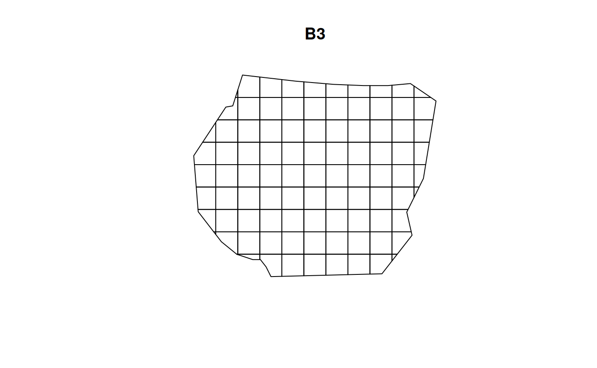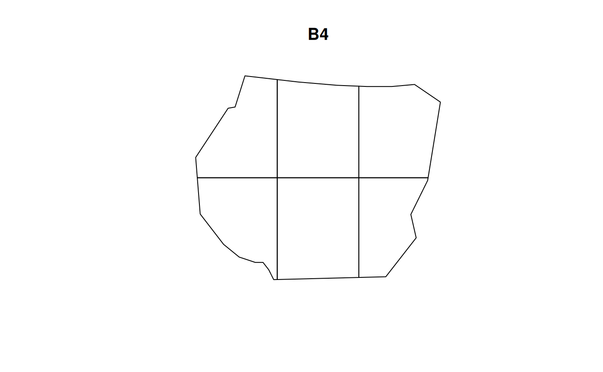

Using these two new choices of B, the residuals are calculated for all
four models at both resolutions using `residual_df()`.

The functions `set_csc()` and `residual_plot()` are defined to plot the
three types of residuals for the model for each partition in B. The code
chunk below demonstrates how this plotting is done for the vegetation
model at resolution B = B_3. Here, it is useful for each type of
residual to have the same colour scale at both resolutions.

``` r

# Residuals of Vegetation model
Residual_fit1_B3 <- residual_df(
  model = fit1, df = As3$df,
  expr = expression(exp(vegetation + Intercept)), A_sum = As3$A_sum,
  A_integrate = As3$A_integrate
)

Residual_fit1_B4 <- residual_df(
  model = fit1, df = As4$df,
  expr = expression(exp(vegetation + Intercept)), A_sum = As4$A_sum,
  A_integrate = As4$A_integrate
)

# Colour scales for each model to cover both resolutions
fit1_csc <- set_csc(rbind(Residual_fit1_B3, Residual_fit1_B4), rep("RdBu", 3))

# Store plots
plotB3_fit1 <- residual_plot(B3, Residual_fit1_B3, fit1_csc, "Vegetation Model")
plotB4_fit1 <- residual_plot(B4, Residual_fit1_B4, fit1_csc, "Vegetation Model")

# comparing the vegetation model
((plotB3_fit1$Scaling | plotB3_fit1$Inverse | plotB3_fit1$Pearson) /
  (plotB4_fit1$Scaling | plotB4_fit1$Inverse | plotB4_fit1$Pearson)) +
  plot_annotation(title = "Vegetation Model") +
  plot_layout(guides = "collect") &
  theme(legend.position = "bottom")
```

#### Comparing different types of residuals for each model

Now, the plots below help to compare the residuals for each model at two
resolutions of B for each type of residual.

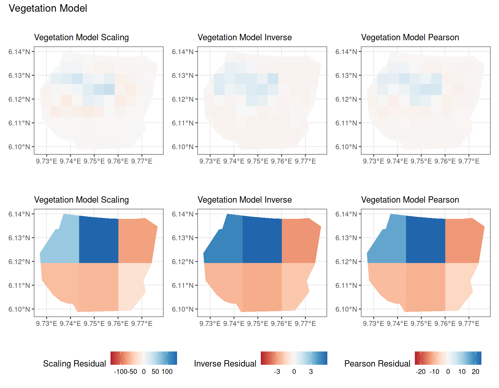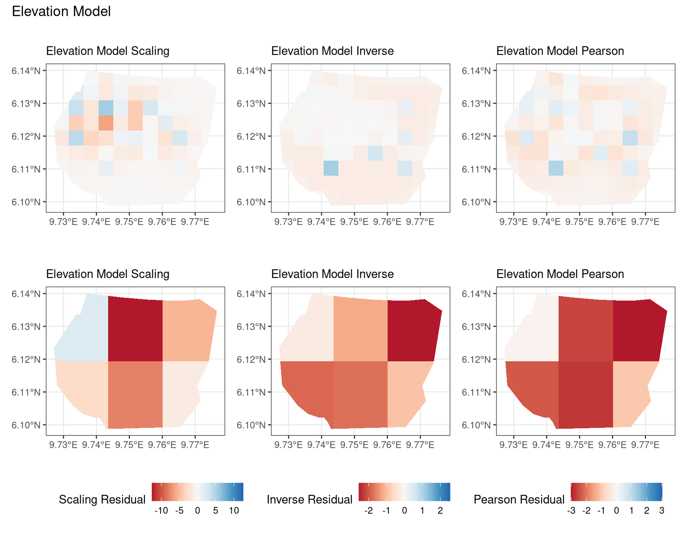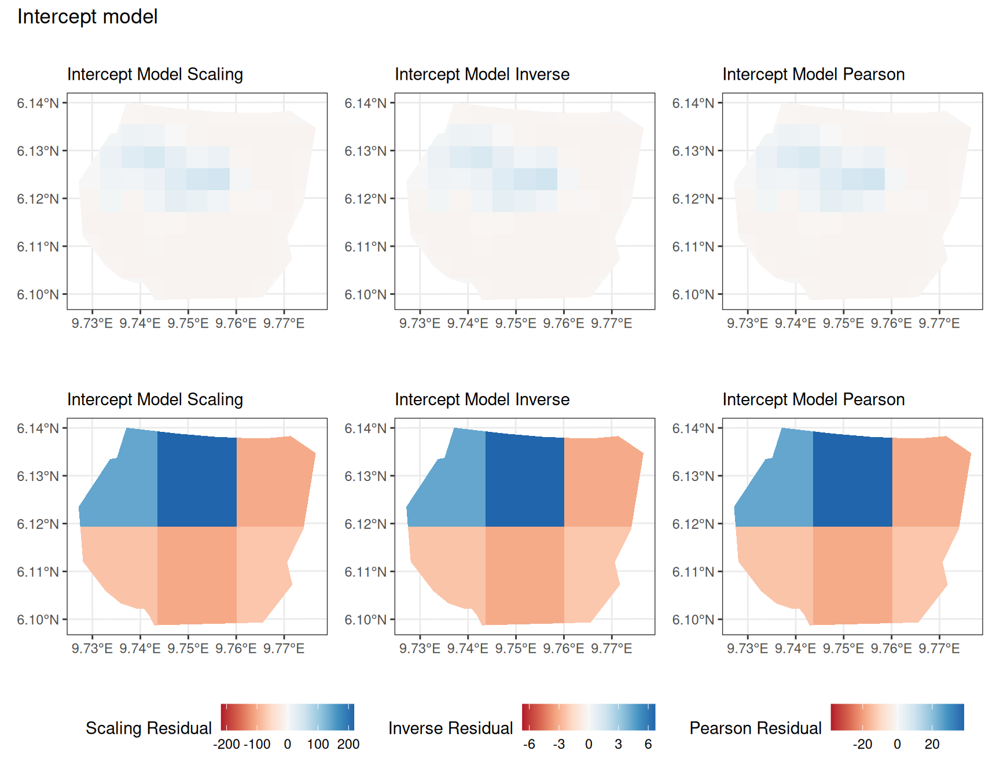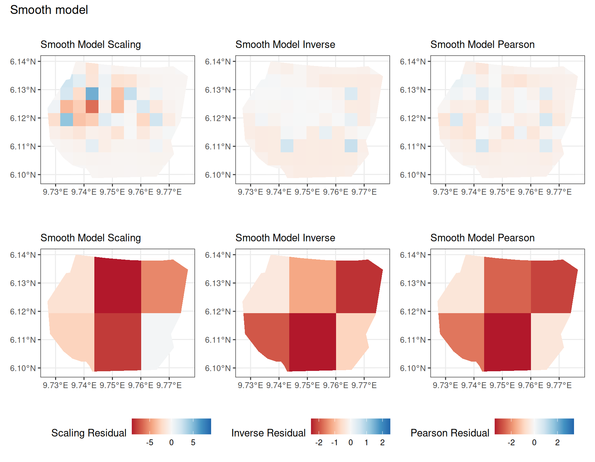

##### Discussion

In this section, we discuss some of the findings from the output in the
code. A relevant point that would be used repeatedly in this discussion
is that since the colour scales for the residuals are chosen so that
negative and positive values are in hues of red and blue respectively,
negative and positive residuals imply an overestimation and
underestimation of gorilla nests by the model respectively. Thus, red
regions in a plot would imply overestimation of gorilla nests by the
model in that region and blue regions in a plot would imply
underestimation of gorilla nests by the model in that region.

A common observation for all models is that the scaling residuals seem
to have the highest range among the residuals since they are direct
interpretations of residuals for all models. Also, the Pearson residuals
seem to take values between the scaling and inverse residuals for both
resolutions of all four models. However, for almost all types of
residuals for each model, the positive and negative residual values are
not very extreme for the B_3 resolution but these corresponding residual
values are more extreme at the B_4 resolution for each type of residual.
This could be because of the bias in the \`\`experimental” mode of which
is explored at other points in this project.

For the vegetation and intercept model, the regions which have negative
and positive residuals remain the same for all residuals at different
levels for each type of residual. Also, it seems that the north and
north-west region of both models are underestimated by the model while
the remaining regions are overestimated by the model at different
levels.

For the elevation model, each type of residual has slight variations in
negative and positive residuals for corresponding regions in a fixed
resolution. This means that different residuals suggest that a
particular polygon in overestimated and underestimated by the model.
However, this happens only at a few points and is not containing
extremes of the residuals in the same regions. The Pearson residuals are
supposedly the most reliable in this case as they are normalised
residuals. All three types of residuals contain larger proportions of
negative residuals which suggest that the model overestimates the
gorilla population the region (at different amounts in different
regions).

#### Comparing different models for each type of residual

Another way to compare residuals, is to consider each type of residual
separately and plot the residuals for all four models at each
resolution. This helps to compare the models for a given type of
residual and choice of B. Here, it is useful to have the same colour
scale for all the 4 models.

The code chunk below demonstrates the code for plotting the “Pearson”
residuals when B = B_4.

``` r

# Calculate the residuals for all models at B4
Residual_fit1_B4 <- residual_df(
  model = fit1, df = As4$df,
  expr = expression(exp(vegetation + Intercept)), A_sum = As4$A_sum,
  A_integrate = As4$A_integrate
)

Residual_fit2_B4 <- residual_df(
  model = fit2, df = As4$df,
  expr = expression(exp(elev + mySmooth + Intercept)),
  A_sum = As4$A_sum, A_integrate = As4$A_integrate
)

Residual_fit3_B4 <- residual_df(
  model = fit3, df = As4$df,
  expr = expression(exp(Intercept)), A_sum = As4$A_sum,
  A_integrate = As4$A_integrate
)

Residual_fit4_B4 <- residual_df(
  model = fit4, df = As4$df,
  expr = expression(exp(mySmooth + Intercept)), A_sum = As4$A_sum,
  A_integrate = As4$A_integrate
)

# Set the colour scale
B4res <- rbind(
  Residual_fit1_B4, Residual_fit2_B4,
  Residual_fit3_B4, Residual_fit4_B4
)
B4csc <- set_csc(B4res, rep("RdBu", 3))

# Plots for residuals of all 4 models with resolution B4
plotB4_veg <- residual_plot(B4, Residual_fit1_B4, B4csc, "Vegetation Model")
plotB4_elev <- residual_plot(B4, Residual_fit2_B4, B4csc, "Elevation Model")
plotB4_int <- residual_plot(B4, Residual_fit3_B4, B4csc, "Intercept Model")
plotB4_smooth <- residual_plot(B4, Residual_fit4_B4, B4csc, "Smooth Model")

# Comparing all models for B4 Pearson residuals
((plotB4_veg$Pearson | plotB4_elev$Pearson) /
  (plotB4_int$Pearson | plotB4_smooth$Pearson)) +
  plot_annotation("B4 Pearson Residuals") +
  plot_layout(guides = "collect") &
  theme(legend.position = "bottom")
```

Now, the plots below help to compare all 4 models at a particular choice
of B and for a chosen residual type.

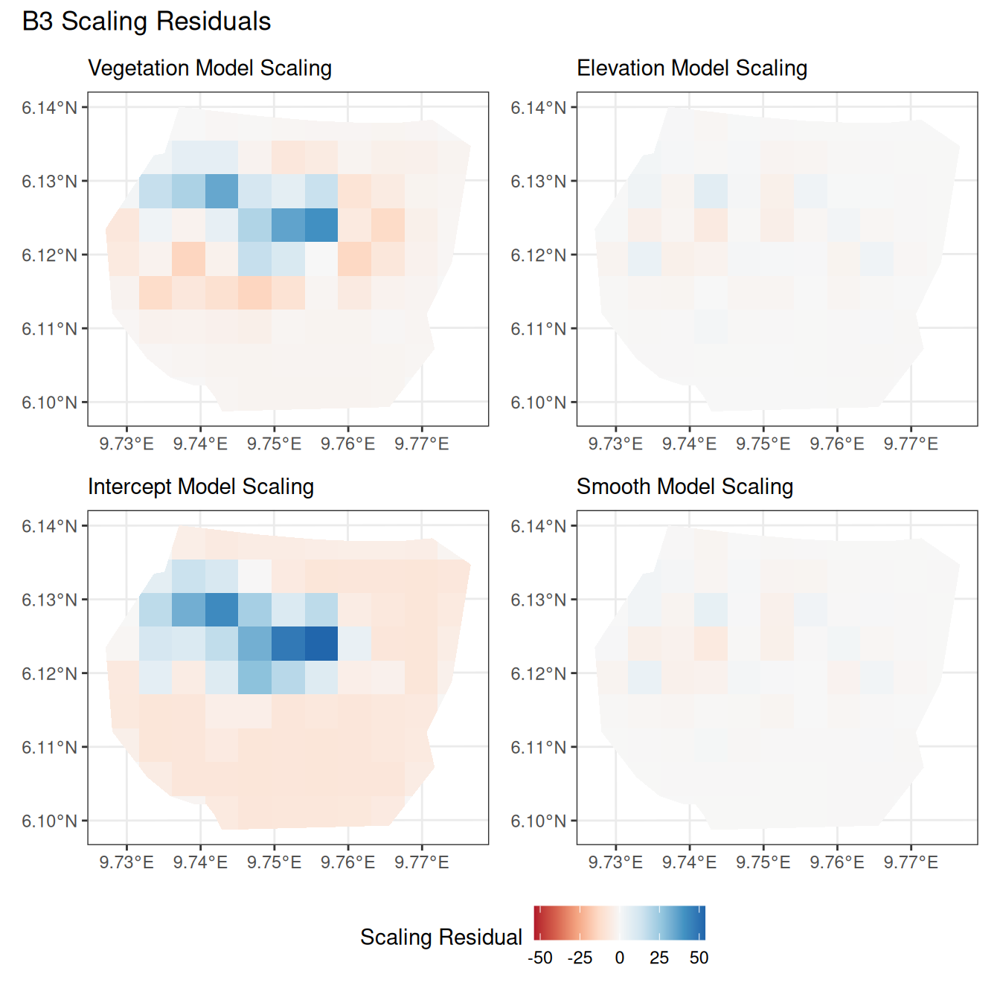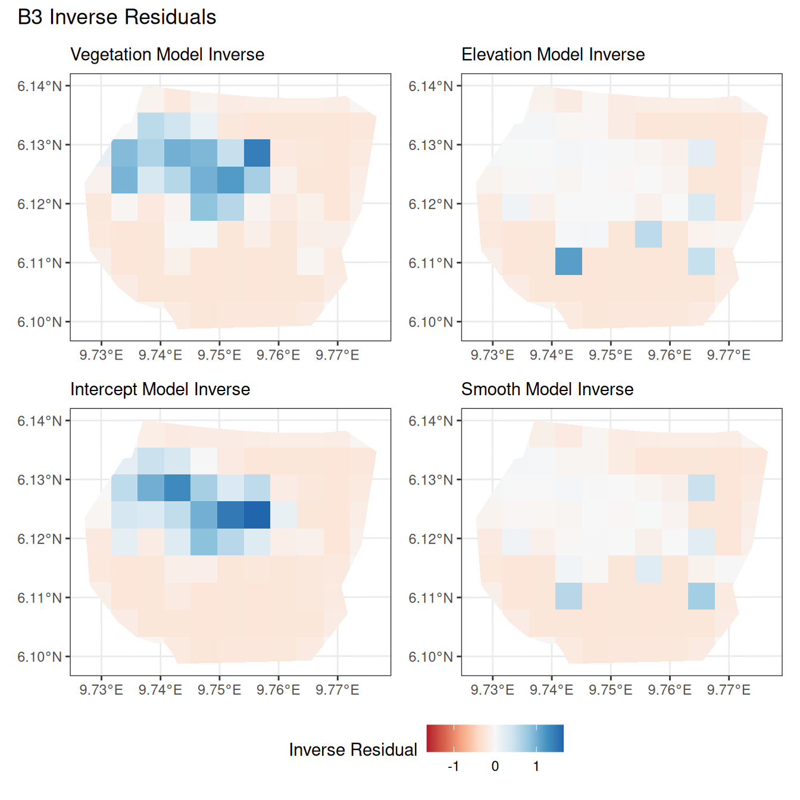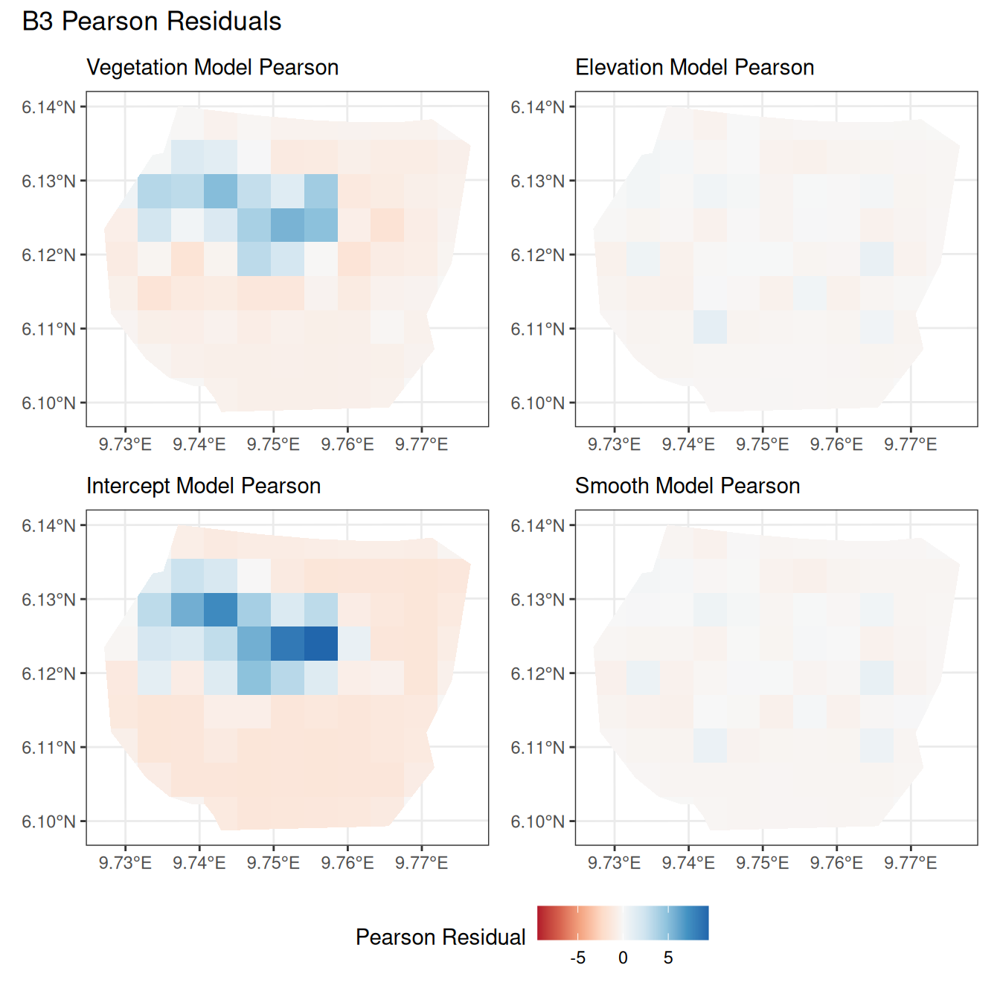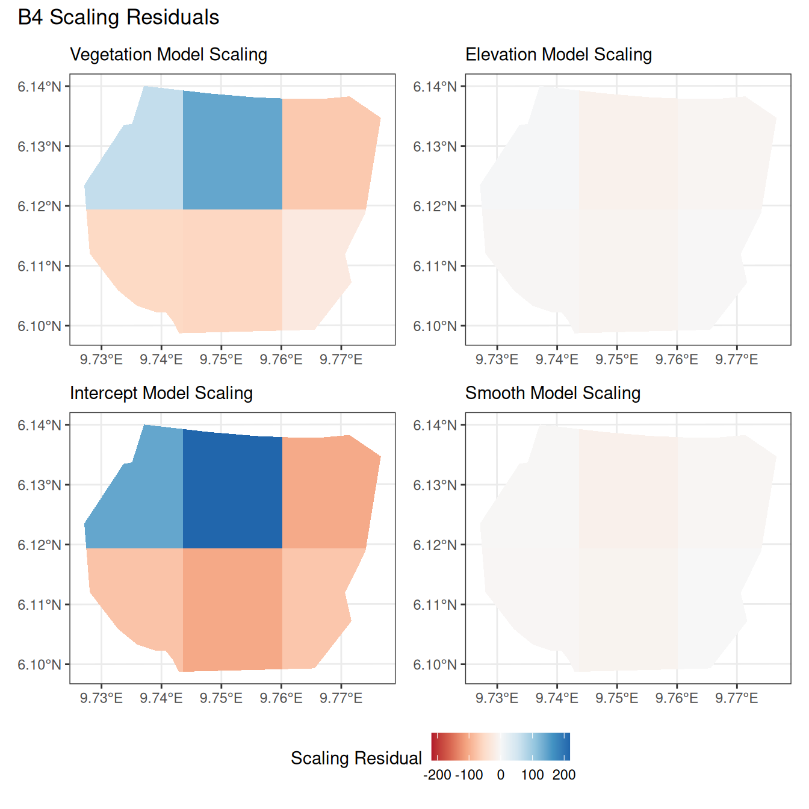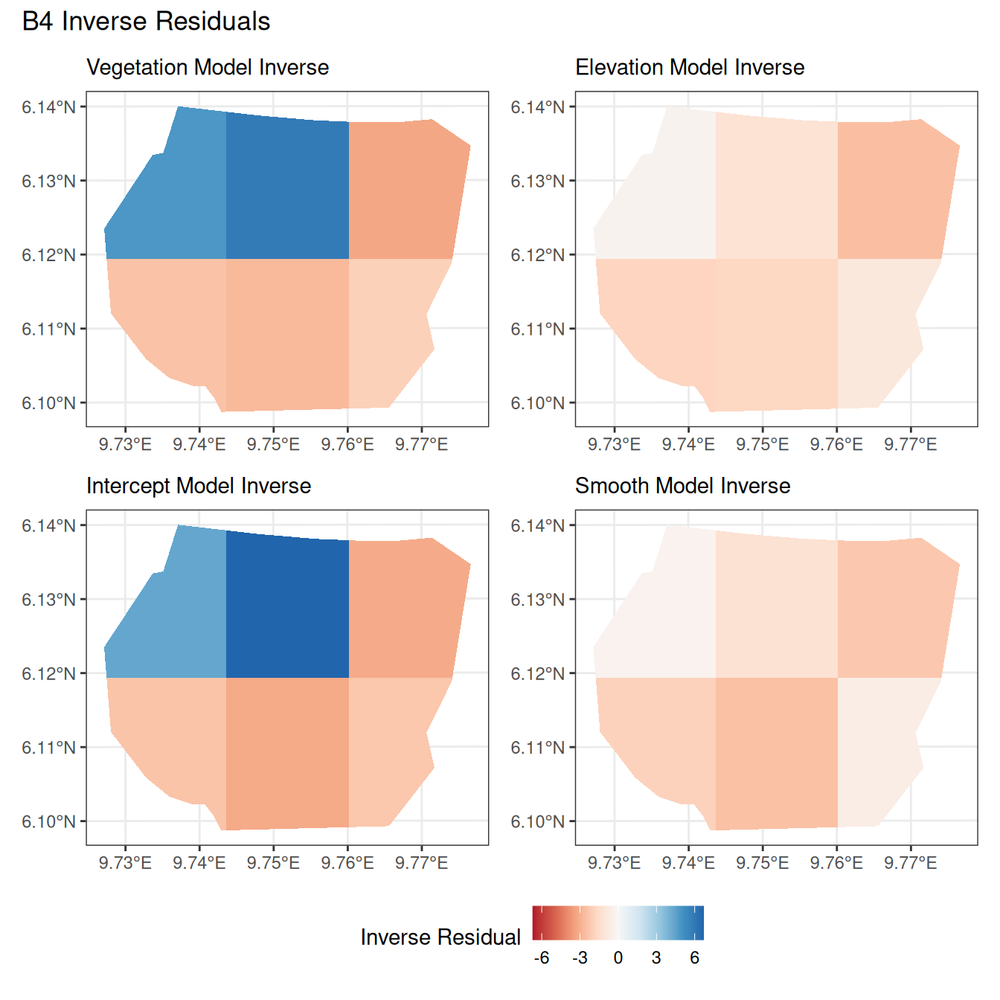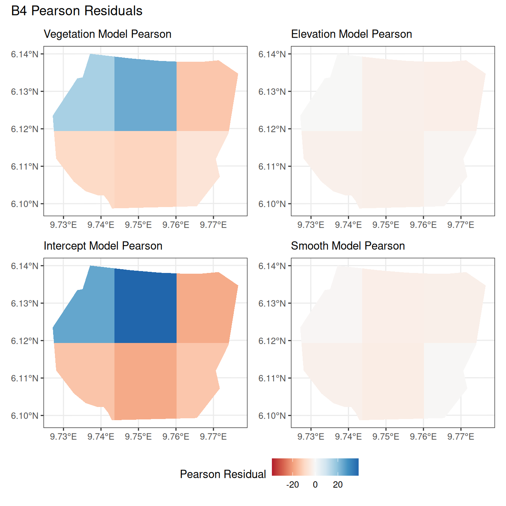

##### Discussion

Firstly, a common feature in each of the three figures is that the
residual plots for the vegetation and intercept models are relatively
similar and those of the elevation and smooth models are relatively
similar as well for both resolutions for any type of residual. Also, for
a fixed type of residual and a chosen model, the B_3 residuals are less
extreme compared to the B_4 residuals, plausibly owing to the bias in
the \`\`experimental” mode in . Another feature in all three types of
residuals is that the elevation and intercept model have less extreme
residual values compared to the vegetation and intercept models for a
given type of residual. This could suggest that the former two are
better models for gorilla nesting in the given region. The residual
values have a wider range when B=B_4 than when B = B_3.

For the scaling residuals and the Pearson residuals, the elevation and
smooth models have less extreme values of residuals relative the
vegetation and intercept models. This suggests that the elevation and
smooth models are more suited to estimating the gorilla nesting
locations in W. Also, there is a significant underestimation in the
north-west areas by the vegetation and intercept models while the same
areas are not underestimated by the other two models. However, as
explored in , these residuals are calculated in the \`\`experimental”
mode of which produces some overestimates in these two models, so this
must be kept in mind while reaching to conclusions about a suitable
model for nesting locations.

For the inverse residuals, the same observations hold, except the
residuals for the elevation and smooth models have residuals that are
not significantly less extreme relative to the vegetation and intercept
models as seen in the case of the Pearson and scaling residuals for both
resolutions B_3 and B_4.

## Code appendix

### Function definitions

``` r

# Niharika Reddy Peddinenikalva
# Vacation Scholarship project
# Updated for sf by Finn Lindgren 2024

suppressPackageStartupMessages(library("RColorBrewer"))
suppressPackageStartupMessages(library("ggplot2"))
suppressPackageStartupMessages(library("dplyr"))
suppressPackageStartupMessages(library("lwgeom"))
suppressPackageStartupMessages(library("patchwork"))
suppressPackageStartupMessages(library("terra"))
suppressPackageStartupMessages(library("sf"))
suppressPackageStartupMessages(library("INLA"))
suppressPackageStartupMessages(library("inlabru"))
suppressPackageStartupMessages(library("fmesher"))
theme_set(theme_bw())


#' ----------------------------------
#' prepare_residual_calculations
#' ----------------------------------
#'
#' Computes the A_sum, A_integrate matrices and the data frame used for
#' calculating the residuals for the given set of polygons B

#' Input:
#' @param samplers `sf` polygons containing partitions for which
#' residuals are to be calculated
#' @param domain A mesh object
#' @param observations `sf` points containing observed data
#'
#' Output:
#' @return A_sum - matrix used to compute the summation term of the residuals
#' @return A_integrate - matrix used to compute the integral term
#' @return df - `sf` containing all the locations 'u' for
#' calculating residuals
#'
prepare_residual_calculations <- function(samplers, domain, observations) {
  # Calculate the integration weights for A_integrate
  ips <- fmesher::fm_int(domain = domain, samplers = samplers)

  # Set-up the A_integrate matrix
  # A_integrate has as many rows as polygons in the samplers,
  # as many columns as integration points
  A_integrate <- fmesher::fm_block(
    block = ips$.block,
    weights = ips$weight,
    n_block = NROW(samplers)
  )

  # Set-up the A_sum matrix
  # A_sum has as many rows as polygons in the samplers,
  # as many columns as observed points
  # each row has 1s for the points in the corresponding polygon
  idx <- sf::st_within(
    observations,
    samplers,
    sparse = TRUE
  )
  A_sum <- fmesher::fm_block(block = unlist(idx), n_block = NROW(samplers))

  # Setting up the data frame for calculating residuals
  observations$obs <- TRUE
  ips$obs <- FALSE
  df <- dplyr::bind_rows(ips, observations)

  # Return A-sum, A_integrate and the data frame for predicting the residuals
  list(A_sum = A_sum, A_integrate = A_integrate, df = df)
}


#' ------------
#' residual_df
#' ------------
#'
#' Computes the three types if residuals and returns a data frame containing
#' information about all 3 residuals for each partition of 'B'
#'
#' Inputs:
#' @param model fitted model for which residuals need to be calculated
#' @param df sf object containing all the locations 'u'
#' for calculating residuals
#' @param expr an expression object containing the formula of the model
#' @param A_sum matrix used to compute the summation term of the residuals
#' @param A_integrate matrix that computes the integral term of the residuals
#'
#' Outputs:
#' @return Data frame containing residual information for each of the
#' partitions of the subset 'B'
#'

residual_df <- function(model, df, expr, A_sum, A_integrate) {
  # Compute residuals
  res <- predict(
    object = model,
    newdata = df,
    ~ {
      lambda <- eval(expr)
      h1 <- lambda * 0 + 1
      h2 <- 1 / lambda
      h3 <- 1 / sqrt(lambda)
      data.frame(
        Scaling_Residuals = as.vector(A_sum %*% h1[obs]) -
          as.vector(A_integrate %*% (h1 * lambda)[!obs]),
        Inverse_Residuals = as.vector(A_sum %*% h2[obs]) -
          as.vector(A_integrate %*% (h2 * lambda)[!obs]),
        Pearson_Residuals = as.vector(A_sum %*% h3[obs]) -
          as.vector(A_integrate %*% (h3 * lambda)[!obs])
      )
    },
    used = bru_used(expr)
  )

  # Label the three types of residuals
  res$Scaling_Residuals$Type <- "Scaling Residuals"
  res$Inverse_Residuals$Type <- "Inverse Residuals"
  res$Pearson_Residuals$Type <- "Pearson Residuals"
  do.call(rbind, res)
}


#' --------------
#' set_csc
#' --------------
#'
#' Sets the colour scale for the three types of residuals
#'
#' Inputs:
#' @param residuals frame containing residual information for each of the
#' partitions of the subset 'B'
#' @param col_theme vector of themes for each type of residual
#'
#' Outputs:
#' @return a list of 3 colour scales for each type of residual
#'

set_csc <- function(residuals, col_theme) {
  # Store data for the colour scale of the plots for each type of residual
  cscrange <- data.frame(
    residuals |>
      group_by(Type) |>
      summarise(maxabs = max(abs(mean)))
  )

  # Set the colour scale for all three types of residuals
  scaling_csc <-
    scale_fill_gradientn(
      colours = brewer.pal(9, col_theme[1]),
      name = "Scaling Residual",
      limits = cscrange[cscrange$Type == "Scaling Residuals", 2] *
        c(-1, 1)
    )

  inverse_csc <-
    scale_fill_gradientn(
      colours = brewer.pal(9, col_theme[2]),
      name = "Inverse Residual",
      limits = cscrange[cscrange$Type == "Inverse Residuals", 2] *
        c(-1, 1)
    )

  pearson_csc <-
    scale_fill_gradientn(
      colours = brewer.pal(9, col_theme[3]),
      name = "Pearson Residual",
      limits = cscrange[cscrange$Type == "Pearson Residuals", 2] *
        c(-1, 1)
    )

  list(
    "Scaling" = scaling_csc,
    "Inverse" = inverse_csc,
    "Pearson" = pearson_csc
  )
}


#' ---------------
#' residual_plot
#' ---------------
#'
#' plots the three types of residuals for each polygon
#'
#' Input:
#' @param samplers A sf containing partitions for which
#' residuals are to be calculated
#' @param residuals frame containing residual information for each of the
#' partitions of the subset 'B'
#' @param csc list of three colour scales for the three types of residuals
#' @param model_name string containing the name of the model being assessed
#'
#' Output:
#' @return a list of three subplots scaling, inverse and Pearson residuals
#' for the different partitions of samplers

residual_plot <- function(samplers, residuals, csc, model_name) {
  # Initialise the scaling residuals plot
  samplers$Residual <- residuals |>
    filter(Type == "Scaling Residuals") |>
    pull(mean)
  scaling <- ggplot() +
    gg(samplers, aes(fill = Residual), alpha = 1, colour = NA) +
    csc["Scaling"] +
    theme(legend.position = "bottom") +
    labs(subtitle = paste(model_name, "Scaling"))

  # Initialise the inverse residuals plot
  samplers$Residual <- residuals |>
    filter(Type == "Inverse Residuals") |>
    pull(mean)
  inverse <- ggplot() +
    gg(samplers, aes(fill = Residual), alpha = 1, colour = NA) +
    csc["Inverse"] +
    theme(legend.position = "bottom") +
    labs(subtitle = paste(model_name, "Inverse"))

  # Initialise the Pearson residuals plot
  samplers$Residual <- residuals |>
    filter(Type == "Pearson Residuals") |>
    pull(mean)
  pearson <- ggplot() +
    gg(samplers, aes(fill = Residual), alpha = 1, colour = NA) +
    csc["Pearson"] +
    theme(legend.position = "bottom") +
    labs(subtitle = paste(model_name, "Pearson"))

  # Return the three plots in a list
  list(
    Scaling = scaling,
    Inverse = inverse,
    Pearson = pearson
  )
}


#' ------------------
#' partition
#' ------------------
#'
#' Partitions the region based on the given criteria for calculating residuals
#' in each partition. Parts of this function are taken from concepts in
#' https://rpubs.com/huanfaChen/grid_from_polygon
#'
#' Input:
#' @param samplers A sf polygon containing region for which
#' partitions need to be created
#' @param resolution resolution of the grids that are required
#' @param nrows number of rows of grids that are required
#' @param ncols number of columns of grids that are required
#'
#' Output:
#' @return a partitioned sf with polygons as required
#'
#'
partition <- function(samplers, resolution = NULL, nrows = NULL, ncols = NULL) {
  # Create a grid for the given boundary
  if (is.null(resolution)) {
    grid <- terra::rast(
      terra::ext(samplers),
      crs = fmesher::fm_proj4string(samplers),
      nrows = nrows,
      ncols = ncols
    )
  }

  if (is.null(c(nrows, ncols))) {
    grid <- terra::rast(
      terra::ext(samplers),
      crs = fmesher::fm_proj4string(samplers),
      resolution = resolution
    )
  }

  gridPolygon <- terra::as.polygons(grid)

  # Extract the boundary with subpolygons only
  sf::st_as_sf(
    terra::intersect(
      gridPolygon,
      terra::vect(samplers)
    )
  )
}


#' ------------------
#' edit_df
#' ------------------
#'
#' Edits the residual data frames to remove columns that need not be displayed
#'
#' Input:
#' @param df the data frame which needs to be edited
#' @param columns a vector of columns that need to be deleted from df
#'
#' Output:
#' @return the edited data frame with only the desired columns
#'
#'
edit_df <- function(df, columns) {
  # Remove the columns that are not required
  df[, !(colnames(df) %in% columns), drop = FALSE]
}
```
