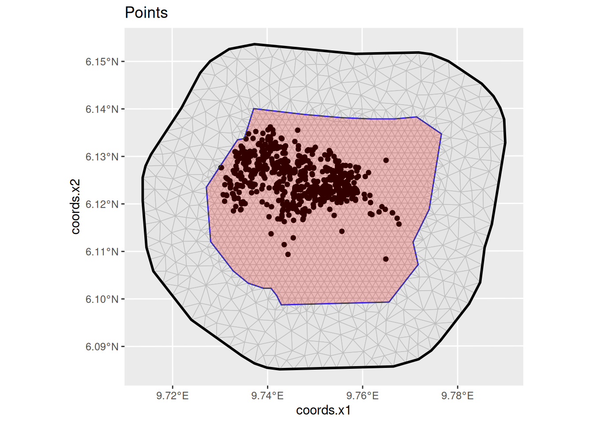
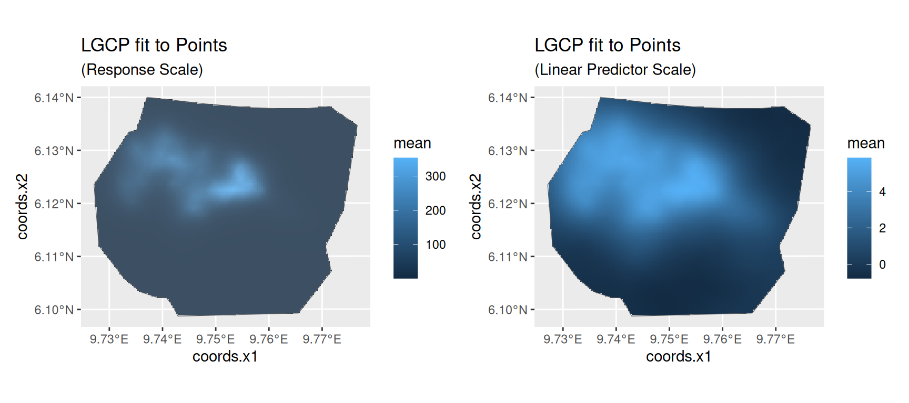
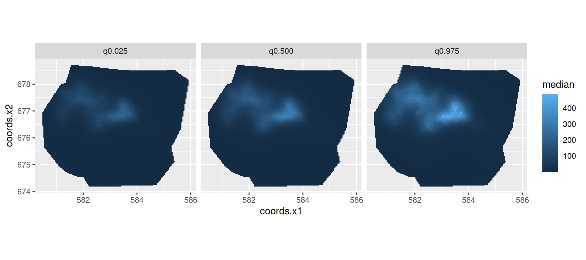
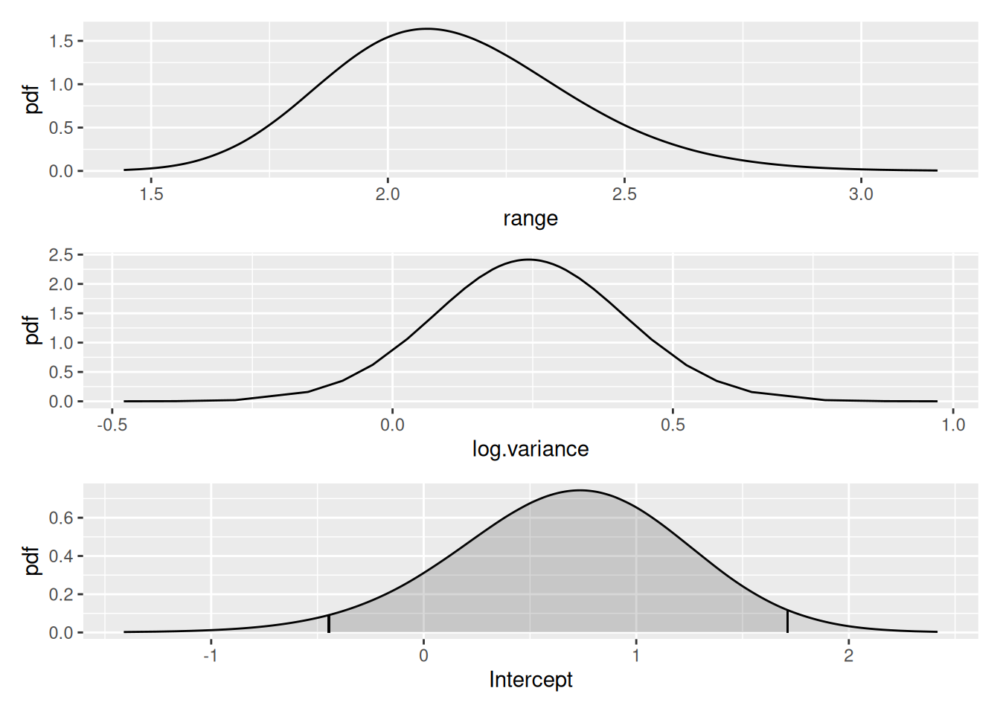
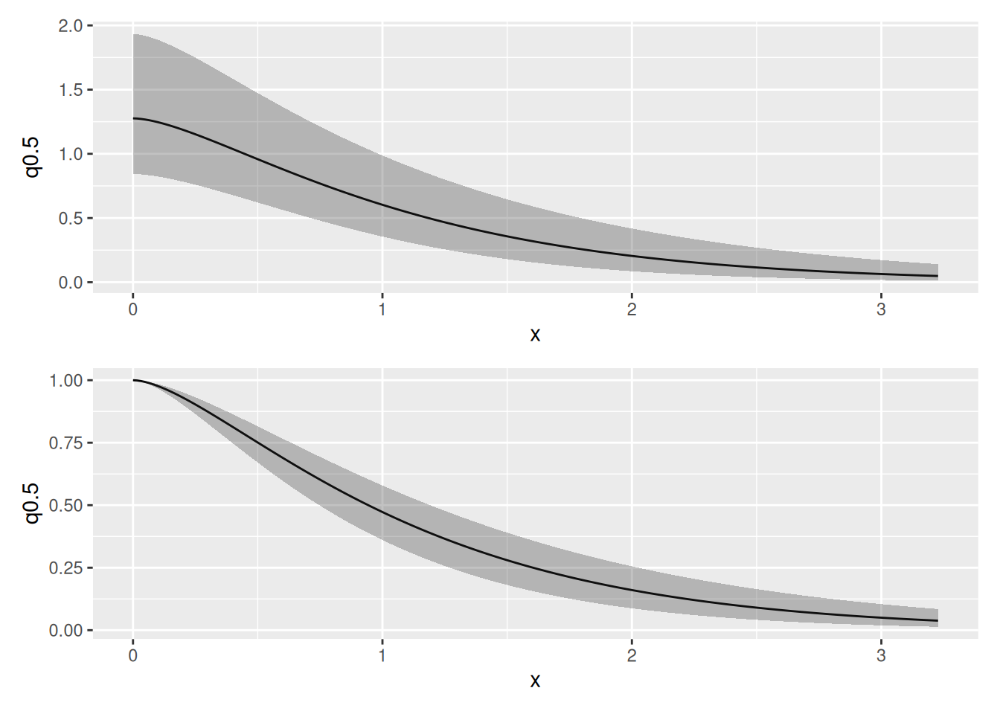
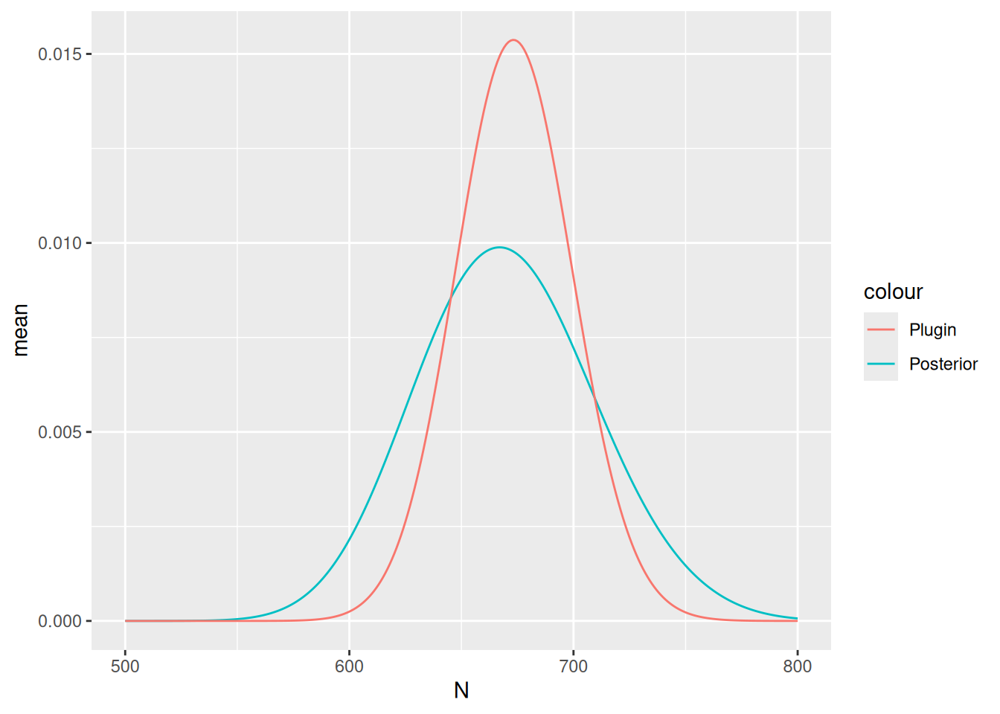

# LGCPs - An example in two dimensions

## Introduction

For this vignette we are going to be working with a dataset obtained
from the `R` package `spatstat`. We will set up a two-dimensional LGCP
to estimate Gorilla abundance.

## Setting things up

Load libraries

``` r

library(fmesher)
library(inlabru)
library(INLA)
library(mgcv)
library(ggplot2)
library(patchwork)
bru_safe_sp(force = TRUE)
```

## Get the data

For the next few practicals we are going to be working with a dataset
obtained from the `R` package `spatstat`, which contains the locations
of 647 gorilla nests. We load the dataset in `sp` format like this:

``` r

gorillas <- gorillas_sp()
#> Loading required namespace: terra
```

This dataset is a list containing a number of `R` objects, including the
locations of the nests, the boundary of the survey area and an `INLA`
mesh - see
[`help(gorillas)`](https://inlabru-org.github.io/inlabru/reference/gorillas.md)
for details. Extract the the objects we need from the list, into other
objects, so that we don’t have to keep typing ‘`gorillas$`’:

``` r

nests <- gorillas$nests
mesh <- gorillas$mesh
boundary <- gorillas$boundary
```

Plot the points (the nests).

``` r

ggplot() +
  geom_fm(data = mesh) +
  gg(nests) +
  gg(boundary, fill = "red", alpha = 0.2) +
  ggtitle("Points")
```



## Fiting the model

Fit an LGCP model to the locations of the gorilla nests, predict on the
survey region, and produce a plot of the estimated density - which
should look like the plot shown below.

Recall that the steps to specifying, fitting and predicting are:

1.  Specify a model, comprising (for 2D models) `coordinates` on the
    left of `~` and an SPDE `+ Intercept(1)` on the right. Please use
    the SPDE prior specification stated below.

2.  Call
    [`lgcp( )`](https://inlabru-org.github.io/inlabru/reference/lgcp.md),
    passing it (with 2D models) the model components, the
    `SpatialPointsDataFrame` containing the observed points and the
    `SpatialPolygonsDataFrame` defining the survey boundary using the
    `samplers` argument.

3.  Call [`predict( )`](https://rdrr.io/r/stats/predict.html), passing
    it the fitted model from 2., locations at which to predict and an
    appropriate predictor specification. The locations at which to
    predict can be a `SpatialPixelsDataFrame` covering the mesh,
    obtained by calling `fm_pixels(mesh, format = "sp")`.

``` r

matern <- inla.spde2.pcmatern(
  mesh,
  prior.sigma = c(0.1, 0.01),
  prior.range = c(5, 0.01)
)

cmp <- coordinates ~
  mySmooth(coordinates, model = matern) +
  Intercept(1)

fit <- lgcp(cmp, nests, samplers = boundary, domain = list(coordinates = mesh))
```

## Predicting intensity

You should get a plot like that below (the command below assumes that
the prediction is in an object called `lambda`):

``` r

pred <- predict(
  fit,
  fm_pixels(mesh, mask = boundary, format = "sp"),
  ~ data.frame(
    lambda = exp(mySmooth + Intercept),
    loglambda = mySmooth + Intercept
  )
)

pl1 <- ggplot() +
  gg(pred$lambda) +
  gg(boundary) +
  ggtitle("LGCP fit to Points", subtitle = "(Response Scale)")

pl2 <- ggplot() +
  gg(pred$loglambda) +
  gg(boundary, alpha = 0) +
  ggtitle("LGCP fit to Points", subtitle = "(Linear Predictor Scale)")

(pl1 | pl2)
```



You can plot the median, lower 95% and upper 95% density surfaces as
follows (assuming that the predicted intensity is in object `lambda`).

``` r

ggplot() +
  gg(cbind(pred$lambda, data.frame(property = "q0.500")), aes(fill = median)) +
  gg(cbind(pred$lambda, data.frame(property = "q0.025")), aes(fill = q0.025)) +
  gg(cbind(pred$lambda, data.frame(property = "q0.975")), aes(fill = q0.975)) +
  coord_equal() +
  facet_wrap(~property)
```



## SPDE parameters

Plot the SPDE parameter and fixed effect parameter posteriors.

``` r

int.plot <- plot(fit, "Intercept")
spde.range <- spde.posterior(fit, "mySmooth", what = "range")
spde.logvar <- spde.posterior(fit, "mySmooth", what = "log.variance")
range.plot <- plot(spde.range)
var.plot <- plot(spde.logvar)

(range.plot / var.plot / int.plot)
```



Look at the correlation function if you want to:

``` r

corplot <- plot(spde.posterior(fit, "mySmooth", what = "matern.correlation"))
covplot <- plot(spde.posterior(fit, "mySmooth", what = "matern.covariance"))
(covplot / corplot)
```



## Estimating Abundance

Finally, estimate abundance using the `predict` function. As a first
step we need an estimate for the integrated lambda. The integration
`weight` values are contained in the
[`fm_int()`](https://inlabru-org.github.io/fmesher/reference/fm_int.html)
output.

``` r

Lambda <- predict(
  fit,
  fm_int(mesh, boundary),
  ~ sum(weight * exp(mySmooth + Intercept))
)
Lambda
#>       mean      sd   q0.025     q0.5   q0.975   median mean.mc_std_err
#> 1 673.7215 25.1074 622.5781 674.7467 716.8305 674.7467        2.862177
#>   sd.mc_std_err
#> 1      1.757187
```

Given some generous interval boundaries (500, 800) for lambda we can
estimate the posterior abundance distribution via

``` r

Nest <- predict(
  fit, fm_int(mesh, boundary),
  ~ data.frame(
    N = 500:800,
    dpois(500:800,
      lambda = sum(weight * exp(mySmooth + Intercept))
    )
  )
)
```

Get its quantiles via

``` r

inla.qmarginal(c(0.025, 0.5, 0.975), marginal = list(x = Nest$N, y = Nest$mean))
#> [1] 595.1432 669.0831 750.5022
```

… the mean via

``` r

inla.emarginal(identity, marginal = list(x = Nest$N, y = Nest$mean))
#> [1] 670.1236
```

and plot posteriors:

``` r

Nest$plugin_estimate <- dpois(Nest$N, lambda = Lambda$mean)
ggplot(data = Nest) +
  geom_line(aes(x = N, y = mean, colour = "Posterior")) +
  geom_line(aes(x = N, y = plugin_estimate, colour = "Plugin"))
```



The true number of nests in 647; the mean and median of the posterior
distribution of abundance should be close to this if you have not done
anything wrong!
