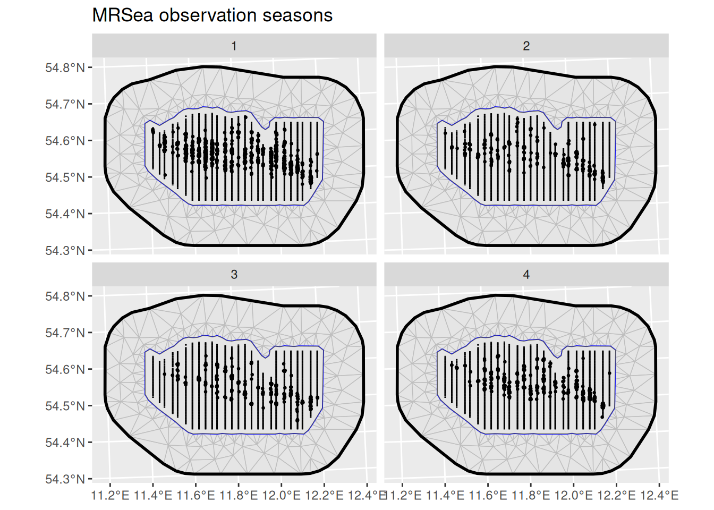
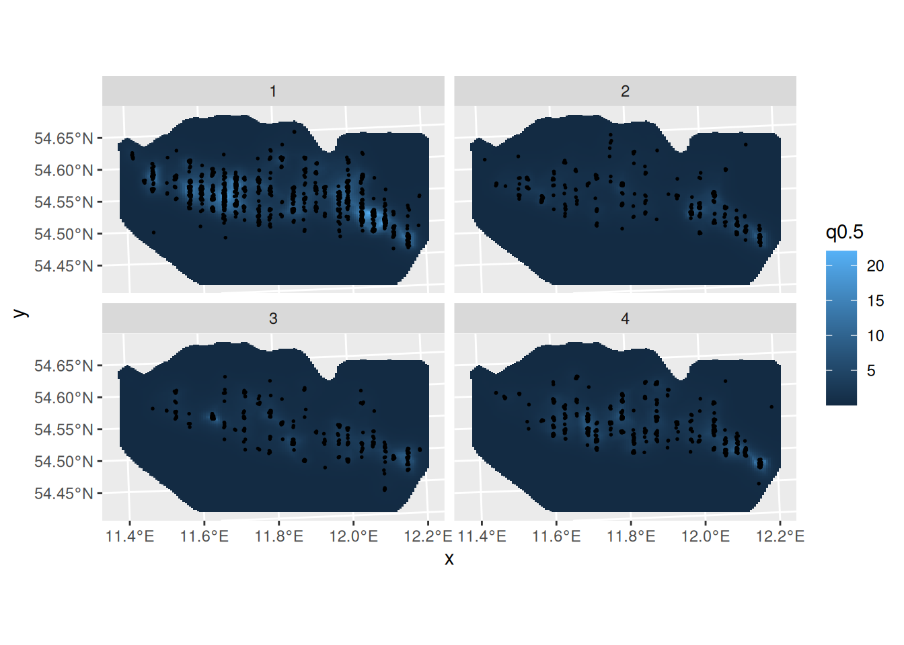
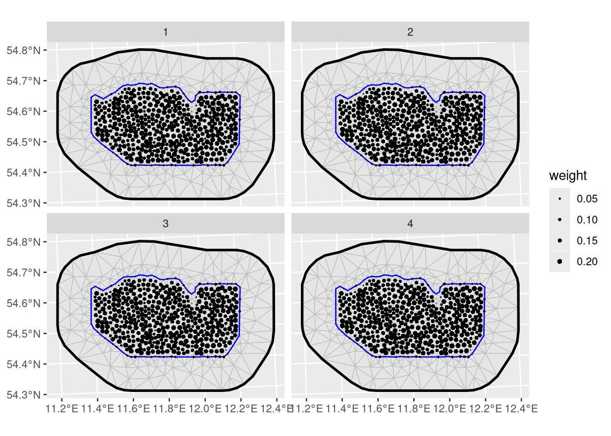

# LGCPs - An example in space and time

## Introduction

For this vignette we are going to be working with a dataset obtained
from the `R` package `MRSea`. We will set up a LGCP with a
spatio-temporal SPDE model to estimate species distribution.

## Setting things up

Load libraries

``` r

library(fmesher)
library(inlabru)
library(INLA)
library(ggplot2)
```

## Get the data

Load the dataset, that has coordinates in UTM in kilometres:

``` r

mrsea <- inlabru::mrsea
```

The points (representing animals) and the sampling regions of this
dataset are associated with a season. Let’s have a look at the observed
points and sampling regions for all seasons:

``` r

ggplot() +
  geom_fm(data = mrsea$mesh) +
  gg(mrsea$boundary) +
  gg(mrsea$samplers) +
  gg(mrsea$points, size = 0.5) +
  facet_wrap(~season) +
  ggtitle("MRSea observation seasons")
```



## Fitting the model

Fit an LGCP model to the locations of the animals. In this example we
will employ a spatio-temporal SPDE. Note how the `group` and `ngroup`
parameters are employed to let the SPDE model know about the name of the
time dimension (season) and the total number of distinct points in time.
The point process likelihood is constructed by the
[`lgcp()`](https://inlabru-org.github.io/inlabru/reference/lgcp.md)
function, which is a wrapper around the `bru_obs(..., model = "cp")` and
[`bru()`](https://inlabru-org.github.io/inlabru/reference/bru.md)
functions. Like for ordinary spatial point process models, the
`samplers` argument specifies the observation region/set, in this case
combinations spatial lines and seasons. The `domain` argument specifies
the spatio-temporal function space to use when constructing the
numerical integration scheme needed for the point process likelihood
evaluation.

``` r

matern <- inla.spde2.pcmatern(mrsea$mesh,
  prior.sigma = c(0.1, 0.01),
  prior.range = c(10, 0.01)
)

cmp <- ~ Intercept(1) +
  mySmooth(
    geometry,
    model = matern,
    group = season,
    ngroup = 4
  )

fit <- bru(
  cmp,
  bru_obs(
    geometry + season ~ .,
    family = "cp",
    data = mrsea$points,
    samplers = mrsea$samplers,
    domain = list(
      geometry = mrsea$mesh,
      season = seq_len(4)
    )
  )
)
```

Predict and plot the intensity for all seasons:

``` r

ppxl <- fm_pixels(mrsea$mesh, mask = mrsea$boundary, format = "sf")
ppxl_all <- fm_cprod(ppxl, data.frame(season = seq_len(4)))

lambda1 <- predict(
  fit,
  ppxl_all,
  ~ data.frame(season = season, lambda = exp(mySmooth + Intercept))
)
```

``` r

pl1 <- ggplot() +
  gg(lambda1, geom = "tile", aes(fill = q0.5)) +
  gg(mrsea$points, size = 0.3) +
  facet_wrap(~season) +
  coord_sf()
pl1
```



## Integration points

The `inlabru` point process model,
[`lgcp()`](https://inlabru-org.github.io/inlabru/reference/lgcp.md) or
`bru_obs(..., model = "cp")`, knows how to construct the numerical
integration scheme for the LGCP likelihood. To see what happens
internally, we can also call the internal functions directly to see what
the integration scheme will look like, using the
[`fm_int()`](https://inlabru-org.github.io/fmesher/reference/fm_int.html)
function with the same `domain` and `samplers` arguments as in the
previous
[`lgcp()`](https://inlabru-org.github.io/inlabru/reference/lgcp.md)
call. Note that omitting the `season` dimension from `domain` would lead
to aggregation of all sampling regions over time.

``` r

ips <- fm_int(
  domain = list(geometry = mrsea$mesh, season = 1:4),
  samplers = mrsea$samplers
)
```

Plot the integration points:

``` r

ggplot() +
  geom_fm(data = mrsea$mesh) +
  gg(ips, aes(size = weight), stroke = 0) +
  scale_size_area(max_size = 2) +
  facet_wrap(~season)
```


