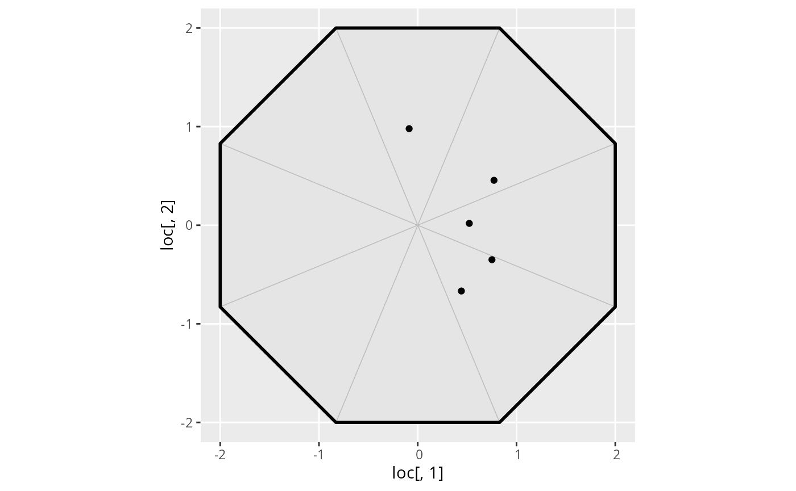

# Converting inla.spde.make.A calls into the bru_mapper system

(Vignette under construction!)

## Introduction

In traditional `INLA` code involving `inla.mesh` objects and `inla.spde`
models, the
[`inla.spde.make.A()`](https://rdrr.io/pkg/INLA/man/inla.spde.make.A.html)
function is used to construct the component design matrix that maps
between spatial/spatio-temporal locations and the latent variables
associated with mesh basis functions. For 2-manifold meshes, such as
flat and spherical meshes, the implementation has one latent variable
per mesh node, linked to piecewise linear basis functions on the mesh
triangles. For 1-manifolds such as intervals and cyclic domains, both
piecewise linear and piecewise quadratic basis functions are supported.

The
[`inla.spde.make.A()`](https://rdrr.io/pkg/INLA/man/inla.spde.make.A.html)
interface supports a variety of features, that can be broken down in
more simple building blocks. With the `inlabru` `bru_mapper` system,
these building blocks are more easily customised for specific uses, some
of which aren’t necessarily connected to spde models, such as the
`block` feature that is used to aggregate rows of a design matrix,
e.g. to construct numerical integration schemes.

If you haven’t already, go read the
[bru_mapper](http://inlabru-org.github.io/inlabru/articles/bru_mapper.md)
vignette for information about the various `bru_mapper` classes and
methods. Then come back here to continue.

## Converting the basic inla.spde.make.A calls into mappers

The most basic `inla.spde.make.A` call is to map purely spatial points
to a mesh:

``` r
mesh <- fm_mesh_2d_inla(cbind(0, 0), offset = 2, max.edge = 10)
loc <- matrix(runif(10) * 2 - 1, 5, 2)
ggplot() +
  geom_fm(data = mesh) +
  geom_point(aes(loc[, 1], loc[, 2]))
```



``` r
A.loc <- inla.spde.make.A(mesh, loc = loc)
A.loc
#> 5 x 9 sparse Matrix of class "dgCMatrix"
#>                                                                          
#> [1,] . 0.29227293 0.09984048 .         .          .         . . 0.6078866
#> [2,] . 0.02324195 0.36614606 .         .          .         . . 0.6106120
#> [3,] . .          0.11935641 0.1416259 .          .         . . 0.7390177
#> [4,] . .          .          0.3522410 0.08180227 .         . . 0.5659568
#> [5,] . .          .          .         0.19233634 0.2974006 . . 0.5102631
```

A basic conversion of this becomes

``` r
A.loc <- fm_basis(mesh, loc = loc)
A.loc
#> 5 x 9 sparse Matrix of class "dgCMatrix"
#>                                                                          
#> [1,] . 0.29227293 0.09984048 .         .          .         . . 0.6078866
#> [2,] . 0.02324195 0.36614606 .         .          .         . . 0.6106120
#> [3,] . .          0.11935641 0.1416259 .          .         . . 0.7390177
#> [4,] . .          .          0.3522410 0.08180227 .         . . 0.5659568
#> [5,] . .          .          .         0.19233634 0.2974006 . . 0.5102631
```

but this is limited to just the basic case of evaluating on only a mesh.

With a `bru_mapper`, this becomes the more generally useful

``` r
mapper <- bru_mapper(mesh)
A.loc <- ibm_jacobian(mapper, input = loc)
A.loc
#> 5 x 9 sparse Matrix of class "dgCMatrix"
#>                                                                          
#> [1,] . 0.29227293 0.09984048 .         .          .         . . 0.6078866
#> [2,] . 0.02324195 0.36614606 .         .          .         . . 0.6106120
#> [3,] . .          0.11935641 0.1416259 .          .         . . 0.7390177
#> [4,] . .          .          0.3522410 0.08180227 .         . . 0.5659568
#> [5,] . .          .          .         0.19233634 0.2974006 . . 0.5102631
```

### Mapping with a precomputed location mapping

``` r
index <- c(1, 3, 5, 2, 1, 2)
inla.spde.make.A(A.loc = A.loc, index = index)
#> 6 x 9 sparse Matrix of class "dgCMatrix"
#>                                                                         
#> [1,] . 0.29227293 0.09984048 .         .         .         . . 0.6078866
#> [2,] . .          0.11935641 0.1416259 .         .         . . 0.7390177
#> [3,] . .          .          .         0.1923363 0.2974006 . . 0.5102631
#> [4,] . 0.02324195 0.36614606 .         .         .         . . 0.6106120
#> [5,] . 0.29227293 0.09984048 .         .         .         . . 0.6078866
#> [6,] . 0.02324195 0.36614606 .         .         .         . . 0.6106120

mapper <- bm_taylor(jacobian = A.loc[index, , drop = FALSE])
ibm_jacobian(mapper)
#> 6 x 9 sparse Matrix of class "dgCMatrix"
#>                                                                         
#> [1,] . 0.29227293 0.09984048 .         .         .         . . 0.6078866
#> [2,] . .          0.11935641 0.1416259 .         .         . . 0.7390177
#> [3,] . .          .          .         0.1923363 0.2974006 . . 0.5102631
#> [4,] . 0.02324195 0.36614606 .         .         .         . . 0.6106120
#> [5,] . 0.29227293 0.09984048 .         .         .         . . 0.6078866
#> [6,] . 0.02324195 0.36614606 .         .         .         . . 0.6106120

# For run-time indexing:
mapper <-
  bm_pipe(
    list(
      matrix = bm_taylor(jacobian = A.loc),
      index = bm_index(nrow(A.loc))
    )
  )
ibm_jacobian(mapper, input = list(index = index))
#> 6 x 9 sparse Matrix of class "dgCMatrix"
#>                                                                         
#> [1,] . 0.29227293 0.09984048 .         .         .         . . 0.6078866
#> [2,] . .          0.11935641 0.1416259 .         .         . . 0.7390177
#> [3,] . .          .          .         0.1923363 0.2974006 . . 0.5102631
#> [4,] . 0.02324195 0.36614606 .         .         .         . . 0.6106120
#> [5,] . 0.29227293 0.09984048 .         .         .         . . 0.6078866
#> [6,] . 0.02324195 0.36614606 .         .         .         . . 0.6106120
```

### Group mapping with a group mesh

``` r
inla.spde.make.A(..., group = group.values, group.mesh = group.mesh)

mapper <- bm_multi(list(
  main = bru_mapper(mesh),
  group = bru_mapper(group.mesh)
))
ibm_jacobian(mapper, input = list(main = loc, group = group.values))
```

### Blockwise aggregation

Blockwise aggregation can be implemented with a `bm_aggregate` mapper.

``` r
block_rescale <- "none" # one of "none", "count", "weights", "sum"
inla.spde.make.A(...,
  weights = weights,
  block = block,
  block.rescale = block_rescale,
  n.block = n_block
)
```

Rescaling options:

- `block_rescale = "none"` corresponds to `rescale = FALSE`
- `block_rescale = "count"` corresponds to `rescale = TRUE` and
  providing no `weights`, as that is interpreted as all weights being
  `1`, so rescaling by the sum of the weights is equivalent to dividing
  by the number of elements in each block.
- `block_rescale = "weights"` corresponds to `rescale = TRUE`
- `block_rescale = "sum"` is not supported by the aggregation mapper.

``` r
mapper <- bm_pipe(
  list(
    main = bm_multi(list(main = bru_mapper(mesh), ...)),
    block = bm_aggregate(
      rescale = (block_rescale != "none"),
      n_block = n_block
    )
  )
)
ibm_jacobian(mapper,
  input = list(
    main = list(main = loc),
    block = list(block = block, weights = weights)
  )
)
```

## inla.spde.make.index

``` r
ngroup <- 2
nrepl <- 3

summary(
  as.data.frame(
    inla.spde.make.index("field",
      n.spde = mesh$n,
      n.group = ngroup,
      n.repl = nrepl
    )
  )
)
#>      field    field.group    field.repl
#>  Min.   :1   Min.   :1.0   Min.   :1   
#>  1st Qu.:3   1st Qu.:1.0   1st Qu.:1   
#>  Median :5   Median :1.5   Median :2   
#>  Mean   :5   Mean   :1.5   Mean   :2   
#>  3rd Qu.:7   3rd Qu.:2.0   3rd Qu.:3   
#>  Max.   :9   Max.   :2.0   Max.   :3

mapper <- bm_multi(list(
  field.main = bru_mapper(mesh),
  field.group = bm_index(ngroup),
  field.replicate = bm_index(nrepl)
))
summary(ibm_values(mapper, multi = TRUE, inla_f = TRUE))
#>    field.main  field.group  field.replicate
#>  Min.   :1    Min.   :1.0   Min.   :1      
#>  1st Qu.:3    1st Qu.:1.0   1st Qu.:1      
#>  Median :5    Median :1.5   Median :2      
#>  Mean   :5    Mean   :1.5   Mean   :2      
#>  3rd Qu.:7    3rd Qu.:2.0   3rd Qu.:3      
#>  Max.   :9    Max.   :2.0   Max.   :3
```

The benefit of the mapper approach here is that it encapsulates all the
information, so that only the mapper needs to be carried around to code
that needs it, and that it doesn’t restrict the group and replicate
mappings to integer indices; the index mappers can be replaced by other
mappers, e.g. to allow interpolation between group indices, with a 1d
mesh mapper.
