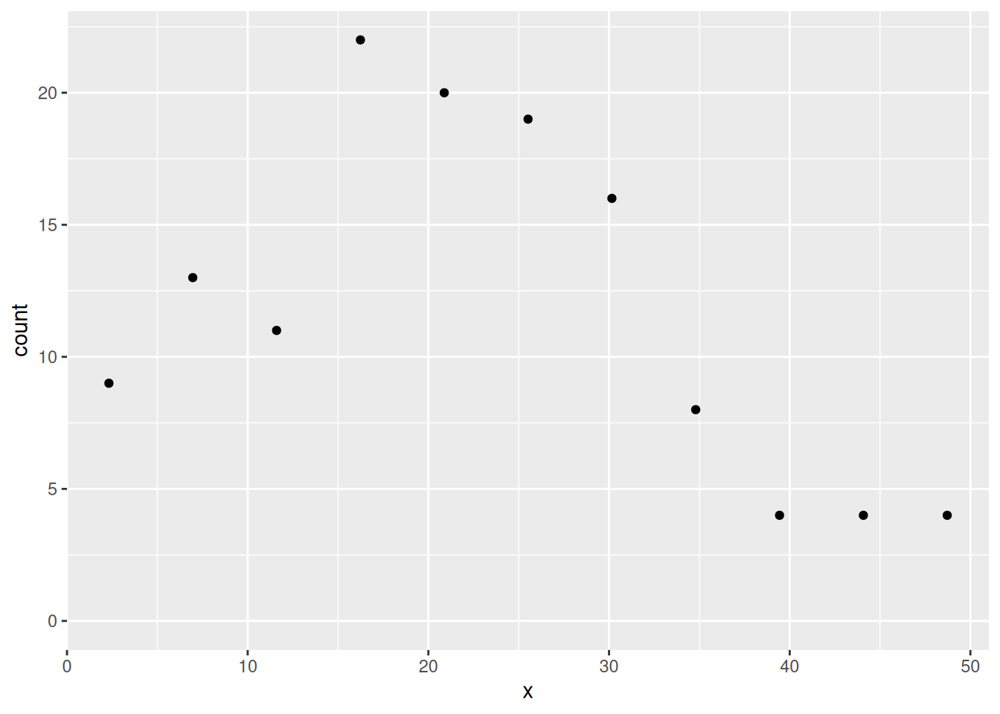
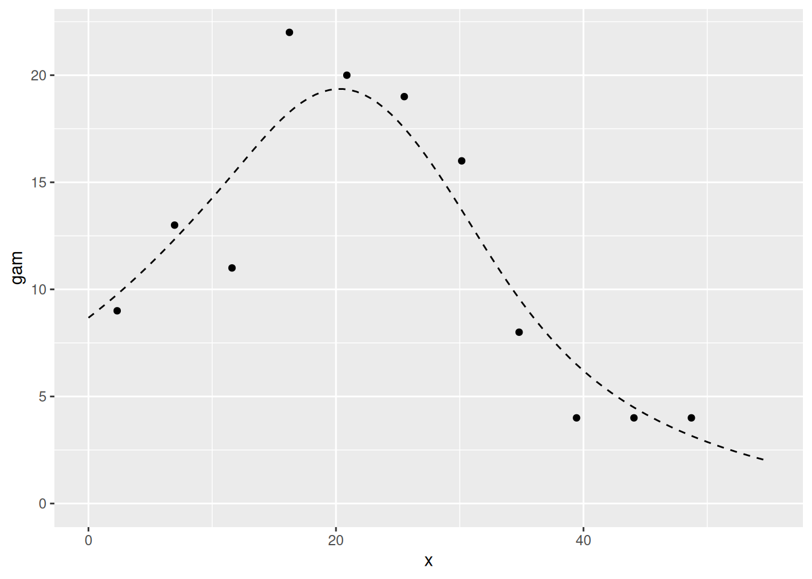
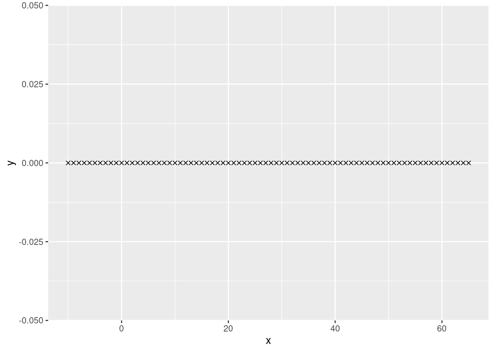
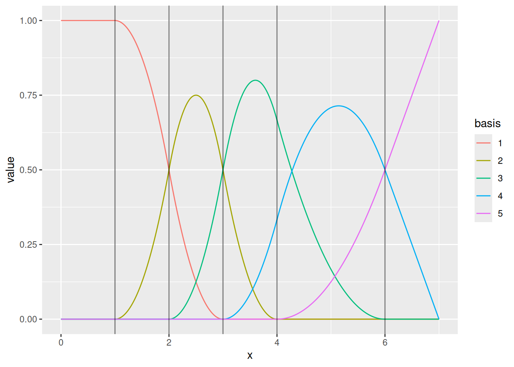
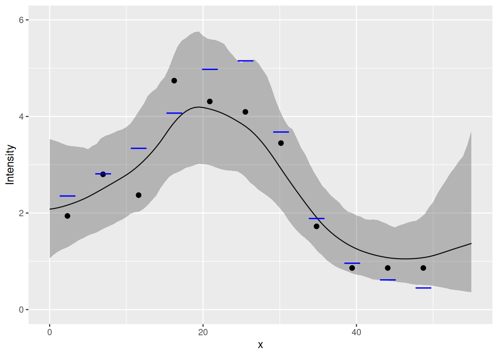
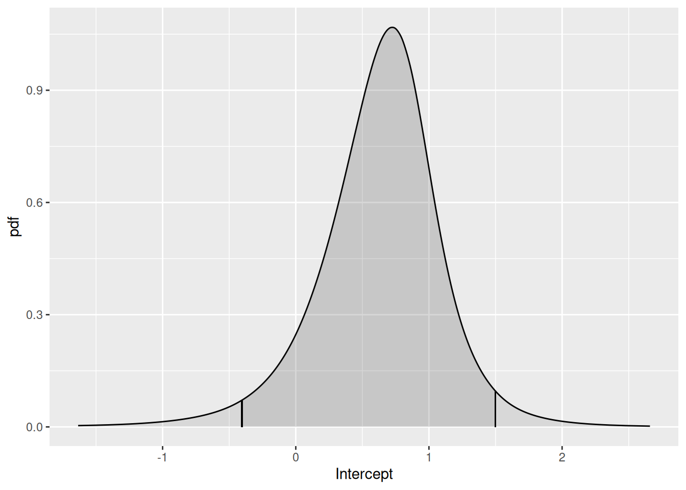
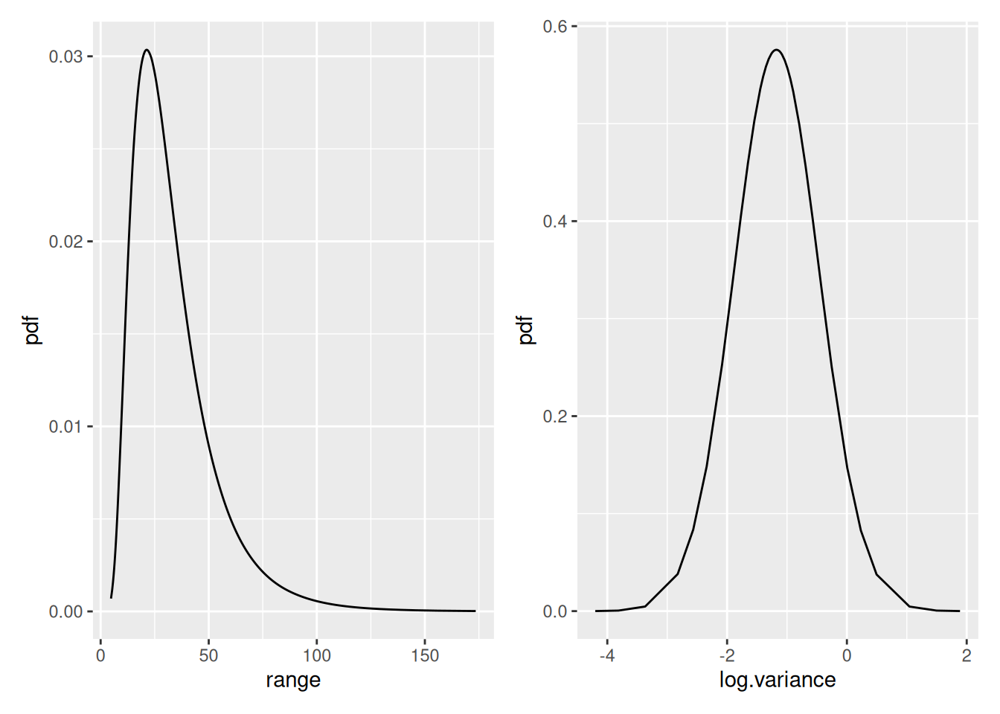
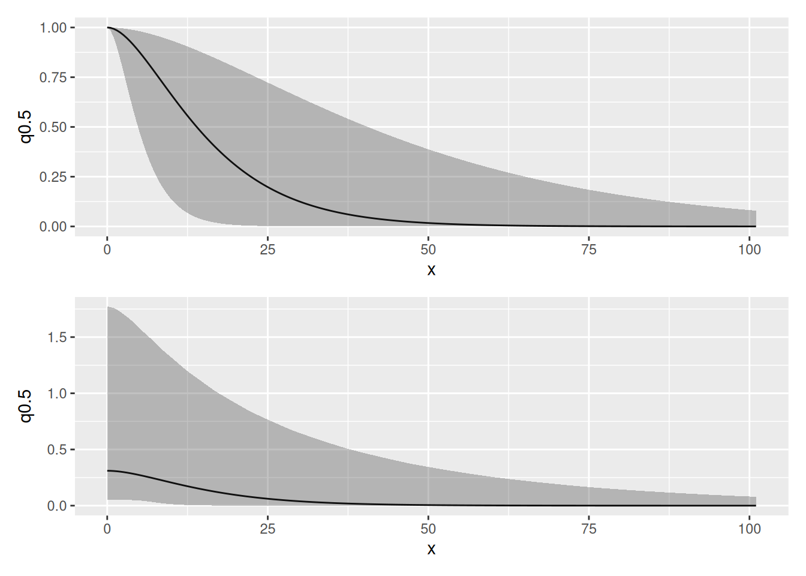

# Random Fields in One Dimension

## Setting things up

``` r

library(INLA)
library(inlabru)
library(mgcv)
library(ggplot2)
library(fmesher)
library(patchwork)
```

Make a shortcut to a nicer colour scale:

``` r

colsc <- function(...) {
  scale_fill_gradientn(
    colours = rev(RColorBrewer::brewer.pal(11, "RdYlBu")),
    limits = range(..., na.rm = TRUE)
  )
}
```

## Get the data

Load the data and rename the countdata object to `cd` (just because
‘`cd`’ is less to type than ‘`countdata2`’.):

``` r

data(Poisson2_1D)
cd <- countdata2
```

Take a look at the count data.

``` r

cd
#>            x count exposure
#> 1   2.319888     9 4.639776
#> 2   6.959664    13 4.639776
#> 3  11.599439    11 4.639776
#> 4  16.239215    22 4.639776
#> 5  20.878991    20 4.639776
#> 6  25.518766    19 4.639776
#> 7  30.158542    16 4.639776
#> 8  34.798318     8 4.639776
#> 9  39.438093     4 4.639776
#> 10 44.077869     4 4.639776
#> 11 48.717645     4 4.639776
ggplot(cd) +
  geom_point(aes(x, y = count)) +
  ylim(0, max(cd$count))
```



*Tip*: `RStudio > Help > Cheatsheets > Data visualisation with ggplot2`
is a useful reference for `ggplot2` syntax.

## Fitting a Generalised Additive Model (GAM)

If you’re not familiar with GAMs and the syntax of `gam` don’t worry,
the point of this is just to provide something to which we can compare
the `inlabru` model fit.

``` r

fit2.gam <- gam(count ~ s(x, k = 10) + offset(log(exposure)),
  family = poisson(),
  data = cd
)
```

The term `s(x,k=10)` just specifies that as nonparametric smooth
function is to be fitted to the data, with *no more than* 10 degrees of
freedom (df). (The larger the df, the more wiggly the fitted curve
(recall from the lecture that this is an effect of how some spline
methods are defined, without discretisation dependent penalty); `gam`
selects the ‘best’ df.) Notice the use of `offset=` to incorporate the
variable `exposure` in `cd` is the size of the bin in which each count
was made.

You can look at the fitted model using
[`summary( )`](https://rspatial.github.io/terra/reference/summary.html)
as below if you want to, but you do not need to understand this output,
or the code that makes the predictions immediately below it if you are
not familiar with GAMs.

``` r

summary(fit2.gam)
```

Make a prediction data frame, get predictions and add them to the data
frame First make vectors of x-values and associated (equal) exposures:

``` r

xs <- seq(0, 55, length = 100)
exposures <- rep(cd$exposure[1], 100)
```

and put them in a data frame:

``` r

dat4pred <- data.frame(x = xs, exposure = exposures)
```

Then predict

``` r

pred2.gam <- predict(fit2.gam, newdata = dat4pred, type = "response")
# add column for prediction in data frame:
dat4pred2 <- cbind(dat4pred, gam = pred2.gam)
```

Plotting the fit and the data using the `ggplot2` commands below should
give you the plot shown below

``` r

ggplot(dat4pred2) +
  geom_line(aes(x = x, y = gam), lty = 2) +
  ylim(0, max(dat4pred2$gam, cd$count)) +
  geom_point(aes(x = x, y = count), cd)
```



## Fitting an SPDE model with inlabru

Make mesh. To avoid boundary effects in the region of interest, let the
mesh extend outside the data range.

``` r

x <- seq(-10, 65, by = 5) # this sets mesh points - try others if you like
(mesh1D <- fm_mesh_1d(x, degree = 2, boundary = "free"))
#> fm_mesh_1d object:
#>   Manifold:  R1
#>   #{knots}:  16
#>   Interval:  (-10,  65)
#>   Boundary:  (free, free)
#>   B-spline degree:   2
#>   Basis d.o.f.:  17
```

… and see where the mesh knots are:

``` r

ggplot() +
  gg(mesh1D)
```

We can also draw the basis functions:

``` r

ggplot() +
  geom_fm(data = mesh1D)
```



For special cases, one can control the knots and boundary conditions.
Normally, we just need to ensure that there is enough flexibility to
represent the intended Gaussian process dependence structure, while not
adding needless computations.

``` r

(mesh <- fm_mesh_1d(c(1, 2, 3, 4, 6),
  boundary = c("neumann", "free"),
  degree = 2
))
#> fm_mesh_1d object:
#>   Manifold:  R1
#>   #{knots}:  5
#>   Interval:  (1, 6)
#>   Boundary:  (neumann, free)
#>   B-spline degree:   2
#>   Basis d.o.f.:  5
ggplot() +
  geom_fm(data = mesh, xlim = c(0, 7))
```



### Using function `bru( )` to fit to count data

We need to specify model components and a model formula in order to fit
it. This can be done inside the call to
[`bru( )`](https://inlabru-org.github.io/inlabru/reference/bru.md) but
that is a bit messy, so we’ll store it in `comp` first and then pass
that to
[`bru( )`](https://inlabru-org.github.io/inlabru/reference/bru.md).

Our response variable in the data frame `cd` is called `count` so the
model specification needs to have that on the left of the `~`. We add an
intercept component with `+ Intercept(1)` on the right hand side (all
the models we use have intercepts), and because we want to fit a
Gaussian random field (GRF), it must have a GRF specification. In
`inlabru` the GRF specification is a function, which allows the GRF to
be calculated at any point in space while `inlabru` is doing its
calculations.

The user gets to name the GRF function. The syntax is
`myname(input, model= ...)`, where:

- ‘myname’ is whatever you want to call the GRF (we called it `field`
  below);
- `input` specifies the coordinates in which the GRF or SPDE ‘lives’.
  Here we are working in one dimension, and we called that dimension `x`
  when we set up the data set.
- `model=` designates the type of effect, here an SPDE model object from
  the `INLA` function
  [`inla.spde2.pcmatern( )`](https://rdrr.io/pkg/INLA/man/inla.spde2.pcmatern.html),
  which requires a mesh to be passed to it, so we pass it the 1D mesh
  that we created above, `mesh1D`.

For models that only sums all the model components, we don’t need to
specify the full predictor formula. Instead, we can provide the name of
the output to the left of the `~` in the component specification, and
“.” on the right hand side, which will cause it to add all components
(unless a subset is selected via the `used` argument to
[`bru_obs()`](https://inlabru-org.github.io/inlabru/reference/bru_obs.md)).

``` r

the_spde <- inla.spde2.pcmatern(mesh1D,
  prior.range = c(1, 0.01),
  prior.sigma = c(1, 0.01)
)

comp <- ~ field(x, model = the_spde) + Intercept(1, prec.linear = 1 / 2^2)

fit2.bru <- bru(
  comp,
  bru_obs(
    count ~ .,
    data = cd,
    family = "poisson",
    E = exposure
  )
)

summary(fit2.bru)
#> inlabru version: 2.15.0 
#> INLA version: 26.06.08 
#> Latent components:
#> field: main = spde(x)
#> Intercept: main = linear(1)
#> Observation models:
#>   Model tag: <No tag>
#>     Family: 'poisson'
#>     Data class: 'data.frame'
#>     Response class: 'integer'
#>     Predictor: count ~ field + Intercept
#>     Additive/Linear/Rowwise: TRUE/TRUE/TRUE
#>     Used components: effect[field, Intercept], latent[] 
#> Time used:
#>     Pre = 0.409, Running = 0.284, Post = 0.0706, Total = 0.763 
#> Fixed effects:
#>            mean    sd 0.025quant 0.5quant 0.975quant  mode kld
#> Intercept 0.631 0.469      -0.41    0.663      1.506 0.733   0
#> 
#> Random effects:
#>   Name     Model
#>     field SPDE2 model
#> 
#> Model hyperparameters:
#>                   mean     sd 0.025quant 0.5quant 0.975quant  mode
#> Range for field 33.385 19.657      9.854   28.762      84.24 21.37
#> Stdev for field  0.594  0.218      0.277    0.557       1.12  0.49
#> 
#> Marginal log-Likelihood:  -36.55 
#>  is computed 
#> Posterior summaries for the linear predictor and the fitted values are computed
#> (Posterior marginals needs also 'control.compute=list(return.marginals.predictor=TRUE)')
```

Predict the values at the x points used for mesh (the data argument must
be a data frame, see
[`?predict.bru`](https://inlabru-org.github.io/inlabru/reference/predict.md)):

``` r

x4pred <- data.frame(x = xs)
pred2.bru <- predict(fit2.bru,
  x4pred,
  x ~ exp(field + Intercept),
  n.samples = 1000
)
```

Let’s do a plot to compare the fitted model to the true model. The
expected counts of the true model are stored in the variable `E_nc2`
which comes with the dataset `Poisson2_1D`. For ease of use in plotting
with `ggplot2` (which needs a data frame), we create a data frame which
we call `true.lambda`, containing `x`- and `y` variables as shown below.

Given that `inlabru` predictions are always on the intensity function
scale, do you understand why we divide the count by `cd$exposure`? (We
will in due course allow predictions on the count scale as well.)

``` r

true.lambda <- data.frame(x = cd$x, y = E_nc2 / cd$exposure)
```

These `ggplot2` commands should generate the plot shown below. It shows
the true intensities as short horizontal blue lines, the observed
intensities as black dots, and the fitted intensity function as a red
curve, with 95% credible intervals shown as a light red band about the
curve.

``` r

ggplot() +
  gg(pred2.bru) +
  geom_point(data = cd, aes(x = x, y = count / exposure), cex = 2) +
  geom_point(data = true.lambda, aes(x, y), pch = "_", cex = 9, col = "blue") +
  coord_cartesian(xlim = c(0, 55), ylim = c(0, 6)) +
  xlab("x") +
  ylab("Intensity")
```



Compare the `inlabru` fit to the `gam` fit:

``` r

ggplot() +
  gg(pred2.bru) +
  geom_point(data = cd, aes(x = x, y = count / exposure), cex = 2) +
  geom_line(data = dat4pred2, aes(x, gam / exposure), lty = 2) +
  coord_cartesian(xlim = c(0, 55), ylim = c(0, 6)) +
  xlab("x") +
  ylab("Intensity")
```

### Looking at the posterior distributions

We can look at the Intercept posterior using the function
[`plot( )`](https://rspatial.github.io/terra/reference/plot.html), as
below.

``` r

plot(fit2.bru, "Intercept")
```



You have to know that there is a variable called `Intercept` in order to
use this function. To see what fixed effect parameters’ posterior
distributions are available to be plotted, you can type

``` r

names(fit2.bru$marginals.fixed)
```

This does not tell you about the SPDE parameters, and if you type

``` r

names(fit2.bru$marginals.random)
#> [1] "field"
```

this just tells you that there is an SPDE in fit2.bru called ‘field’, it
does not tell you what the associated parameter names are. The
parameters that are used in estimation are cryptic – what we are
interested in is the range and variance of the Matern covariance
funcion, that are functions of the internal parameters. We can look at
the posterior distributions of the range parameter and the log of the
variance parameters as follows. (We look at the posterior of the *log*
of the variance because the variance posterior is very skewed and so it
is easier to view the log of the variance)

``` r

spde.range <- spde.posterior(fit2.bru, "field", what = "range")
spde.logvar <- spde.posterior(fit2.bru, "field", what = "log.variance")

range.plot <- plot(spde.range)
var.plot <- plot(spde.logvar)

(range.plot | var.plot)
```



We can look at the posterior distributions of the Matern correlation and
covariance functions as follows:

``` r

(plot(spde.posterior(fit2.bru, "field", what = "matern.correlation")) /
  plot(spde.posterior(fit2.bru, "field", what = "matern.covariance")))
```


