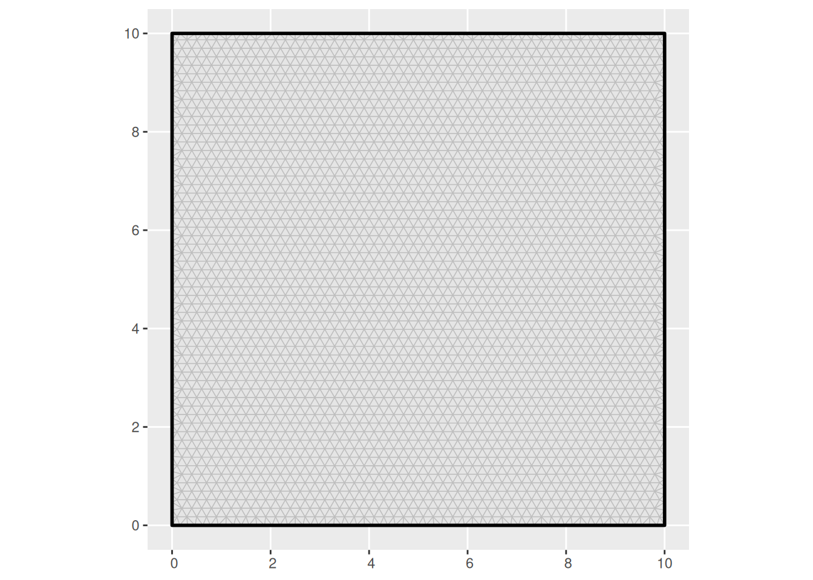
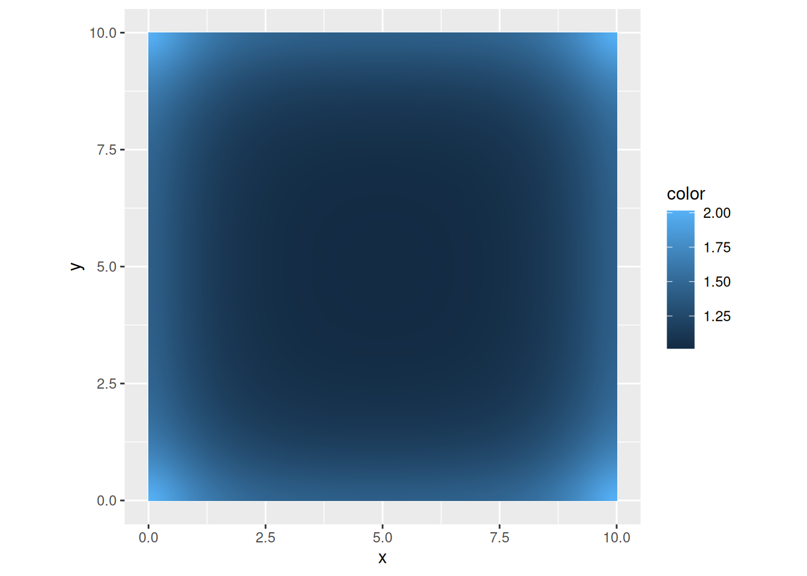
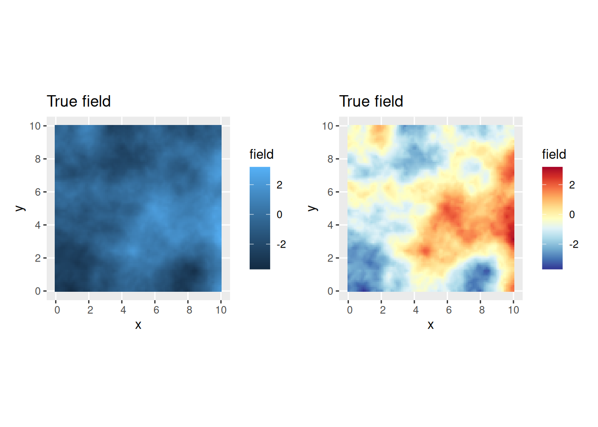
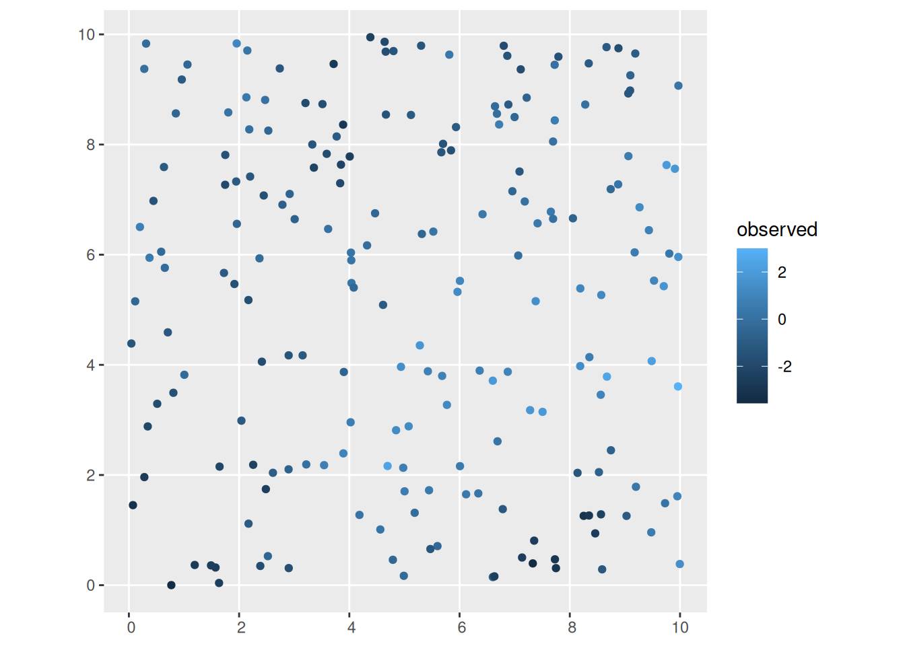
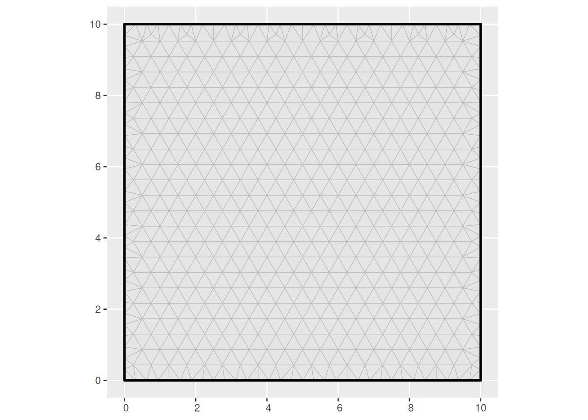
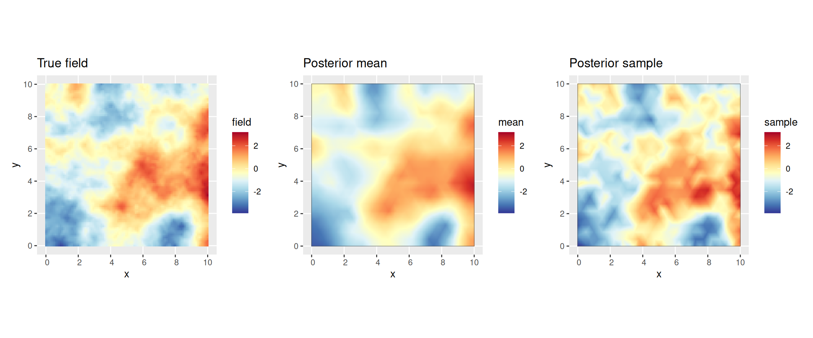
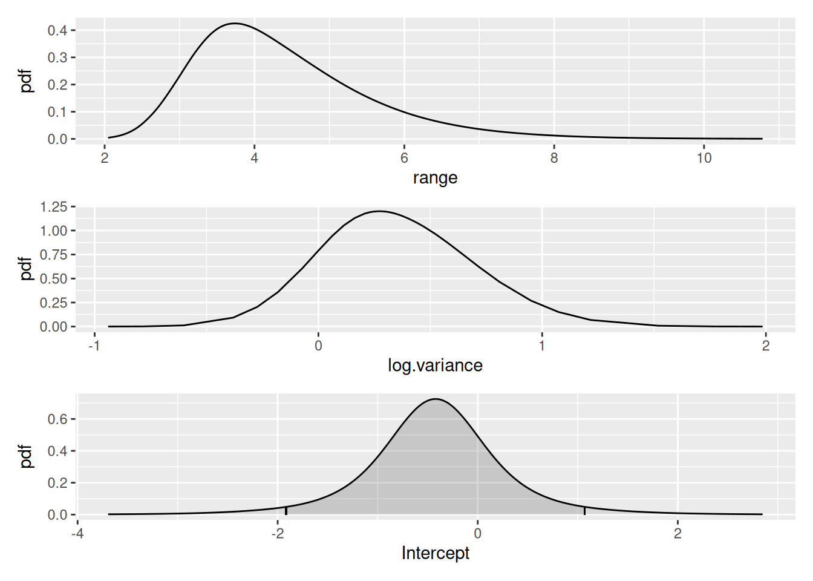
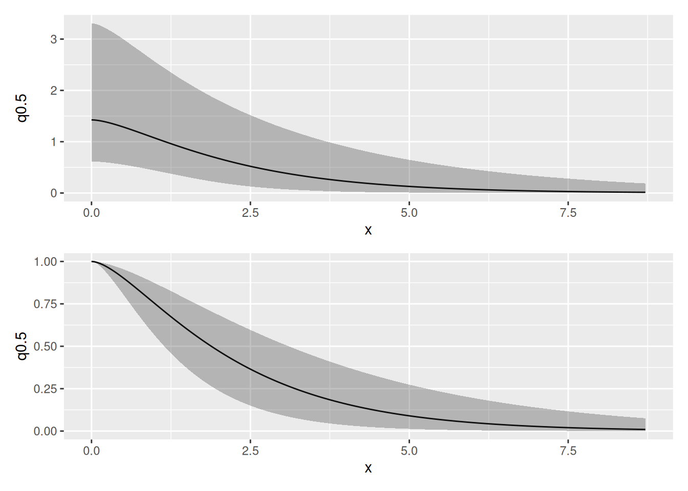
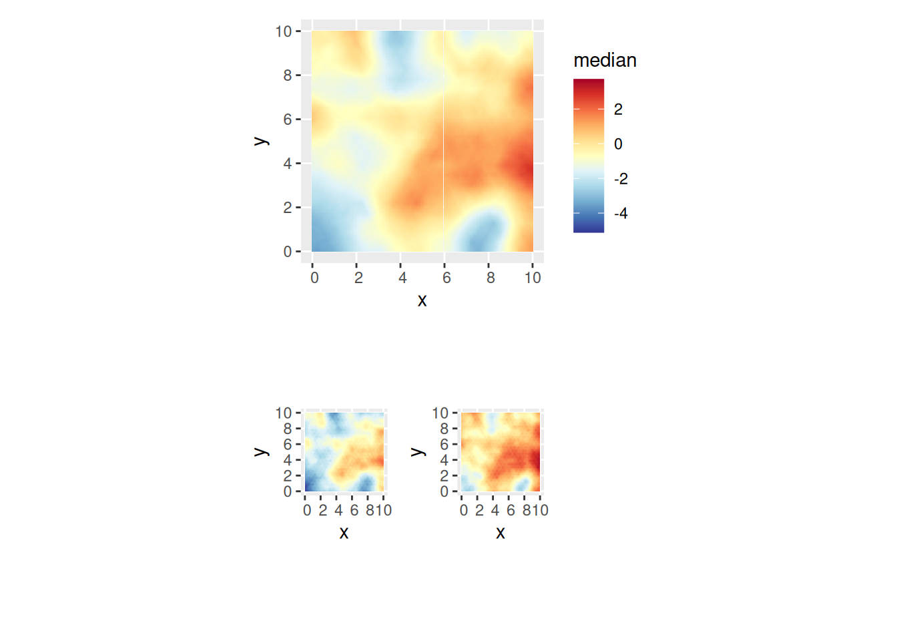

# Random Fields in 2D

## Setting things up

``` r
library(INLA)
library(inlabru)
library(fmesher)
library(mgcv)
library(ggplot2)
library(patchwork)
```

Make a shortcut to a nicer colour scale:

``` r
colsc <- function(...) {
  scale_fill_gradientn(
    colours = rev(RColorBrewer::brewer.pal(11, "RdYlBu")),
    limits = range(..., na.rm = TRUE)
  )
}
```

## Modelling on 2D domains

We will now construct a 2D model, generate a sample of a random field,
and attempt to recover the field from observations at a few locations.
Tomorrow, we will look into more general mesh constructions that adapt
to irregular domains.

First, we build a high resolution mesh for the true field, using low
level INLA functions

``` r
bnd <- spoly(
  data.frame(
    easting = c(0, 10, 10, 0),
    northing = c(0, 0, 10, 10)
  ),
  format = "sf"
)
## For fmesher 0.3.0:
##   mesh_fine <- fm_mesh_2d_inla(boundary = bnd, max.edge = 0.2)
## For fmesher >= 0.4.0:
mesh_fine <- fm_mesh_2d(
  loc = fm_hexagon_lattice(bnd, edge_len = 0.2),
  boundary = bnd,
  max.edge = 0.3
)
ggplot() +
  geom_fm(data = mesh_fine)
```



``` r

# Note: the priors here will not be used in estimation
matern_fine <-
  inla.spde2.pcmatern(mesh_fine,
    prior.sigma = c(1, 0.01),
    prior.range = c(1, 0.01)
  )
true_range <- 4
true_sigma <- 1
true_Q <- inla.spde.precision(matern_fine,
  theta = log(c(true_range, true_sigma))
)
```

What is the pointwise standard deviation of the field? Along straight
boundaries, the variance is twice the target variance. At corners the
variance is 4 times as large.

``` r
true_sd <- diag(inla.qinv(true_Q))^0.5
ggplot() +
  gg(mesh_fine, color = true_sd) +
  coord_equal()
```



Generate a sample from the model:

``` r
true_field <- inla.qsample(1, true_Q)[, 1]

truth <- expand.grid(
  easting = seq(0, 10, length = 100),
  northing = seq(0, 10, length = 100)
)
truth <- sf::st_as_sf(truth, coords = c("easting", "northing"))
truth$field <- fm_evaluate(
  mesh_fine,
  loc = truth,
  field = true_field
)

pl_truth <- ggplot() +
  gg(truth, aes(fill = field), geom = "tile") +
  ggtitle("True field")

## Or with another colour scale:
csc <- colsc(truth$field)
(pl_truth | (pl_truth + csc))
```



Extract observations from some random locations:

``` r
n <- 200
mydata <- sf::st_as_sf(
  data.frame(easting = runif(n, 0, 10), northing = runif(n, 0, 10)),
  coords = c("easting", "northing")
)
mydata$observed <-
  fm_evaluate(
    mesh_fine,
    loc = mydata,
    field = true_field
  ) +
  rnorm(n, sd = 0.4)
ggplot() +
  gg(mydata, aes(col = observed))
```



## Estimating the field

Construct a mesh covering the data:

``` r
## For fmesher 0.3.0:
##   mesh <- fm_mesh_2d_inla(
##     boundary = bnd,
##     max.edge = 0.5
##  )
## For fmesher >= 0.4.0
mesh <- fm_mesh_2d(
  loc = fm_hexagon_lattice(bnd, edge_len = 0.5),
  boundary = bnd,
  max.edge = 0.6
)
ggplot() +
  geom_fm(data = mesh)
```



Construct an SPDE model object for a Matern model:

``` r
matern <-
  inla.spde2.pcmatern(mesh,
    prior.sigma = c(10, 0.01),
    prior.range = c(1, 0.01)
  )
```

Specify the model components:

``` r
cmp <- observed ~ field(geometry, model = matern) + Intercept(1)
```

Fit the model and inspect the results:

``` r
fit <- bru(cmp, mydata, family = "gaussian")
summary(fit)
```

Predict the field on a lattice, and generate a single realisation from
the posterior distribution:

``` r
pix <- fm_pixels(mesh, dims = c(200, 200))
pred <- predict(
  fit,
  pix,
  ~ field + Intercept
)
samp <- generate(
  fit,
  pix,
  ~ field + Intercept,
  n.samples = 1
)
pred$sample <- samp[, 1]
```

Compare the truth to the estimated field (posterior mean and a sample
from the posterior distribution):

``` r
pl_posterior_mean <- ggplot() +
  gg(pred, geom = "tile") +
  gg(bnd, alpha = 0) +
  ggtitle("Posterior mean")
pl_posterior_sample <- ggplot() +
  gg(pred, aes(fill = sample), geom = "tile") +
  gg(bnd, alpha = 0) +
  ggtitle("Posterior sample")

# Common colour scale for the truth and estimate:
csc <- colsc(truth$field, pred$mean, pred$sample)
((pl_truth + csc) |
  (pl_posterior_mean + csc) |
  (pl_posterior_sample + csc))
```



Plot the SPDE parameter and fixed effect parameter posteriors.

``` r
int.plot <- plot(fit, "Intercept")
spde.range <- spde.posterior(fit, "field", what = "range")
spde.logvar <- spde.posterior(fit, "field", what = "log.variance")
range.plot <- plot(spde.range)
var.plot <- plot(spde.logvar)

(range.plot / var.plot / int.plot)
```



Look at the correlation function if you want to:

``` r
corplot <- plot(spde.posterior(fit, "field", what = "matern.correlation"))
covplot <- plot(spde.posterior(fit, "field", what = "matern.covariance"))
(covplot / corplot)
```



You can plot the median, lower 95% and upper 95% density surfaces as
follows (assuming that the predicted intensity is in object `pred`).

``` r
csc <- colsc(
  pred[["median"]],
  pred[["q0.025"]],
  pred[["q0.975"]]
) ## Common colour scale from SpatialPixelsDataFrame

gmedian <- ggplot() +
  gg(pred["median"], geom = "tile") +
  csc
glower95 <- ggplot() +
  gg(pred["q0.025"], geom = "tile") +
  csc +
  theme(legend.position = "none")
gupper95 <- ggplot() +
  gg(pred["q0.975"], geom = "tile") +
  csc +
  theme(legend.position = "none")

(gmedian / (glower95 | gupper95))
```


