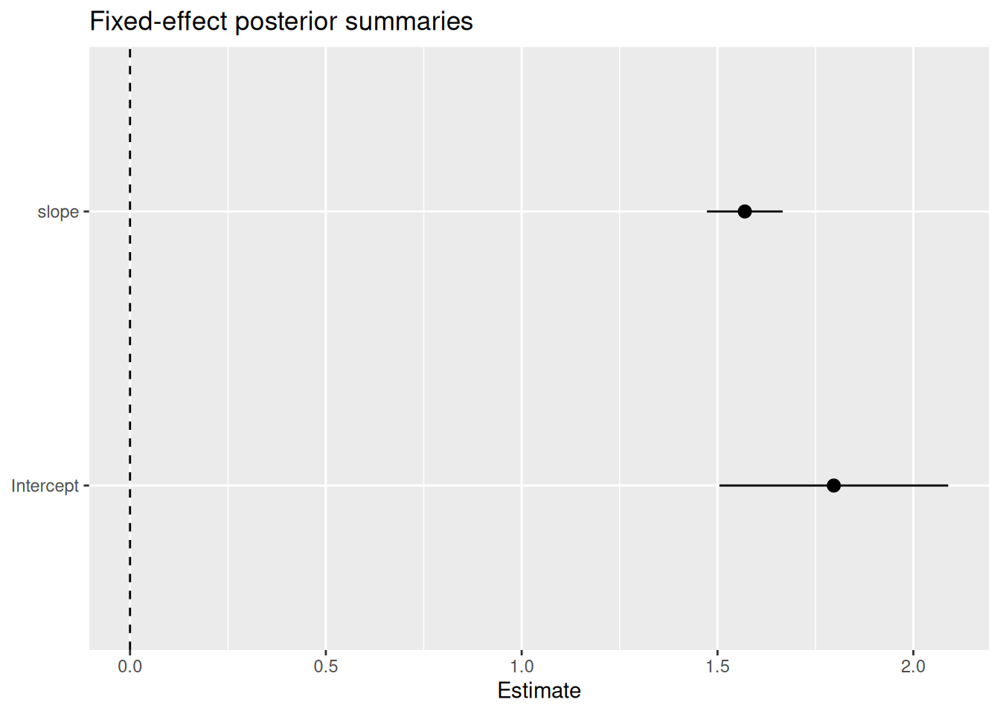
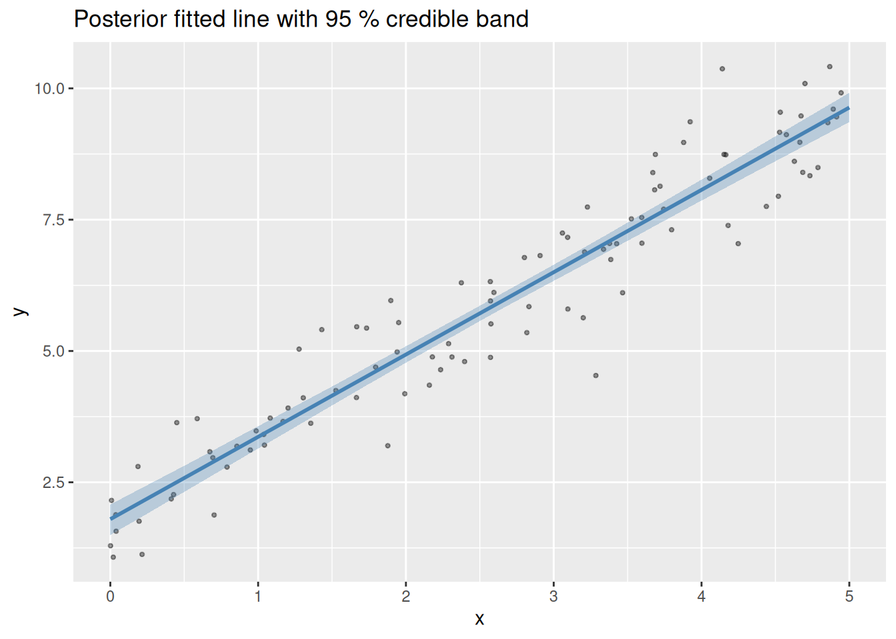

# Tidy model output with broom-style tidiers

inlabru provides [broom](https://broom.tidymodels.org/)-style tidiers
for `bru` model objects through three generics from the
[generics](https://cran.r-project.org/package=generics) package:

- [`tidy()`](https://generics.r-lib.org/reference/tidy.html) — one row
  per model term (fixed effects or hyperparameters)
- [`glance()`](https://generics.r-lib.org/reference/glance.html) — one
  row of model-level fit summaries
- [`augment()`](https://generics.r-lib.org/reference/augment.html) —
  original data extended with posterior fitted values

These make it straightforward to work with inlabru results inside tidy
workflows (dplyr, ggplot2, etc.) without manually unpacking the `bru`
object.

Note that the column names in the broom framework are standardised in a
way that in most cases are inaccurate in the Bayesian context
(e.g. `std.error` in the frequentist context is the standard error of an
estimator, but to allow these methods to work in a Bayesian context, the
value used is the posterior standard deviation of the estimated
quantity). However, the tidy output is still useful for quick summaries
and plotting, and the column names are chosen to integrate with tidy
tools that expect them. Only fixed effects and hyperparameters are
initially supported
[`tidy()`](https://generics.r-lib.org/reference/tidy.html), not random
effects; those may be added in a future version.

Introduced in version `2.14.1.9005`.

## Set up

``` r

library(INLA)
library(inlabru)
library(ggplot2)
bru_options_set(control.compute = list(dic = TRUE, waic = TRUE))
```

We use a simple simulated Gaussian dataset throughout.

``` r

set.seed(42L)
n <- 100
x <- runif(n, 0, 5)
y <- 2 + 1.5 * x + rnorm(n, sd = 0.8)
dat <- data.frame(x = x, y = y)
```

## Fit a model

``` r

fit <- bru(
  y ~ Intercept(1) + slope(x, model = "linear"),
  family = "gaussian",
  data = dat
)
```

## `tidy()` — fixed effects

[`tidy()`](https://generics.r-lib.org/reference/tidy.html) returns a
tibble with one row per fixed-effect term, including the posterior mean,
standard deviation, and 95 % credible interval.

``` r

tidy(fit)
#> # A tibble: 2 × 5
#>   term      estimate std.error conf.low conf.high
#>   <chr>        <dbl>     <dbl>    <dbl>     <dbl>
#> 1 Intercept     1.80    0.149      1.50      2.09
#> 2 slope         1.57    0.0492     1.47      1.67
```

The column names follow the broom convention so the output integrates
with standard tidy tools. For example, a quick coefficient plot:

``` r

tidy(fit) |>
  ggplot(aes(x = term, y = estimate, ymin = conf.low, ymax = conf.high)) +
  geom_pointrange() +
  geom_hline(yintercept = 0, linetype = "dashed") +
  coord_flip() +
  labs(title = "Fixed-effect posterior summaries", x = NULL, y = "Estimate")
```



## `tidy()` — hyperparameters

Pass `effects = "hyperpar"` to extract the precision (or other
hyperparameters) instead.

``` r

tidy(fit, effects = "hyperpar")
#> # A tibble: 1 × 5
#>   term                                    estimate std.error conf.low conf.high
#>   <chr>                                      <dbl>     <dbl>    <dbl>     <dbl>
#> 1 Precision for the Gaussian observations     1.86     0.263     1.38      2.41
```

The Gaussian family has one hyperparameter — the precision of the
likelihood. More complex models (e.g. with SPDE random fields) will have
additional rows.

## `glance()` — model-level summaries

[`glance()`](https://generics.r-lib.org/reference/glance.html) returns a
single-row tibble with the DIC, WAIC, marginal log-likelihood, the
number of observations, and total wall-clock time.

``` r

glance(fit)
#> # A tibble: 1 × 5
#>     dic  waic marginal_loglik  nobs elapsed
#>   <dbl> <dbl>           <dbl> <int>   <dbl>
#> 1  228.  228.           -133.   100    1.05
```

This is useful when comparing competing models:

``` r

fit_null <- bru(
  y ~ Intercept(1),
  family = "gaussian",
  data = dat
)
```

``` r

library(dplyr)
#> 
#> Attaching package: 'dplyr'
#> The following objects are masked from 'package:stats':
#> 
#>     filter, lag
#> The following objects are masked from 'package:base':
#> 
#>     intersect, setdiff, setequal, union
bind_rows(
  glance(fit_null) |> mutate(model = "intercept only"),
  glance(fit) |> mutate(model = "intercept + slope")
) |>
  select(model, dic, waic, marginal_loglik, nobs)
#> # A tibble: 2 × 5
#>   model               dic  waic marginal_loglik  nobs
#>   <chr>             <dbl> <dbl>           <dbl> <int>
#> 1 intercept only     469.  468.           -250.   100
#> 2 intercept + slope  228.  228.           -133.   100
```

The model with `slope` should have a substantially lower DIC and WAIC.

## `augment()` — fitted values on new data

[`augment()`](https://generics.r-lib.org/reference/augment.html) adds
posterior summaries of the linear predictor to a data frame. Because
inlabru prediction expressions are arbitrary R code, you must supply a
`pred_formula` that names what to predict.

``` r

grid <- data.frame(x = seq(0, 5, length.out = 50))

augmented <- augment(
  fit,
  data = grid,
  pred_formula = ~ Intercept + slope,
  n_samples = 500L,
  seed = 1L
)
```

``` r

head(augmented)
#> # A tibble: 6 × 5
#>       x .fitted .fitted_low .fitted_high .fitted_sd
#>   <dbl>   <dbl>       <dbl>        <dbl>      <dbl>
#> 1 0        1.80        1.50         2.08      0.151
#> 2 0.102    1.96        1.66         2.23      0.146
#> 3 0.204    2.12        1.83         2.38      0.142
#> 4 0.306    2.28        2.00         2.53      0.138
#> 5 0.408    2.44        2.17         2.68      0.133
#> 6 0.510    2.60        2.33         2.83      0.129
```

The four added columns are `.fitted` (posterior mean), `.fitted_low` and
`.fitted_high` (2.5 % and 97.5 % quantiles), and `.fitted_sd` (posterior
standard deviation).

Plot the fitted line with a credible band on top of the raw data:

``` r

ggplot() +
  geom_point(data = dat, aes(x, y), alpha = 0.4, size = 0.8) +
  geom_ribbon(
    data = augmented,
    aes(x, ymin = .fitted_low, ymax = .fitted_high),
    fill = "steelblue", alpha = 0.3
  ) +
  geom_line(
    data = augmented,
    aes(x, .fitted),
    colour = "steelblue", linewidth = 1
  ) +
  labs(
    title = "Posterior fitted line with 95 % credible band",
    x = "x", y = "y"
  )
```



## Naming convention for `pred_formula`

The latent variables in `pred_formula` follow inlabru’s naming rule: the
effect of a component named `foo` is available as `foo`, and the
corresponding latent variables (model coefficients, spline coefficients,
etc) can be accessed as `foo_latent` inside prediction expressions. In
classic frequentist terminology, these two distinct quantities are
usually conflated, making it difficult to know whether one is talking
about `beta_x` (the latent variable/coefficient), `x` (the covariate
value), or `beta_x * x` (the effect of a model component that multiplies
a latent variable with a covariate). In `inlabru` expressions, the
covariate can be accessed as `.data$x`, the effect can be accessed as
`x` or `.effect$x`, and the latent variable can be accessed as
`x_latent` or `.latent$x`.

Components with `model = "linear"` (including the implicit intercept)
appear in `summary.fixed`; components with a random-effect model (iid,
rw1, SPDE, …) appear in `summary.random`.

``` r

# fixed-effect component names → use <name>_latent in pred_formula to access
# the coefficients, and <name> to access the effect itself.
rownames(fit$summary.fixed)
#> [1] "Intercept" "slope"

# random-effect component names (none in this model)
names(fit$summary.random)
#> NULL
```

## Calling tidiers with the `broom` package

The tidiers are registered as S3 methods on `bru` objects through the
[generics](https://cran.r-project.org/package=generics) package, and are
re-exported by `inlabru` so they work whether `generics` or `broom` are
explicitly loaded or not.

``` r

tidy(fit)
glance(fit)
generics::glance(fit)
broom::glance(fit)
```
