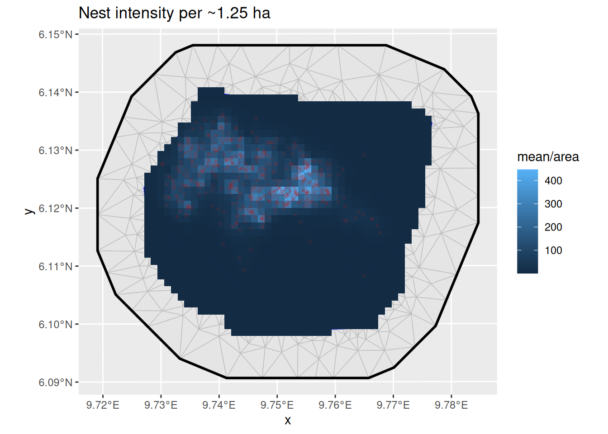
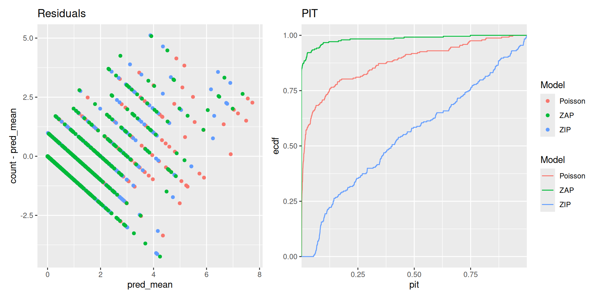
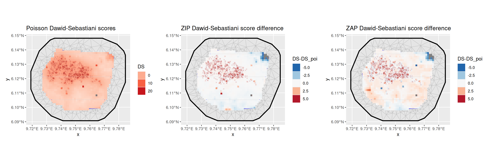
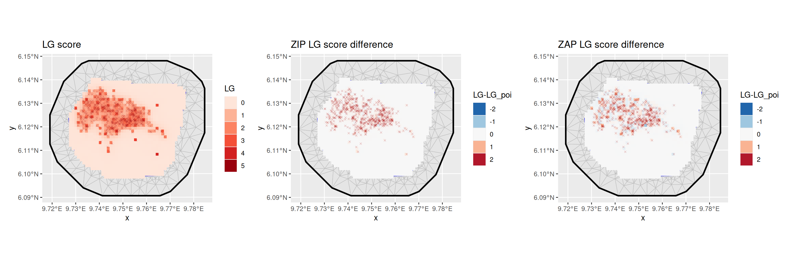

# ZIP and ZAP models

(Vignette under construction!)

``` r

library(fmesher)
library(dplyr)
library(ggplot2)
library(inlabru)
library(terra)
library(sf)
library(RColorBrewer)
library(patchwork)

# We want to obtain CPO data from the estimations
bru_options_set(control.compute = list(cpo = TRUE))
```

## Count model

In addition to the point process models, `inlabru` is capable of
handling models with positive integer responses, such as abundance
models where species counts are recorded at each observed location.
Count models can be considered as coarse aggregations of point process
models.

The following example utilizes the `gorillas` dataset. To obtain the
count data, we rasterize the species counts to match the spatial
covariates available for the ‘gorilla’ data, and then aggregate the
pixels to cover an area 16 times larger (4x4 pixels in the original
covariate raster dimensions). Finally, we mask regions outside the study
area.

``` r

gorillas_sf <- inlabru::gorillas_sf
nests <- gorillas_sf$nests
mesh <- gorillas_sf$mesh
boundary <- gorillas_sf$boundary
gcov <- gorillas_sf_gcov()
counts_rstr <-
  terra::rasterize(vect(nests), gcov, fun = sum, background = 0) |>
  terra::aggregate(fact = 4, fun = sum) |>
  mask(vect(sf::st_geometry(boundary)))
plot(counts_rstr)
```


Counts of gorilla nests

``` r

counts_rstr <- counts_rstr |>
  cellSize(unit = "km") |>
  c(counts_rstr)
```

We now need to extract the coordinates for these pixels. The plot below
illustrates the pixel locations for all pixels with non-zero counts. We
create a mesh over the study area and define a prior for it.

``` r

counts_df <- crds(counts_rstr, df = TRUE, na.rm = TRUE) |>
  bind_cols(values(counts_rstr, mat = TRUE, na.rm = TRUE)) |>
  rename(count = sum) |>
  mutate(present = (count > 0) * 1L) |>
  st_as_sf(coords = c("x", "y"), crs = st_crs(nests))
```

We can also aggregate the relevant spatial covariates to the same level
of granularity as the nest counts. The vegetation classes are quite
unbalances, so it might make sense to split them by class and use
proportion of land cover for some classes, say classes 2, and 3
(Disturbed, and Grassland, respectively).

``` r

gcov_lvls <- gcov$vegetation |> levels()
gcov_vegetation <- gcov$vegetation |>
  segregate() |>
  terra::aggregate(fact = 4, fun = mean)
names(gcov_vegetation) <- gcov_lvls[[1]]$vegetation
gcov_vegetation |> plot()
```


Proportion of vegetation cover by class

``` r

px_mesh <- fm_mesh_2d_inla(
  loc = st_intersection(st_as_sfc(counts_df), st_buffer(boundary, -0.05)),
  boundary = boundary,
  max.edge = c(0.5, 1),
  crs = st_crs(counts_df)
)

px_matern <- INLA::inla.spde2.pcmatern(px_mesh,
  prior.sigma = c(5, 0.01),
  prior.range = c(0.1, 0.01)
)

ggplot() +
  geom_fm(data = px_mesh) +
  geom_sf(
    data = counts_df[counts_df$count > 0, ],
    aes(color = count),
    size = 1,
    pch = 4
  ) +
  theme_minimal()
```


Mesh over the count locations

### Poisson GLM

Next, we can define the Poisson model that links the species count per
observation plot (raster cell) to the spatial covariates, such as
vegetation type and elevation.

``` r

comps <- ~ veg_disturbed(gcov_vegetation$Disturbed, model = "linear") +
  veg_grassland(gcov_vegetation$Grassland, model = "linear") +
  elevation(gcov$elevation, model = "linear") +
  field(geometry, model = px_matern) + Intercept(1)

fit_poi <- bru(
  comps,
  bru_obs(
    family = "poisson", data = counts_df,
    formula = count ~
      veg_disturbed + veg_grassland +
      elevation + field + Intercept,
    E = area
  )
)
summary(fit_poi)
#> inlabru version: 2.15.0 
#> INLA version: 26.06.08 
#> Latent components:
#> veg_disturbed: main = linear(gcov_vegetation$Disturbed)
#> veg_grassland: main = linear(gcov_vegetation$Grassland)
#> elevation: main = linear(gcov$elevation)
#> field: main = spde(geometry)
#> Intercept: main = linear(1)
#> Observation models:
#>   Model tag: <No tag>
#>     Family: 'poisson'
#>     Data class: 'sf', 'data.frame'
#>     Response class: 'numeric'
#>     Predictor: count ~ veg_disturbed + veg_grassland + elevation + field + Intercept
#>     Additive/Linear/Rowwise: TRUE/TRUE/TRUE
#>     Used components: effect[veg_disturbed, veg_grassland, elevation, field, Intercept], latent[] 
#> Time used:
#>     Pre = 0.447, Running = 2.65, Post = 0.596, Total = 3.69 
#> Fixed effects:
#>                 mean    sd 0.025quant 0.5quant 0.975quant   mode kld
#> veg_disturbed -0.183 0.380     -0.928   -0.183      0.564 -0.183   0
#> veg_grassland -1.244 0.394     -2.016   -1.244     -0.470 -1.244   0
#> elevation      0.003 0.002      0.000    0.003      0.007  0.003   0
#> Intercept     -6.129 3.457    -12.949   -6.121      0.666 -6.111   0
#> 
#> Random effects:
#>   Name     Model
#>     field SPDE2 model
#> 
#> Model hyperparameters:
#>                 mean    sd 0.025quant 0.5quant 0.975quant mode
#> Range for field 2.33 0.644       1.36     2.23       3.87 2.02
#> Stdev for field 2.85 0.661       1.82     2.77       4.41 2.58
#> 
#> Marginal log-Likelihood:  -733.11 
#> CPO, PIT is computed 
#> Posterior summaries for the linear predictor and the fitted values are computed
#> (Posterior marginals needs also 'control.compute=list(return.marginals.predictor=TRUE)')


pred_poi <- predict(
  fit_poi, counts_df,
  ~ {
    expect <- exp( # vegetation +
      veg_disturbed + veg_grassland +
        elevation + field + Intercept
    ) * area
    list(
      expect = expect,
      obs_prob = dpois(count, expect)
    )
  },
  n.samples = 2500
)
# For Poisson, the posterior conditional variance is equal to
# the posterior conditional mean, so no need to compute it separately.
expect_poi <- pred_poi$expect
expect_poi$pred_var <- expect_poi$mean + expect_poi$sd^2
expect_poi$log_score <- -log(pred_poi$obs_prob$mean)

ggplot() +
  geom_fm(data = px_mesh) +
  gg(expect_poi, aes(fill = mean / area), geom = "tile") +
  geom_sf(data = nests, color = "firebrick", size = 1, pch = 4, alpha = 0.2) +
  ggtitle("Nest intensity per ~1.25 ha")
```



### True zeroes and false zeroes

In the Poisson GLM model, zeros can occur in some locations. These are
referred to as “true zeros” because they can be explained by the model
and the associated covariates. On the other hand, “false zeros” do not
align with the covariates. They can arise due to issues such as sampling
at the wrong time or place, observer errors, unsuitable environmental
conditions, and so on.

In our dataset, the number of zeros is quite substantial, and our model
may struggle to account for them adequately. To address this, we should
select a model capable of handling an “inflated” number of zeros,
exceeding what a standard Poisson model would imply. For this purpose,
we opt for a “zero-inflated Poisson model,” commonly abbreviated as ZIP.

### ZIP model

The [Type 1 Zero-inflated Poisson
model](https://inla.r-inla-download.org/r-inla.org/doc/likelihood/zeroinflated.pdf)
is defined as follows:

\text{Prob}(y\vert\dots)=p\times 1\_{y=0}+(1-p)\times \text{Poisson}(y)

Here, p=\text{logit}^{-1}(\theta)

The expected value and variance for the counts are calculated as:

\begin{gathered} E(count)=(1-p)\lambda \\ Var(count)= (1-p)(\lambda+p
\lambda^2) \end{gathered}

``` r

fit_zip <- bru(
  comps,
  bru_obs(
    family = "zeroinflatedpoisson1", data = counts_df,
    formula = count ~
      veg_disturbed + veg_grassland +
      elevation + field + Intercept,
    E = area
  )
)

summary(fit_zip)
#> inlabru version: 2.15.0 
#> INLA version: 26.06.08 
#> Latent components:
#> veg_disturbed: main = linear(gcov_vegetation$Disturbed)
#> veg_grassland: main = linear(gcov_vegetation$Grassland)
#> elevation: main = linear(gcov$elevation)
#> field: main = spde(geometry)
#> Intercept: main = linear(1)
#> Observation models:
#>   Model tag: <No tag>
#>     Family: 'zeroinflatedpoisson1'
#>     Data class: 'sf', 'data.frame'
#>     Response class: 'numeric'
#>     Predictor: count ~ veg_disturbed + veg_grassland + elevation + field + Intercept
#>     Additive/Linear/Rowwise: TRUE/TRUE/TRUE
#>     Used components: effect[veg_disturbed, veg_grassland, elevation, field, Intercept], latent[] 
#> Time used:
#>     Pre = 0.265, Running = 3.99, Post = 0.0753, Total = 4.33 
#> Fixed effects:
#>                 mean    sd 0.025quant 0.5quant 0.975quant   mode kld
#> veg_disturbed -0.370 0.370     -1.092   -0.372      0.359 -0.372   0
#> veg_grassland -1.366 0.387     -2.123   -1.366     -0.606 -1.366   0
#> elevation      0.003 0.002      0.000    0.003      0.006  0.003   0
#> Intercept     -5.115 3.343    -11.819   -5.082      1.407 -5.079   0
#> 
#> Random effects:
#>   Name     Model
#>     field SPDE2 model
#> 
#> Model hyperparameters:
#>                                                         mean    sd 0.025quant
#> zero-probability parameter for zero-inflated poisson_1 0.075 0.031      0.026
#> Range for field                                        2.700 0.790      1.527
#> Stdev for field                                        2.797 0.690      1.736
#>                                                        0.5quant 0.975quant
#> zero-probability parameter for zero-inflated poisson_1     0.07      0.147
#> Range for field                                            2.58      4.606
#> Stdev for field                                            2.70      4.433
#>                                                         mode
#> zero-probability parameter for zero-inflated poisson_1 0.061
#> Range for field                                        2.328
#> Stdev for field                                        2.493
#> 
#> Marginal log-Likelihood:  -732.89 
#> CPO, PIT is computed 
#> Posterior summaries for the linear predictor and the fitted values are computed
#> (Posterior marginals needs also 'control.compute=list(return.marginals.predictor=TRUE)')

pred_zip <- predict(
  fit_zip, counts_df,
  ~ {
    scaling_prob <- (1 - zero_probability_parameter_for_zero_inflated_poisson_1)
    lambda <- exp( # vegetation +
      veg_disturbed + veg_grassland +
        elevation + field + Intercept
    )
    expect_param <- lambda * area
    expect <- scaling_prob * expect_param
    variance <- scaling_prob * expect_param *
      (1 + (1 - scaling_prob) * expect_param)
    list(
      lambda = lambda,
      expect = expect,
      variance = variance,
      obs_prob = (1 - scaling_prob) * (count == 0) +
        scaling_prob * dpois(count, expect_param)
    )
  },
  n.samples = 2500
)
expect_zip <- pred_zip$expect
expect_zip$pred_var <- pred_zip$variance$mean + expect_zip$sd^2
expect_zip$log_score <- -log(pred_zip$obs_prob$mean)

ggplot() +
  geom_fm(data = px_mesh) +
  gg(expect_zip, aes(fill = mean / area), geom = "tile") +
  geom_sf(data = nests, color = "firebrick", size = 1, pch = 4, alpha = 0.2) +
  ggtitle("Nest intensity per ~1.25 ha")
```


Predictions from zero-inflated model

We will compare the performance of the models in the diagnostic section
below.

### ZAP model

Based on the distribution of nests in relation to the [spatial
covariates](https://inlabru-org.github.io/inlabru/articles/2d_lgcp_covars.Rmd),
it appears that gorillas tend to avoid setting their nests in certain
types of vegetation. While the type of vegetation may not directly
influence nest density, it does play a significant role in determining
their presence or absence. In such cases, the `vegetation` covariate
should be included in the binomial part of the model but not in the
Poisson part.

When the process driving the presence or absence of a species
substantially differs from the process governing its abundance, it is
advisable to switch to the Zero-Adjusted Poisson (ZAP) model, which
consists of both a binomial and a truncated Poisson component.

In the `zeroinflatedpoisson0` model, which is defined by the [following
observation probability
model](https://inla.r-inla-download.org/r-inla.org/doc/likelihood/zeroinflated.pdf)

\text{Prob}(y\vert\dots)=p\times 1\_{y=0}+(1-p)\times
\text{Poisson}(y\vert y\>0)

where p=\text{logit}^{-1}(\theta). In order to allow p to be controlled
by a full latent model and not just a single hyperparameter, we set want
to set p=0, and handle the zero-probability modelling with a separate
binary observation model modelling presence/absence. Before INLA version
`23.10.19-1`, this could be done by fixing the hyperparameter to a small
value. The [`nzpossion`
model](https://inla.r-inla-download.org/r-inla.org/doc/likelihood/nzpoisson.pdf),
available from INLA version `23.10.19-1` implements the
\text{Poisson}(y\vert y\>0) model exactly. `inlabru` added shortcuts for
the hyperparameter approach for “nzbinomal”, “nznbinomial”,
“nzcenpoisson”, and “nzbetabinomial”, in version `2.14.1.9007`.

In the resulting model, the truncated Poisson distribution governs only
the positive counts, while the absences are addressed by a separate
binomial model that can have its own covariates. It’s worth noting that
we exclude observations with absent nests from the truncated Poisson
part of the model by subsetting the data to include only instances where
`present` is `TRUE`.

The expectation and variance are computed as follows:

\begin{aligned} E(\text{count})&=\frac{1}{1-\exp(-\lambda)}p\lambda \\
Var(\text{count})&= \frac{1}{1-\exp(-\lambda)} p(\lambda+p \lambda^2)-
\left(\frac{1}{1-\exp(-\lambda)}p\lambda\right)^2 \\ &= E(\text{count})
(1+p\lambda) - E(\text{count})^2 \\ &= E(\text{count})
(1+p\lambda-E(\text{count})) \\ &= E(\text{count})
\left(1+p\lambda\left(1-\frac{1}{1-\exp(-\lambda)}\right)\right) \\ &=
E(\text{count})
\left(1-p\lambda\frac{\exp(-\lambda)}{1-\exp(-\lambda)}\right) \\ &=
E(\text{count}) \left(1-\exp(-\lambda) E(\text{count})\right)
\end{aligned}

``` r

comps <- ~
  Intercept_count(1) +
    veg_disturbed(gcov_vegetation$Disturbed, model = "linear") +
    veg_grassland(gcov_vegetation$Grassland, model = "linear") +
    elevation(gcov$elevation, model = "linear") +
    field_present(geometry, model = px_matern) +
    Intercept_present(1) +
    elevation_present(gcov$elevation, model = "linear") +
    field_count(geometry, model = px_matern)

## Alternative with a shared field component:
#  field_count(geometry, copy = "field_present", fixed = FALSE)

truncated_poisson_obs <-
  bru_obs(
    family = "nzpoisson",
    data = counts_df[counts_df$present > 0, ],
    formula = count ~ elevation + field_count + Intercept_count,
    E = area
  )

present_obs <- bru_obs(
  family = "binomial",
  data = counts_df,
  formula = present ~ # vegetation +
    veg_disturbed + veg_grassland +
    elevation_present + field_present + Intercept_present
)

fit_zap <- bru(
  comps,
  present_obs,
  truncated_poisson_obs
)

summary(fit_zap)
#> inlabru version: 2.15.0 
#> INLA version: 26.06.08 
#> Latent components:
#> veg_disturbed: main = linear(gcov_vegetation$Disturbed)
#> veg_grassland: main = linear(gcov_vegetation$Grassland)
#> field_present: main = spde(geometry)
#> Intercept_present: main = linear(1)
#> elevation_present: main = linear(gcov$elevation)
#> Intercept_count: main = linear(1)
#> elevation: main = linear(gcov$elevation)
#> field_count: main = spde(geometry)
#> Observation models:
#>   Model tag: <No tag>
#>     Family: 'binomial'
#>     Data class: 'sf', 'data.frame'
#>     Response class: 'integer'
#>     Predictor: present ~ veg_disturbed + veg_grassland + elevation_present + field_present + Intercept_present
#>     Additive/Linear/Rowwise: TRUE/TRUE/TRUE
#>     Used components: effect[veg_disturbed, veg_grassland, field_present, Intercept_present, elevation_present], latent[] 
#>   Model tag: <No tag>
#>     Family: 'nzpoisson'
#>     Data class: 'sf', 'data.frame'
#>     Response class: 'numeric'
#>     Predictor: count ~ elevation + field_count + Intercept_count
#>     Additive/Linear/Rowwise: TRUE/TRUE/TRUE
#>     Used components: effect[Intercept_count, elevation, field_count], latent[] 
#> Time used:
#>     Pre = 0.383, Running = 4.87, Post = 0.163, Total = 5.41 
#> Fixed effects:
#>                      mean    sd 0.025quant 0.5quant 0.975quant    mode kld
#> veg_disturbed      -1.027 0.637     -2.261   -1.032      0.238  -1.032   0
#> veg_grassland      -1.382 0.588     -2.537   -1.381     -0.229  -1.381   0
#> Intercept_present -10.824 4.540    -19.996  -10.749     -2.066 -10.746   0
#> elevation_present   0.004 0.002     -0.001    0.004      0.009   0.004   0
#> Intercept_count     1.852 1.696     -1.824    1.948      4.979   2.199   0
#> elevation           0.001 0.001      0.000    0.001      0.003   0.001   0
#> 
#> Random effects:
#>   Name     Model
#>     field_present SPDE2 model
#>    field_count SPDE2 model
#> 
#> Model hyperparameters:
#>                          mean    sd 0.025quant 0.5quant 0.975quant  mode
#> Range for field_present 2.406 0.726      1.338    2.289       4.17 2.056
#> Stdev for field_present 3.165 0.745      1.992    3.068       4.91 2.866
#> Range for field_count   0.567 0.238      0.255    0.518       1.17 0.433
#> Stdev for field_count   0.802 0.137      0.570    0.789       1.11 0.762
#> 
#> Marginal log-Likelihood:  -764.27 
#> CPO, PIT is computed 
#> Posterior summaries for the linear predictor and the fitted values are computed
#> (Posterior marginals needs also 'control.compute=list(return.marginals.predictor=TRUE)')
```

Note that in this model, there is no direct link between the parameters
of the two observation parts, and we could estimate them separately.
However, if for example the `field_count` component could be used for
both predictors, it would be possible to use the `copy` argument to
share the same component between the two parts, with
`field_present(geometry, copy = "field_count", fixed = TRUE)`, where
`fixed = TRUE` tells
[`bru()`](https://inlabru-org.github.io/inlabru/reference/bru.md) to
estimate a scaling parameter instead of using the same linear effect
parameter for both version of the field. In the results above, we see
that the estimated covariance parameters for the two fields are very
different, so it is not sensible to share the same component between the
two parts.

## Predict intensity on the original raster locations

``` r

pred_zap <- predict(
  fit_zap,
  counts_df,
  ~ {
    presence_prob <-
      plogis( # vegetation +
        veg_disturbed + veg_grassland +
          elevation_present +
          field_present + Intercept_present
      )
    lambda <- exp(elevation + field_count + Intercept_count)
    expect_param <- presence_prob * lambda * area
    expect <- expect_param / (1 - exp(-lambda * area))
    variance <- expect * (1 - exp(-lambda * area) * expect)
    list(
      presence = presence_prob,
      lambda = lambda,
      expect = expect,
      variance = variance,
      obs_prob = (1 - presence_prob) * (count == 0) +
        (count > 0) * presence_prob * dpois(count, expect_param) /
          (1 - dpois(0, expect_param))
    )
  },
  n.samples = 2500
)
presence_zap <- pred_zap$presence
expect_zap <- pred_zap$expect
expect_zap$pred_var <- pred_zap$variance$mean + expect_zap$sd^2
expect_zap$log_score <- -log(pred_zap$obs_prob$mean)

p1 <- ggplot() +
  geom_fm(data = px_mesh) +
  gg(presence_zap, aes(fill = mean), geom = "tile") +
  geom_sf(data = nests, color = "firebrick", size = 1, pch = 4, alpha = 0.2) +
  ggtitle("Presence probability")
p2 <- ggplot() +
  geom_fm(data = px_mesh) +
  gg(expect_zap, aes(fill = mean / area), geom = "tile") +
  geom_sf(data = nests, color = "firebrick", size = 1, pch = 4, alpha = 0.2) +
  ggtitle("Expected number of nests per ~1.25 ha")

patchwork::wrap_plots(p1, p2, nrow = 1)
```


Predictions from zero-adjusted model

To ensure proper truncation of the Poisson distribution, we have
included the `control.family` argument with the parameter `theta` fixed
to a large negative value. This choice ensures that when transformed by
\text{logit}^{-1}(\theta) to obtain the probability p, it approaches
zero.

### Model Comparison

The variance in count predictions can be obtained from the posterior
predictions of expectations and variances that were previously computed
for each grid box. Let’s denote the count expectation in each grid box
as m_i, and the count variance as s_i^2, both conditioned on the model
predictor \eta_i. Then, the posterior predictive variance of the count
X_i is given by:

\begin{aligned} V(X_i) &= E(V(X_i\|\eta_i)) + V(E(X_i\|\eta_i)) \\ &=
E(s_i^2) + V(m_i) . \end{aligned}

This equation provides the posterior predictive variance of the count
X_i based on the expectations and variances of the model predictions m_i
and s_i^2 for each grid box, conditioned on the model predictor \eta_i.

Predictive Integral Transform (PIT) (Marshall and Spiegelhalter 2003;
Gelman et al. 1996; Held et al. 2010) is calculated as the cumulative
distribution function (CDF) of the observed data at each predicted value
from the model. Mathematically, for each observation y_i and its
corresponding predicted value \hat{y}\_i from the model, the PIT is
calculated as follows:

PIT_i=P(Y_i\leq \hat y_i \vert data)

where Y_i is a random variable representing the observed data for the
ith observation.

The PIT measures how well the model’s predicted values align with the
distribution of the observed data. Ideally, if the model’s predictions
are perfect, the PIT values should follow a uniform distribution between
0 and 1. Deviations from this uniform distribution may indicate issues
with model calibration or overfitting. It’s often used to assess the
reliability of model predictions and can be visualized through PIT
histograms or quantile-quantile (Q-Q) plots.

The Conditional Predictive Ordinate (CPO) (Pettit 1990) is calculated as
the posterior probability of the observed data at each observation
point, conditional on the rest of the data and the model. For each
observation y_i, it is computed as:

CPO_i=P(y_i\vert data \setminus y_i, model)

where \setminus means “other than”, so that P(y_i \|
\text{data}\setminus y_i, \text{model}) represents the conditional
probability given all other observed data and the model.

CPO provides a measure of how well the model predicts each individual
observation while taking into account the rest of the data and the
model. A low CPO value suggests that the model has difficulty explaining
that particular data point, whereas a high CPO value indicates a good
fit for that observation. In practice, CPO values are often used to
identify influential observations, potential outliers, or model
misspecification. When comparing models, the following summary of the
CPO is often used:

-\sum\_{i=1}^n\log(CPO_i) where smaller values indicate a better model
fit.

``` r

zap_pit <- rep(NA_real_, nrow(counts_df))
zap_pit[counts_df$count > 0] <- fit_zap$cpo$pit[-seq_len(nrow(counts_df))]

df <- data.frame(
  count = rep(counts_df$count, times = 3),
  pred_mean = c(
    expect_poi$mean,
    expect_zip$mean,
    expect_zap$mean
  ),
  pred_var = c(
    expect_poi$pred_var,
    expect_zip$pred_var,
    expect_zap$pred_var
  ),
  log_score = c(
    expect_poi$log_score,
    expect_zip$log_score,
    expect_zap$log_score
  ),
  pit = c(
    fit_poi$cpo$pit * c(NA_real_, 1)[1 + (counts_df$count > 0)],
    fit_zip$cpo$pit * c(NA_real_, 1)[1 + (counts_df$count > 0)],
    zap_pit
  ),
  Model = rep(c("Poisson", "ZIP", "ZAP"), each = nrow(counts_df))
)

p1 <- ggplot(df) +
  geom_point(aes(pred_mean, count - pred_mean, color = Model)) +
  ggtitle("Residuals")

p2 <- ggplot(df) +
  stat_ecdf(aes(pit, color = Model), na.rm = TRUE) +
  scale_x_continuous(expand = c(0, 0)) +
  ggtitle("PIT")

patchwork::wrap_plots(p1, p2, nrow = 1, guides = "collect")
```



#### Prediction scores

We use three distinct prediction scores to evaluate model performance:

\begin{aligned} \text{SE}\_i&=\[y_i-E(X_i\|\text{data})\]^2, \text{
and}\\
\text{DS}\_i&=\frac{\[y_i-E(X_i\|\text{data})\]^2}{V(X_i\|\text{data})} +
\log\[V(X_i\|\text{data})\], \\ \text{LG}\_i&=-\log\[P(X_i =
y_i\|\text{data})\]. \end{aligned} The Dawid-Sebastiani score is a
proper scoring rule for the predictive mean E(X_i) and variance V(X_i).
SE is a proper score for the expectation. The (negated) Log score is a
strictly proper score (Gneiting and Raftery 2007).

Ideally, one might want to also compute the proper version of the
Absolute Error score, \text{AE}\_i=\|y_i-\text{median}\_i\|, but
unfortunately the \text{median}\_i value isn’t as computationally
efficient as the mean, variance, and log-score. The code use for
computing the mean and variance would make it easy to calculate the
posterior expectation of the *conditional* median given the
hyperparameters, but for the actual prediction median, one would need to
sample from the full posterior count model.

``` r

df <- df |>
  mutate(
    SE = (count - pred_mean)^2,
    DS = (count - pred_mean)^2 / pred_var + log(pred_var),
    LG = log_score
  )

scores <- df |>
  group_by(Model) |>
  summarise(
    RMSE = sqrt(mean(SE)),
    MDS = mean(DS),
    MLG = mean(LG)
  ) |>
  left_join(
    data.frame(
      Model = c("Poisson", "ZIP", "ZAP"),
      Order = 1:3
    ),
    by = "Model"
  ) |>
  arrange(Order) |>
  select(-Order)
knitr::kable(scores)
```

| Model   |      RMSE |       MDS |       MLG |
|:--------|----------:|----------:|----------:|
| Poisson | 0.6216723 | -2.214451 | 0.4470953 |
| ZIP     | 0.7119346 | -2.344356 | 0.4647422 |
| ZAP     | 0.7309681 | -1.979667 | 0.4515611 |

We see that the average scores are very similar between all three models

``` r

df <- df |>
  tibble::as_tibble() |>
  cbind(geometry = c(
    counts_df$geometry,
    counts_df$geometry,
    counts_df$geometry
  ))
df_ <- df |>
  left_join(
    df |>
      filter(Model == "Poisson") |>
      select(geometry,
        SE_Poisson = SE,
        DS_Poisson = DS,
        LG_Poisson = LG
      ),
    by = c("geometry")
  ) |>
  sf::st_as_sf()
```

``` r

p1 <- ggplot() +
  geom_fm(data = px_mesh) +
  gg(df_ |> filter(Model == "Poisson"), aes(fill = DS), geom = "tile") +
  scale_fill_distiller(
    type = "seq",
    palette = "Reds",
    limits = c(-7.5, 25),
    direction = 1
  ) +
  geom_sf(
    data = nests,
    color = "firebrick",
    size = 1,
    pch = 4,
    alpha = 0.2
  ) +
  ggtitle("Poisson Dawid-Sebastiani scores") +
  guides(fill = guide_legend("DS"))
p2 <- ggplot() +
  geom_fm(data = px_mesh) +
  gg(df_ |> filter(Model == "ZIP"),
    aes(fill = DS - DS_Poisson),
    geom = "tile"
  ) +
  scale_fill_distiller(type = "div", palette = "RdBu", limits = c(-5, 5)) +
  geom_sf(data = nests, color = "firebrick", size = 1, pch = 4, alpha = 0.2) +
  ggtitle("ZIP Dawid-Sebastiani score difference") +
  guides(fill = guide_legend("DS-DS_poi"))
p3 <- ggplot() +
  geom_fm(data = px_mesh) +
  gg(df_ |> filter(Model == "ZAP"),
    aes(fill = DS - DS_Poisson),
    geom = "tile"
  ) +
  scale_fill_distiller(type = "div", palette = "RdBu", limits = c(-5, 5)) +
  geom_sf(data = nests, color = "firebrick", size = 1, pch = 4, alpha = 0.2) +
  ggtitle("ZAP Dawid-Sebastiani score difference") +
  guides(fill = guide_legend("DS-DS_poi"))

patchwork::wrap_plots(p1, p2, p3, nrow = 1)
```



``` r

p1 <- ggplot() +
  geom_fm(data = px_mesh) +
  gg(df_ |> filter(Model == "Poisson"), aes(fill = LG), geom = "tile") +
  scale_fill_distiller(
    type = "seq",
    palette = "Reds",
    limits = c(0, 5),
    direction = 1
  ) +
  geom_sf(
    data = nests,
    color = "firebrick",
    size = 1,
    pch = 4,
    alpha = 0.2
  ) +
  ggtitle("LG score") +
  guides(fill = guide_legend("LG"))
p2 <- ggplot() +
  geom_fm(data = px_mesh) +
  gg(df_ |> filter(Model == "ZIP"),
    aes(fill = LG - LG_Poisson),
    geom = "tile"
  ) +
  scale_fill_distiller(type = "div", palette = "RdBu", limits = c(-2, 2)) +
  geom_sf(data = nests, color = "firebrick", size = 1, pch = 4, alpha = 0.2) +
  ggtitle("ZIP LG score difference") +
  guides(fill = guide_legend("LG-LG_poi"))
p3 <- ggplot() +
  geom_fm(data = px_mesh) +
  gg(df_ |> filter(Model == "ZAP"),
    aes(fill = LG - LG_Poisson),
    geom = "tile"
  ) +
  scale_fill_distiller(type = "div", palette = "RdBu", limits = c(-2, 2)) +
  geom_sf(data = nests, color = "firebrick", size = 1, pch = 4, alpha = 0.2) +
  ggtitle("ZAP LG score difference") +
  guides(fill = guide_legend("LG-LG_poi"))

patchwork::wrap_plots(p1, p2, p3, nrow = 1)
```



## References

Gelman, Andrew, Xiao-Li Meng, and Hal Stern. 1996. “Posterior Predictive
Assessment of Model Fitness Via Realized Discrepancies.” *Statistica
Sinica* 6 (4): 733–60. <https://www.jstor.org/stable/24306036>.

Gneiting, Tilmann, and Adrian E Raftery. 2007. “Strictly Proper Scoring
Rules, Prediction, and Estimation.” *Journal of the American Statistical
Association* 102 (477): 359–78.
<https://doi.org/10.1198/016214506000001437>.

Held, L., B. Schrödle, and H. Rue. 2010. “Posterior and Cross-validatory
Predictive Checks: A Comparison of MCMC and INLA.” In *Held, L;
Schrödle, B; Rue, H (2010). Posterior and Cross-validatory Predictive
Checks: A Comparison of MCMC and INLA. In: Kneib, T; Tutz, G.
Statistical Modelling and Regression Structures - Festschrift in Honour
of Ludwig Fahrmeir. Berlin: Physica-Verlag (Springer), 91-110.*, edited
by T. Kneib and G. Tutz. Physica-Verlag (Springer).
<https://doi.org/10.1007/978-3-7908-2413-1>.

Marshall, E. C., and D. J. Spiegelhalter. 2003. “Approximate
Cross-Validatory Predictive Checks in Disease Mapping Models.”
*Statistics in Medicine* 22 (10): 1649–60.
<https://doi.org/10.1002/sim.1403>.

Pettit, L. I. 1990. “The Conditional Predictive Ordinate for the Normal
Distribution.” *Journal of the Royal Statistical Society: Series B
(Methodological)* 52 (1): 175–84.
<https://doi.org/10.1111/j.2517-6161.1990.tb01780.x>.
