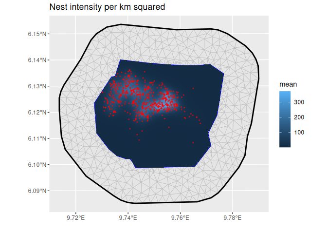

# inlabru

The goal of [inlabru](http://inlabru.org) is to facilitate spatial
modelling using integrated nested Laplace approximation via the [R-INLA
package](https://www.r-inla.org). Additionally, extends the GAM-like
model class to more general nonlinear predictor expressions, and
implements a log Gaussian Cox process likelihood for modelling
univariate and spatial point processes based on ecological survey data.
Model components are specified with general inputs and mapping methods
to the latent variables, and the predictors are specified via general R
expressions, with separate expressions for each observation likelihood
model in multi-likelihood models. A prediction method based on fast
Monte Carlo sampling allows posterior prediction of general expressions
of the latent variables. See Fabian E. Bachl, Finn Lindgren, David L.
Borchers, and Janine B. Illian (2019), inlabru: an R package for
Bayesian spatial modelling from ecological survey data, Methods in
Ecology and Evolution, British Ecological Society, 10, 760–766,
[doi:10.1111/2041-210X.13168](https://doi.org/10.1111/2041-210X.13168),
and `citation("inlabru")`.

The [inlabru.org](http://inlabru.org) website has links to old tutorials
with code examples for versions up to 2.1.13. For later versions,
updated versions of these tutorials, as well as new examples, can be
found at <https://inlabru-org.github.io/inlabru/articles/> for the
latest CRAN/stable release, and at
<https://inlabru-org.github.io/inlabru/dev/articles/> for the latest
development version.

## Online documentation

<https://inlabru-org.github.io/inlabru/>

## Example

This is a basic example which shows how fit a simple spatial Log
Gaussian Cox Process (LGCP) and predicts its intensity:

``` r

# Load libraries
library(INLA)
#> Loading required package: Matrix
#> 
library(inlabru)
library(fmesher)
library(ggplot2)

# Construct latent model components
matern <- inla.spde2.pcmatern(
  gorillas_sf$mesh,
  prior.sigma = c(0.1, 0.01),
  prior.range = c(0.01, 0.01)
)
cmp <- ~ field(geometry, model = matern) + Intercept(1)
# Fit LGCP model
# This particular bru/bru_obs combination has a shortcut function lgcp() as well
fit <- bru(
  cmp,
  bru_obs(
    formula = geometry ~ ., # ~ . is a shortcut for adding all components
    family = "cp",
    data = gorillas_sf$nests,
    samplers = gorillas_sf$boundary,
    domain = list(geometry = gorillas_sf$mesh)
  ),
  options = list(control.inla = list(int.strategy = "eb"))
)

# Predict Gorilla nest intensity
lambda <- predict(
  fit,
  fm_pixels(gorillas_sf$mesh, mask = gorillas_sf$boundary),
  ~ exp(field + Intercept)
)
```

``` r

# Plot the result
ggplot() +
  geom_fm(data = gorillas_sf$mesh) +
  gg(lambda, geom = "tile") +
  gg(gorillas_sf$nests, color = "red", size = 0.5, alpha = 0.5) +
  ggtitle("Nest intensity per km squared") +
  xlab("") +
  ylab("")
```



Nest intensity per km squared

## Installation

You can install the current [CRAN
version](https://cran.r-project.org/package=inlabru) version of inlabru,
using the basic
[`install.packages()`](https://rdrr.io/r/utils/install.packages.html)
function, or [pak](https://pak.r-lib.org/), after adding the INLA
repository added to the list of repositories:

``` r

options(repos = c(
  INLA = "https://inla.r-inla-download.org/R/testing",
  getOption("repos")
))
install.packages("inlabru")
```

or

``` r

# install.packages("pak")
pak::pak("inlabru")
```

### Development version on r-universe

Track the development version builds via
[inlabru-org.r-universe.dev](https://inlabru-org.r-universe.dev/builds):

``` r

options(repos = c(
  inlabruorg = "https://inlabru-org.r-universe.dev",
  getOption("repos")
))
pak::pak("inlabru")
```

This will pick the r-universe version if it is more recent than the CRAN
version.

### Development version on github

Install the development version
[GitHub](https://github.com/inlabru-org/inlabru) with

``` r

pak::pak("inlabru-org/inlabru")
```
